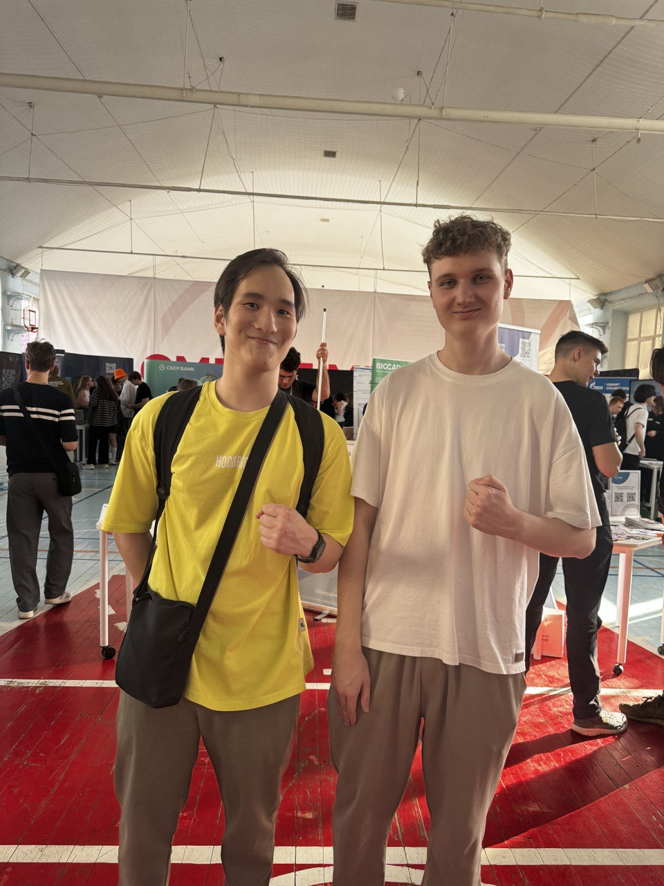

## Введение

В рамках прохождения проектной (учебной) практики значительное внимание было уделено не только выполнению технических задач, но и активному взаимодействию с представителями индустрии, а также участию в профильных мероприятиях. Данные активности преследовали цель расширения профессионального кругозора, получения актуальных знаний о применяемых в отрасли технологиях и понимания требований рынка труда к молодым IT-специалистам. Этот раздел отчета подробно описывает ключевые мероприятия и полученный опыт.


---

## Участие в Карьерном марафоне Московского Политеха

Центральным событием, направленным на взаимодействие с потенциальными работодателями и изучение карьерных перспектив, стало посещение Карьерного марафона, организованного **Московским Политехом**.

### 1. Обзор выставки индустриальных партнеров

В ходе марафона была организована выставка, на которой свои стенды представили такие крупные игроки рынка, как *Yandex (Young&&Yandex)*, *ПАО «Сбербанк»*, *Wildberries*, *ПАО «ВТБ-банк»*, *ПАО «Ростелеком»*, *R-Vision* и другие.

Общение с представителями этих компаний позволило получить информацию о:
*   Текущих проектах и используемых технологических стеках.
*   Программах стажировок и обучения для студентов.
*   Критериях отбора кандидатов.

**Ключевые моменты взаимодействия с компаниями:**

*   **Young&&Yandex:**
    

    *   Презентация летних школ по направлениям: разработка интерфейсов, бэкенд, мобильная разработка, аналитика.
    *   Отмечена высокая вероятность трудоустройства или стажировки для успешных выпускников школ.
    *   Особый интерес вызвала *"Школа бэкенд-разработки"* и *"Школа мобильной разработки"*.
    *   Была предоставлена возможность принять участие в интерактивном задании – решении алгоритмической задачи "Выставление тегов". (сама задача https://coderun.yandex.ru/problem/calculate-tags/description?compiler=python).
        ```python
        # Решение задачи "Выставление тегов" (представлено для полноты картины)
        def main():
            n = int(input())
            if n == 1:
                print(1)
            elif n == 2:
                print(2)
            else:
                tags = [0] * 36 # Предполагается, что n не превышает 35
                tags[1] = 1
                tags[2] = 1
                for i in range(3,n+1):
                    tags[i] = tags[i-1] + tags[i-2]
                print(sum(tags))
        if __name__ == '__main__': # Стандартная конструкция для запуска main
            main()

        ```


*   **Сбербанк России:**
    Были представлены программы для IT-специалистов:
    * *"Летнюю цифровую школу Сбера"* 
    * *"Школу 21"* – полуторагодовой курс по разработке ПО.
    * Стажировки в Сбербанке начинаются со второго курса и охватывают широкий спектр направлений, включая Backend (C#, Golang, Java, Python, JavaScript) и мобильную разработку. Отбор на стажировку многоэтапный:
      1. Анкетирование.
      2. Онлайн-тестирование.
      3. Отбор на собеседование.
      4. Интервью.
      5. Выход на стажировку.\
    Это подчеркивает серьезность подхода компании к подбору кадров.
    *   Полезный ресурс: `www.sberstudent.ru`.
    
    
*   **Wildberries:**
    Основное внимание было уделено программе *"WB Техношкола"*, предлагающей бесплатные онлайн-курсы по различным IT-направлениям (Android, Golang, JS, Computer Vision, iOS) с возможностью участия в реальных бизнес-проектах. Обучение ориентировано на самостоятельную работу и занимает около 18 часов в неделю. Успешное решение предложенной логической задачи также было отмечено призами.

*   **ВТБ-Банк:**
    Представители пригласили следить за актуальными вакансиями и стажировками через корпоративный телеграмм-канал. Для студентов IT-специальностей актуальна программа "ВТБ Юниор" (с третьего курса), включающая направления по различным видам аналитики (данных, бизнес, продуктовая, системная, финансовая) с ключевыми требованиями к знанию SQL, Python и офисного пакета.

*   **Прочие компании**: Диалог с представителями *ПАО «Ростелеком», R-Vision, ООО «Хэдхантер», АНО «Россия — страна возможностей», BIOCAD и ФБУН «ЦНИИ Эпидемиологии»* позволил получить советы по развитию карьеры, составлению резюме и прохождению собеседований, а также оценить важность междисциплинарных проектов на стыке IT и других отраслей (например, биотехнологий).

---

### 2. Мастер-класс НИИ «Мостранспроект»: "Как мы развиваем ИТ-продукты для госсектора"

Особый интерес в рамках карьерного марафона вызвал мастер-класс, организованный специалистами Научно-исследовательского и проектного института городского транспорта города Москвы «Мостранспроект». Мероприятие было посвящено специфике применения информационных технологий в сфере транспортного планирования и развития городской инфраструктуры. Были рассмотрены:

*   **BIM-моделирование** для 3D-проектирования инфраструктуры.
*   **Анализ больших данных и ИИ** для оптимизации транспортных потоков.
*   **ГИС-системы** для пространственного анализа   и поддержки принятия решений в области транспортного планирования
*   **Цифровые двойники** для моделирования сценариев(например, строительство новой развязки или изменение схемы движения).


> Демонстрация системы "Умный светофор" и платформы мониторинга дорожного покрытия наглядно показала практическое применение этих технологий.

Этот опыт позволил глубже понять специфику разработки IT-решений для государственного сектора.

---

### 3. Конференция R-EVOLUTION 2025 от R-Vision

Не менее значимым событием стало участие в конференции R-EVOLUTION 2025, организованной компанией R-Vision, одним из лидеров в области разработки решений для кибербезопасности. Оно предоставило ценные знания о применении нейронных сетей и ИИ в кибербезопасности.

---


---

**Ключевые тезисы конференции:**

*   **Автоматизированный мониторинг угроз** с помощью нейросетей (Использование нейросетевых алгоритмов для непрерывного анализа).
*   Интеллектуальные системы реагирования **(SOAR - Security Orchestration, Automation and Response)** - демонстрация того, как ИИ автоматизирует рутинные задачи.
*   Перспективы **генеративного ИИ** для защиты информации.
*   Улучшение обнаружения угроз с помощью **Machine Learning (ML)**:
    *   Анализ данных в 10-100 раз быстрее человека.
    *   Обнаружение до 85% новых угроз.
    *   Снижение затрат на мониторинг на 40-60%.
*   Важность **корреляции событий** (SIEM) для снижения ложных срабатываний.
*   Ключевой мыслью стала идея о необходимости **Синергия человека и машины:** Наиболее эффективная стратегия – сочетание автоматизации и человеческого контроля.

---

## Итоговые выводы по взаимодействию и участию в мероприятиях

Период практики, совмещенный с участием в Карьерном марафоне и профильных мероприятиях, оказался чрезвычайно продуктивным. Взаимодействие с широким кругом индустриальных партнеров позволило:

*   Сформировать **актуальное представление о требованиях рынка труда** к IT-специалистам.
*   Установить **ценные профессиональные контакты**.
*   Получить **непосредственный опыт решения практических задач**, предложенных компаниями.
*   **Глубже понять специфику применения ИИ** и передовых IT-решений в различных отраслях.

---



---

Опыт, полученный на мастер-классах и конференциях, напрямую соотносится с тематикой основного проекта «Перестройка бизнес-процессов на базе мультиагентных систем с GPT». Знания о практическом применении ИИ, безусловно, обогатили теоретическую базу проекта.

Таким образом, участие в описанных активностях не только выполнило требования практики, но и послужило **мощным стимулом для дальнейшего профессионального развития** и способствовало формированию более четкого видения собственной карьерной траектории в IT-индустрии.

---