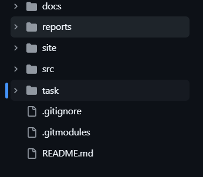
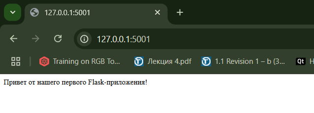
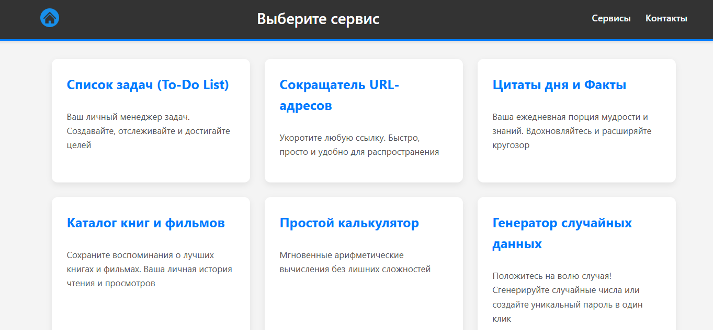

# Итоговый отчет по проекту "Мультисервисный веб-портала"

**Версия:** 1.0
**Авторы:** [Мукабенов Дмитрий]

---

## ВВЕДЕНИЕ
Разработка «Мультисервисного веб-портала» оказалась насыщенным и многоплановым процессом. Я прошёл путь от изучения требований задания и формулировки задач до написания кода для backend-ачсти веб-сайта и создания пользовательских интерфейсов. в этом разделе я подробно расскажу о каждом важном этапе, о том как ставились цели, какие решения принимались и каких результатов у меня получилось добиться.
Практическая часть проекта заняла 72 академических часа в рамках учебной практики — с 31 марта по 21 мая 2025 года. Однако разработка моего проекта началась чуть позже, для удобства планирования я буду ориентироваться именно на реальные сроки выполнения задач.
Далее будет сказано на личном опыте то, как я подходил к постановке задач, какие технологии изучал и применял на практике, с какими сложностями сталкивался и какие уроки из этого извлёк. Для понимания я дополню повествование фрагментами кода, схемами архитектуры и иллюстрациями ключевых экранов портала.

## 1. Хронологическая последовательность этапов работы над проектом "Мультисервисный веб-портал":
*   Этап 1: Подготовка и начальное планирование (до 2 апреля 2025)\
    В течение первой недели я внимательно изучил задание практики и согласовал его вариативную часть с руководителями (Федюков М.А., Богославский Е.С.). Принял решение реализовать проект самостоятельно и выбрал технологический стек — Python/Flask для бэкенда и классические HTML, CSS, JavaScript для фронтенда. Одновременно я определил шесть ключевых сервисов (Список задач, Сокращатель URL, Цитаты, Каталог, Калькулятор и Генератор данных) и создал базовые требования к каждому из них. \
    Результат: Установлена идея проекта, его стек и основные функции сервисов. \
    Время: ~2 ч.

*   Этап 2: Настройка окружения и основа проекта (3–9 апреля 2025)\
    Python уже был установлен на моек ПК, для работы установил Flask. После создал Git-репозиторий на GitHub (github.com/a1lock) со следующей структурой: \
     \
    Настроил app.py для начальной работы и структуру каталогов (static/css, static/images, templates). в конфигурации Flask включил поддержку JSON и убедился, что сервер успешно стартует.

    

    Результат: Готовое рабочее окружение и базовое приложение Flask. \
    Время: ~3 ч.

*   Этап 3: Базовый интерфейс и первые страницы (10–23 апреля 2025) \
    С помощью Jinja2 я создал общий шаблон layout.html с header’ом, main-частью и footer’ом, затем наполнил главную страницу index.html контентом о моём портале. Создал service_details.html, как шаблон для будущих страниц сервисом. Создал страницу services.html, заполнил эту страницу заготовками для шести виджетов сервисов, в CSS прописал базовые стили для всех страниц. Параллельно создавая первые записи для журнала проекта, в качесвте хода работы, в формате Markdown. \
    Результат: Функционирующий «скелет» сайта с главной и страницей сервисов. \
    Время: ~13 ч.

*   Этап 4: Разработка сервисов и API (24 апреля – 13 мая 2025) \
    Далее мною происходила разработка 6 основных сервисов:
    1.	Спроектировал REST-эндпоинты для каждого из сервисов (пути, методы, схемы ответов). Подробный код API-эндпоинтов и функций для каждого сервиса можно посмотреть в файле app.py.
    
    | Сервис                     | Метод  | Путь API                 | Краткое назначение                                     |
    |----------------------------|--------|--------------------------|--------------------------------------------------------|
    | **Список Задач**           | POST   | `/api/tasks`             | Создать новую задачу                                   |
    |                            | GET    | `/api/tasks`             | Получить список всех задач                             |
    |                            | GET    | `/api/tasks/<id>`        | Получить задачу по ID                                  |
    |                            | PUT    | `/api/tasks/<id>`        | Обновить существующую задачу                           |
    |                            | DELETE | `/api/tasks/<id>`        | Удалить задачу по ID                                   |
    | **Сокращатель URL**        | POST   | `/api/shorten`           | Сократить длинный URL-адрес                            |
    |                            | GET    | `/s/<short_code>`        | Перенаправить по короткому коду на оригинальный URL    |
    | **Цитаты дня и Факты**     | GET    | `/api/quotes/random`     | Получить случайную цитату или факт                     |
    |                            | GET    | `/api/quotes/<id>`       | Получить цитату/факт по ID                             |
    |                            | POST   | `/api/quotes`            | Добавить новую цитату (требуется Basic Auth)           |
    | **Каталог книг и фильмов** | POST   | `/api/catalog`           | Добавить новый элемент (книгу или фильм)               |
    |                            | GET    | `/api/catalog`           | Получить список всех элементов (с фильтрацией)         |
    |                            | GET    | `/api/catalog/<id>`      | Получить элемент каталога по ID                        |
    | **Калькулятор**            | GET    | `/api/calculate`         | Выполнить операцию (параметры в URL)                   |
    |                            | POST   | `/api/calculate`         | Выполнить операцию (параметры в JSON-теле)             |
    | **Генератор данных**       | GET    | `/api/random/number`     | Сгенерировать случайное целое число                    |
    |                            | GET    | `/api/random/password`   | Сгенерировать случайный пароль                         |

    2.	Реализовал логику в app.py, организовав временное хранение данных в памяти.

    ```python
    # Сервис 1: Список Задач (To-Do List)
    tasks_db = []  # Более "базоподобное" имя вместо tasks_data
    _next_task_id_counter = 1 # Явное указание, что это счетчик

    # Сервис 2: Сокращатель URL-адресов
    url_shortener_mappings = {} # Более описательное имя

    # Сервис 3: Цитаты дня
    quotes_collection = [ # "Коллекция" звучит лучше для набора цитат
        {"id": 1, "text": "Жизнь - это то, что с тобой происходит, пока ты строишь другие планы.", "author": "Джон Леннон"},
        {"id": 2, "text": "Единственный способ делать великие дела – любить то, что вы делаете.", "author": "Стив Джобс"},
        {"id": 3, "text": "Чтобы дойти до цели, надо прежде всего идти.", "author": "Оноре де Бальзак"}
    ]
    _next_quote_id_counter = 4

    # Учетные данные для Basic Authentication (только для добавления цитат)
    # ВАЖНО: в реальном приложении эти данные НИКОГДА не должны храниться в коде.
    #        Используйте переменные окружения и хеширование паролей.
    BASIC_AUTH_USERNAME = 'admin' # ЗАМЕНИТЬ на безопасное значение из переменных окружения
    BASIC_AUTH_PASSWORD = 'supersecretpassword123' # ЗАМЕНИТЬ и использовать хеширование

    # Сервис 4: Каталог книг и фильмов
    media_catalog_db = [
        {"id": 1, "type": "book", "title": "1984", "author": "Джордж Оруэлл", "year": 1949, "genre": "Антиутопия"},
        {"id": 2, "type": "movie", "title": "Начало", "director": "Кристофер Нолан", "year": 2010, "genre": "Научная фантастика"},
        {"id": 3, "type": "book", "title": "Мастер и Маргарита", "author": "Михаил Булгаков", "year": 1967, "genre": "Роман"},
    ]
    _next_catalog_item_id_counter = 4

    # Сервисы 5 (Калькулятор) и 6 (Генератор) не требуют серверного хранения состояния,
    # вся логика их API stateless (обрабатывается в рамках одного запроса).
    ```

    3.	Создал HTML страницы  каждого сервиса с документацией API и добавил JavaScript для взаимодействия.

    4.	Дополнил стиль специфичными правилами CSS.

    ```css
    /* Часть стилей из сервиса Сокращателя URL */
    .interactive-shortener { 
        background: #fff; 
        padding: 25px; 
        border-radius: 8px; 
        box-shadow: 0 4px 12px rgba(0,0,0,0.1); 
        margin-top: 30px; 
    }

    .interactive-shortener h2 {
        margin-top: 0;
        font-size: 1.8em; 
        border-bottom: 1px solid #eee; 
        padding-bottom: 10px; 
        margin-bottom: 20px; 
    }
    /*.....*/
    ```

    Результат: Шесть работоспособных инструментов с разработанным API и пользовательским интерфейсом. \
    Время: ~35 ч.

    

*   Этап 5: Разработка доп. Сервиса в качестве модификации проекта (30 апреля – 13 мая 2025) \
    На основе имеющегося и полученного опыта, я создал дополнительный сервис Конвертор единиц измерения, который способен конвертировать длинны (см, дц, км и т. д.), объемы (мл, л, м3 и т. д.), размеры цифровых данных (Б, Кбайт, Мбайт, КиБ, МиБ и т. д.).
    
    | Сервис                        | Метод  | Путь API                        | Краткое назначение                                        |
    |-------------------------------|--------|---------------------------------|-----------------------------------------------------------|
    | **Конвертер Единиц Измерения**| GET    | `/api/converter/units`          | Получить список доступных категорий и единиц              |
    |                               | GET    | `/api/converter/convert`        | Выполнить конвертацию (параметры в URL)                   |


    Результат: Работоспособный 7ой сервис с разработанным API и пользовательским интерфейсом. \
    Время: ~5 ч.

    

*   Этап 6: Тестирование и финальная документация (14–21 мая 2025) \
    Я провёл тестирование всех страниц и сервисов, устранил найденные ошибки. После подготовил техническую документацию проекта, техническое руководство по созданию проекта на данную тему, презентацию и загрузил финальную версию проекта в Git-репозиторий.
    Результат: Готовый к демонстрации “Мультисервисный веб-портал” и комплект отчётных материалов. \
    Время: ~15 ч.

## 2. План и вклад в проект
Разработку «Мультисервисного веб-портала» я взял на себя, весь цикл работы — от идеи до запуска работоспособного сайта и документации. Мой вклад можно разделить на несколько взаимосвязанных блоков:

1.  Анализ и планирование.
    Я подробно изучил задание и необходимые материалы, определил общую идею портала и сформировал список из шести сервисов (+1 дополнительный сервис). На этом этапе прописал требования к каждому компоненту и разбил работу на этапы с оценкой необходимого времени.
2. Проектирование.
    Выбрал стек технологий – Python и Flask для бэкенда, HTML, CSS и JavaScript для фронтенда, спроектировал архитектуру приложения. описал эндпоинты (RESTful API), HTTP-методы, форматы данных и коды ответов. Также разработал общие макеты пользовательских интерфейсов и макет страниц.
3. Реализация бэкенда.
    В файле app.py я настроил Flask-приложение, реализовал временное хранение данных в памяти и написал всю логику API-эндпоинтов: обработку запросов, валидацию данных, генерацию JSON-ответов и базовую аутентификацию для защиты сервисов.
4. Реализация фронтенда.
    На основе Jinja2 я сверстал общий каркас сайта и отдельные страницы каждого сервиса (например service_todo.html и т. д.). С помощью JavaScript обеспечил интерактивность - работа с формами, отправка AJAX-запросов и динамическое обновление содержимого без перезагрузки. 
5. Стилизация.
    В файле style.css я описал стили для каждой страницы или сервиса.  Интерфейс портала стал удобным и визуально приятным. Оформил общие элементы макета, а также создал стилизацию для каждого сервиса.
6. Тестирование.
    Я провел тестирование всех функций портала, внес коррективы на основе найденных ошибок.
7. Документирование.
    Параллельно с кодом я вел Git-репозиторий, описывая изменения в каждом коммите. На страницах каждого сервиса разместил документацию по API, также подготовил техническое руководство по созданию проекта на данную тему, техническую документацию по проекту.

Результат - у меня получилось разработать работоспособный мультисервисный портал, который я поддерживал на протяжении всего его «жизненного цикла».

