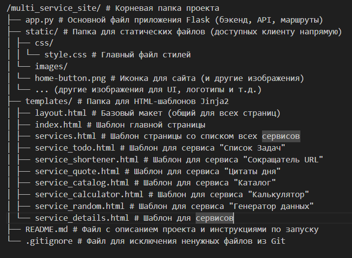
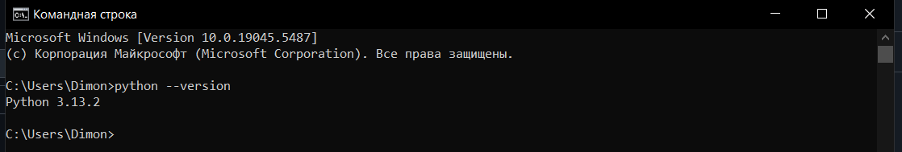
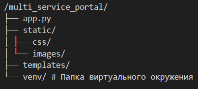

# Руководство по исследованию и созданию Мультисервисного веб-портала на Flask

**Версия:** 1.0
**Авторы:** [Мукабенов Дмитрий]

---

## 1. Введение

Данное руководство представляет собой комплексное описание процесса исследования, проектирования и разработки технологии "Мультисервисный веб-портал", реализованной с использованием языка программирования Python и микрофреймворка Flask. Проект был выполнен в рамках проектной (учебной) практики и тесно связан с более масштабной исследовательской работой по теме «Применение искусственного интеллекта в профессиональном обучении», а также с проектом по дисциплине «Проектная деятельность» – «Перестройка бизнес-процессов на базе мультиагентных систем с GPT».

Создание мультисервисного веб-портала было выбрано в качестве практической реализации технологии не случайно. В современном цифровом мире потребность в удобных, централизованных и легкодоступных онлайн-инструментах постоянно растет. Наш портал призван предоставить пользователям именно такой набор утилит, охватывающих различные повседневные и рабочие задачи, от простого ведения списка дел до более специализированных функций, таких как сокращение URL-адресов или генерация данных.

В ходе работы над проектом особое внимание уделялось не только технической реализации функциональности, но и качеству пользовательского опыта, понятности интерфейсов и доступности документации по использованию API для потенциальных разработчиков. Я стремился создать продукт, который был бы полезен как конечным пользователям, так и тем, кто захочет интегрировать наши сервисы в свои системы.

### 1.1. Цель документа

Основной целью настоящего документа является предоставление исчерпывающего и пошагового руководства, освещающего все ключевые этапы создания описанной технологии. Я ставил перед собой задачу не просто зафиксировать результат, но и поделиться опытом, который может быть полезен другим начинающим разработчикам, сталкивающимся с аналогичными задачами.

Таким образом, документ преследует следующие цели:

*   **Систематизировать и представить** последовательность действий, предпринятых в ходе исследования предметной области, выбора технологического стека и непосредственной разработки веб-портала.
*   **Описать архитектурные решения** и ключевые компоненты созданной системы, объяснив логику их выбора и взаимодействия.
*   **Предоставить детальное техническое руководство** по созданию подобного веб-портала с нуля, включая настройку окружения, реализацию бэкенда на Flask, создание API-эндпоинтов, разработку фронтенда (HTML, CSS, JavaScript) и интеграцию интерактивных пользовательских интерфейсов.
*   **Продемонстрировать практическое применение** теоретических знаний в области веб-разработки, создания RESTful API и организации клиент-серверного взаимодействия.
*   **Служить образовательным материалом** для тех, кто только начинает свой путь в веб-разработке на Python и Flask, предлагая понятные инструкции и наглядные примеры кода.

### 1.2. Для кого это руководство?

Данное руководство ориентировано на достаточно широкую аудиторию, однако в первую очередь оно будет полезно следующим категориям читателей:

*   **Начинающие веб-разработчики:** Студенты IT-специальностей, а также все, кто делает первые шаги в создании веб-приложений и API, особенно с использованием Python и Flask. Руководство написано с учетом того, что читатель может не обладать глубокими предварительными знаниями.
*   **Студенты, выполняющие учебные проекты:** Материал может служить примером и источником вдохновения для выполнения схожих заданий в рамках курсовых работ, практик или дипломных проектов.
*   **Разработчики, желающие освоить Flask:** Те, кто уже имеет некоторый опыт в программировании, но хочет быстро освоить основы создания веб-приложений на данном микрофреймворке.
*   **Преподаватели и менторы:** Руководство может быть использовано в качестве дополнительного учебного материала при объяснении принципов веб-разработки и создания API.
*   **Участники проекта (если применимо):** Как справочный документ, фиксирующий ключевые этапы разработки и принятые решения.

Я постарался изложить материал максимально доступно, сопровождая теоретические выкладки практическими примерами кода и иллюстрациями, чтобы сделать процесс изучения технологии увлекательным и продуктивным.

### 1.3. Обзор технологии

Разработанный "Мультисервисный веб-портал" представляет собой веб-приложение, построенное на базе микрофреймворка Flask. Его архитектура следует классической клиент-серверной модели.

**Ключевые технологические аспекты и функциональные компоненты:**

*   **Бэкенд (Серверная часть):**
    *   Реализован на **Python 3** с использованием **Flask**.
    *   Отвечает за обработку HTTP-запросов, бизнес-логику сервисов и взаимодействие с (временно внутрисерверными) хранилищами данных.
    *   Предоставляет **RESTful API** для каждого из реализованных сервисов, позволяя сторонним приложениям и клиентскому JavaScript взаимодействовать с функциональностью портала.
*   **Фронтенд (Клиентская часть):**
    *   Построен на стандартных веб-технологиях: **HTML** для структуры страниц, **CSS** для стилизации и **JavaScript** (ванильный) для обеспечения интерактивности пользовательских интерфейсов.
    *   Использует шаблонизатор **Jinja2** (интегрированный во Flask) для динамической генерации HTML-страниц на основе данных с сервера.
*   **Реализованные сервисы:**
    1.  **Список задач (To-Do List):** Интерактивное управление личными задачами (создание, просмотр, обновление, удаление) с соответствующим API.
    2.  **Сокращатель URL-адресов:** Преобразование длинных URL в короткие с возможностью редиректа и API для автоматизации.
    3.  **Цитаты дня и Факты:** Получение случайных или конкретных по ID цитат/фактов; API для добавления новых записей (с Basic Auth).
    4.  **Каталог книг и фильмов:** Ведение личной медиатеки с добавлением, просмотром и фильтрацией записей; API для управления каталогом.
    5.  **Простой онлайн-калькулятор:** Выполнение базовых арифметических операций через интерактивный UI, имитирующий физический калькулятор, и через API.
    6.  **Генератор случайных данных:** Создание случайных чисел в заданном диапазоне и паролей с настраиваемыми параметрами, доступное через UI и API.
*   **Пользовательский интерфейс (UI):**
    *   Каждый сервис имеет свою выделенную веб-страницу, которая сочетает в себе подробную документацию по API (для разработчиков) и интерактивный блок (для непосредственного использования функциональности пользователями).
    *   Общая навигация по сайту осуществляется через единый хедер и страницу "Сервисы", представляющую доступные инструменты в виде виджетов.
    *   Дизайн стремится к чистоте, интуитивной понятности и удобству использования.

В следующих разделах данного руководства я подробно рассмотрел процесс исследования, который предшествовал разработке, детально опишем шаги по проектированию и созданию каждого компонента этой технологии, сопровождая объяснения примерами кода и иллюстрациями.

## 2. Исследование предметной области

Прежде чем приступить к непосредственной разработке "Мультисервисного веб-портала", был проведен этап исследования предметной области. Этот этап является критически важным, поскольку позволяет четко определить цели проекта, понять потребности потенциальных пользователей, изучить существующие аналоги и выбрать наиболее подходящий технологический стек для реализации поставленных задач.

### 2.1. Определение проблемы и постановка задачи

На начальном этапе была сформулирована основная проблема, которую призван решить разрабатываемый портал. В современном информационном пространстве существует множество разрозненных онлайн-инструментов и утилит, предназначенных для выполнения различных повседневных или специфических задач (например, ведение списков дел, сокращение URL-адресов, генерация случайных данных и т.д.). Пользователям часто приходится переключаться между несколькими сайтами или приложениями, что не всегда удобно и эффективно. Кроме того, разработчикам, нуждающимся в интеграции подобных функций в свои проекты, не всегда легко найти простые, хорошо документированные и легковесные API.

**Постановка задачи** в рамках проекта заключалась в создании единой, централизованной веб-платформы, которая бы:
*   Объединяла набор востребованных мини-сервисов под общей оболочкой.
*   Предоставляла удобный графический пользовательский интерфейс (GUI) для прямого использования этих сервисов конечными пользователями.
*   Предлагала разработчикам понятный и простой в использовании RESTful API для каждого сервиса, позволяющий легко интегрировать их функциональность в сторонние приложения.
*   Служила практическим примером реализации веб-приложения на Python с использованием микрофреймворка Flask, что было одной из целей учебной практики.

#### 2.1.1. Анализ существующих решений (если применимо)

В ходе исследования были рассмотрены существующие на рынке решения, предлагающие отдельные или схожие по функциональности сервисы. Например:

*   **Для управления задачами:** Существует множество как крупных платформ (Trello, Asana, Jira – хотя они ориентированы на более сложные процессы управления проектами), так и более простых To-Do приложений (Todoist, Microsoft To Do, Google Tasks). Основное отличие нашего подхода – интеграция в мультисервисную платформу и предоставление простого API.
*   **Для сокращения URL:** Сервисы типа Bitly, TinyURL, Cutt.ly предлагают схожий функционал. Наш проект ставил целью создать легковесную альтернативу с открытым API, которую можно было бы развернуть и использовать локально или в рамках собственных проектов.
*   **Для цитат или случайных данных:** Множество сайтов предлагают подобный контент, но часто без удобного API или с избыточной функциональностью. Задача была в создании простого, кастомизируемого (через добавление своих цитат) и API-доступного сервиса.
*   **Для калькуляторов и генераторов:** Онлайн-калькуляторы и генераторы широко распространены, но часто перегружены рекламой или сложным интерфейсом. Цель – создать чистый, быстрый инструмент с возможностью API-доступа.

Анализ показал, что хотя отдельные сервисы хорошо представлены, удобной **интегрированной платформы**, предлагающей набор таких разноплановых утилит с простым UI и одновременно легковесным API, ориентированным на разработчиков-новичков или для быстрого прототипирования, не так много. Это и стало одной из ниш, которую стремился занять наш проект.

#### 2.1.2. Формулирование требований к создаваемой технологии

На основе анализа проблемы и существующих решений были сформулированы следующие ключевые требования к "Мультисервисному веб-порталу":

*   **Функциональные требования (к каждому сервису):**
    *   **Список задач:** CRUD-операции (создание, чтение, обновление, удаление задач), отметка о выполнении.
    *   **Сокращатель URL:** Прием длинного URL, генерация уникального короткого кода, редирект по короткому коду.
    *   **Цитаты дня:** Выдача случайной цитаты, выдача цитаты по ID, возможность добавления новых цитат (с аутентификацией).
    *   **Каталог книг/фильмов:** Добавление записей (тип, название, автор/режиссер, год, жанр), просмотр всех записей, просмотр по ID, фильтрация.
    *   **Калькулятор:** Выполнение базовых арифметических операций (+, -, \*, /).
    *   **Генератор случайных данных:** Генерация чисел в диапазоне, генерация паролей с параметрами длины и использования символов.
*   **Требования к API:**
    *   Для каждого сервиса должен быть предоставлен RESTful API.
    *   API должен быть хорошо документирован на страницах соответствующих сервисов.
    *   Использование стандартных HTTP-методов (GET, POST, PUT, DELETE).
    *   Обмен данными в формате JSON.
    *   Корректная обработка ошибок и возврат соответствующих HTTP-статус кодов.
*   **Требования к пользовательскому интерфейсу (UI):**
    *   Интуитивно понятный и простой в использовании интерфейс для каждого сервиса.
    *   Возможность взаимодействия с основной функциональностью сервисов прямо на веб-странице.
    *   Единый стиль оформления для всех страниц портала.
    *   Адаптивность макета для корректного отображения на различных устройствах (базовая).
*   **Нефункциональные требования:**
    *   **Простота развертывания и поддержки** (в рамках учебного проекта).
    *   **Расширяемость:** Архитектура должна позволять относительно легко добавлять новые сервисы в будущем.
    *   **Надежность:** Корректная обработка пользовательского ввода и ошибок.
    *   **Безопасность:** Базовая аутентификация для операций, изменяющих данные (например, добавление цитат).

### 2.2. Выбор стека технологий

Выбор технологического стека основывался на требованиях проекта, учебных целях практики и доступности инструментов для начинающих разработчиков.

#### 2.2.1. Обоснование выбора Python и Flask

*   **Python:** Был выбран в качестве основного языка для серверной разработки благодаря его простоте синтаксиса, богатой стандартной библиотеке и огромному количеству сторонних пакетов, что значительно ускоряет разработку. Python также является популярным языком для веб-разработки и анализа данных, что соответствует более широкому контексту проекта, связанного с ИИ. Его низкий порог входа делает его отличным выбором для учебных проектов.
*   **Flask:** В качестве веб-фреймворка был выбран Flask. Это микрофреймворк, что означает его минималистичность и гибкость. Основные причины выбора:
    *   **Простота освоения:** Flask имеет очень понятную структуру и небольшое ядро, что позволяет быстро начать разработку.
    *   **Гибкость:** Не навязывает строгую структуру проекта или конкретные инструменты (ORM, шаблонизаторы и т.д.), позволяя разработчику выбирать компоненты по своему усмотрению. Это хорошо для понимания основ веб-разработки.
    *   **Расширяемость:** Несмотря на свою "микро"-природу, Flask легко расширяется с помощью множества доступных расширений для решения практически любых задач (аутентификация, работа с базами данных, и т.д.).
    *   **Подходит для API:** Flask отлично подходит для создания RESTful API благодаря своей простоте в обработке маршрутов и HTTP-запросов.
    *   **Учебные цели:** Задание по практике прямо рекомендовало ознакомиться с реализацией RESTful API с помощью Python и Flask на основе предоставленного теоретического материала, что сделало этот выбор очевидным.

#### 2.2.2. Обзор HTML, CSS, JavaScript для фронтенда

Для создания клиентской части веб-портала был использован классический набор фронтенд-технологий:

*   **HTML (HyperText Markup Language):** Использовался для определения структуры и семантической разметки веб-страниц. Шаблонизатор Jinja2, интегрированный во Flask, применялся для динамической генерации HTML на основе данных с сервера, а также для создания переиспользуемых компонентов макета (наследование шаблонов, блоки).
*   **CSS (Cascading Style Sheets):** Применялся для визуального оформления и стилизации HTML-элементов. Был создан единый файл стилей (`style.css`), содержащий как общие стили для всего сайта (макет, навигация, футер), так и специфические стили для каждого интерактивного сервиса, чтобы обеспечить их уникальный и удобный вид.
*   **JavaScript (Vanilla JS):** Использовался для добавления интерактивности на страницы сервисов. В частности, JavaScript отвечает за:
    *   Отправку асинхронных запросов (AJAX, с использованием Fetch API) к API-эндпоинтам бэкенда без перезагрузки страницы.
    *   Динамическое обновление содержимого страницы на основе ответов от сервера (например, отображение списка задач, результатов вычислений, сгенерированных данных).
    *   Обработку событий от пользовательских элементов управления (кнопки, формы).
    *   Валидацию данных на стороне клиента перед отправкой на сервер (базовая).

Выбор "ванильного" JavaScript (без использования фронтенд-фреймворков типа React, Vue или Angular) был сделан для концентрации на фундаментальных принципах работы с DOM и AJAX, что более соответствует уровню начинающего разработчика и учебным целям практики.

### 2.3. Изучение ключевых концепций

Для успешной реализации проекта потребовалось изучение и понимание ряда ключевых концепций веб-разработки и создания API:

*   **REST (Representational State Transfer):** Изучение принципов построения RESTful API, таких как использование стандартных HTTP-методов для операций с ресурсами, именование URL-путей для представления ресурсов, stateless-взаимодействие. Теоретический материал, предоставленный в рамках задания практики (статья Луиса Рея "Implementing a RESTful Web API with Python & Flask"), послужил отличной отправной точкой.
*   **HTTP-методы:** Понимание назначения и правильного применения основных HTTP-методов:
    *   `GET`: для запроса данных.
    *   `POST`: для создания новых ресурсов.
    *   `PUT`: для полного обновления существующих ресурсов.
    *   `DELETE`: для удаления ресурсов.
    *   (Также были рассмотрены, но не использовались активно `PATCH` для частичного обновления).
*   **HTTP-статус коды:** Изучение стандартных кодов ответа HTTP (200 OK, 201 Created, 400 Bad Request, 404 Not Found, 401 Unauthorized, 500 Internal Server Error и др.) для корректной обратной связи от API.
*   **JSON (JavaScript Object Notation):** Освоение формата JSON как основного способа обмена данными между клиентом и сервером в RESTful API. Понимание структуры JSON, методов сериализации (Python dict -> JSON string) и десериализации (JSON string -> Python dict).
*   **Маршрутизация во Flask (`@app.route`)**: Понимание того, как Flask связывает URL-адреса и HTTP-методы с конкретными функциями-обработчиками Python.
*   **Обработка запросов во Flask (объект `request`):** Изучение способов получения данных из входящего HTTP-запроса: параметры URL (query parameters), данные из тела запроса (JSON, данные форм), заголовки.
*   **Формирование ответов во Flask (функция `jsonify`, объект `Response`):** Научились создавать корректные HTTP-ответы, включая JSON-данные и установку соответствующих статус-кодов и заголовков.
*   **Шаблонизация с Jinja2:** Освоение синтаксиса Jinja2 для создания динамических HTML-страниц, наследования шаблонов, использования переменных и управляющих конструкций (циклы, условия).
*   **Basic Authentication:** Изучение простого механизма аутентификации для защиты определенных API-эндпоинтов.

Это исследование позволило заложить прочный теоретический и практический фундамент для последующего проектирования и разработки "Мультисервисного веб-портала".

## 3. Проектирование технологии

После этапа исследования предметной области и определения ключевых требований начался этап проектирования "Мультисервисного веб-портала". На этой стадии были заложены основы архитектуры системы, определена структура проекта, детально спроектированы API-эндпоинты для каждого сервиса и сформирована общая концепция пользовательского интерфейса. Грамотное проектирование является залогом успешной и предсказуемой разработки, позволяя минимизировать риски и упростить дальнейшую поддержку и расширение функциональности.

### 3.1. Общая архитектура системы

Для "Мультисервисного веб-портала" была выбрана классическая **трехзвенная архитектура**, характерная для большинства веб-приложений. Эта архитектура подразумевает разделение системы на следующие логические компоненты:

1.  **Клиентская часть (Frontend / Presentation Tier):**
    *   Реализована с использованием стандартных веб-технологий: HTML (структура), CSS (стилизация) и JavaScript (интерактивность).
    *   Отвечает за отображение информации пользователю и взаимодействие с ним через веб-браузер.
    *   Именно на этой стороне происходит формирование запросов к серверу (API-эндпоинтам) и динамическое обновление страниц на основе полученных ответов.
    *   HTML-страницы генерируются на стороне сервера с помощью шаблонизатора Jinja2, но клиентский JavaScript обеспечивает дальнейшую интерактивность без полной перезагрузки страниц.

2.  **Серверная часть (Backend / Application Tier):**
    *   Разработана на языке Python с использованием микрофреймворка Flask.
    *   Является "мозгом" приложения. Здесь происходит обработка входящих HTTP-запросов от клиента.
    *   Реализует всю бизнес-логику каждого из шести сервисов (список задач, сокращатель URL и т.д.).
    *   Определяет и обрабатывает RESTful API-эндпоинты, через которые клиентская часть или сторонние приложения могут взаимодействовать с сервисами.
    *   Управляет состоянием приложения и взаимодействием с хранилищем данных (в текущей версии – внутрисерверные структуры данных).

3.  **Уровень данных (Data Tier):**
    *   В текущей реализации проекта этот уровень представлен глобальными переменными Python (списками и словарями), хранящимися в оперативной памяти сервера `app.py`. Это решение было принято для упрощения на начальном этапе разработки и в рамках учебных целей.
    *   В будущем **(критическое TODO)** этот уровень должен быть заменен на полноценную систему управления базами данных (например, SQLite для простоты или PostgreSQL/MySQL для более серьезных нагрузок). Это обеспечит постоянное хранение данных, их целостность и возможность более сложных запросов.

**Взаимодействие компонентов:** Пользователь взаимодействует с клиентской частью через браузер. JavaScript на клиенте отправляет асинхронные запросы (Fetch API) на соответствующие API-эндпоинты серверной части. Серверная часть (Flask) обрабатывает эти запросы, выполняет необходимую логику, при необходимости обращается к данным и возвращает ответ (обычно в формате JSON) обратно на клиент, где JavaScript обновляет пользовательский интерфейс.

**(Иллюстрация 1: Вставить здесь диаграмму общей архитектуры)**
*   *Описание для иллюстрации:* "На диаграмме можно схематично представить взаимодействие Клиента (веб-браузер с HTML/CSS/JS), Сервера приложений (Python/Flask с API и бизнес-логикой) и Уровня данных (пока в памяти, в будущем – БД)."

    
    *(Замените `путь/к/вашей/диаграмме_архитектуры.png` на реальный путь. Диаграмма может быть простой: блок "Браузер пользователя", стрелка к блоку "Flask-сервер (app.py)", от него стрелка к блоку "Хранилище данных (в памяти)", и обратные стрелки.)*

### 3.2. Структура проекта (файловая структура)

Для организации кода и ресурсов была принята стандартная для Flask-приложений и интуитивно понятная файловая структура:




**Пояснения к структуре:**

*   **`app.py`**: Содержит всю логику на Python, включая определение маршрутов Flask, обработчики API-эндпоинтов и бизнес-логику сервисов. Здесь же (временно) находятся переменные для хранения данных.
*   **`static/`**: Эта папка используется Flask для обслуживания статических файлов, таких как таблицы стилей CSS, изображения, и клиентские JavaScript файлы (если бы они были вынесены отдельно). Пути к файлам в этой папке генерируются в шаблонах с помощью `url_for('static', filename='...')`.
*   **`templates/`**: Здесь хранятся все HTML-шаблоны, которые обрабатываются шаблонизатором Jinja2. Flask автоматически ищет шаблоны в этой директории.
*   **`README.md`**: Важный файл для любого проекта, содержащий основную информацию и инструкции.
*   `.gitignore`**: Этот файл является хорошей практикой для любого Python-проекта, управляемого с помощью Git, для чистоты репозитория.

Такая структура является достаточно стандартной, что облегчает понимание проекта другими разработчиками и его дальнейшую поддержку.

**(Иллюстрация 2: Можно вставить здесь упрощенную диаграмму файловой структуры)**
*   *Описание для иллюстрации:* "Схематическое представление основных директорий и файлов проекта, показывающее их иерархию."

    

### 3.3. Проектирование API-эндпоинтов (для каждого сервиса)

Ключевой частью проекта является предоставление RESTful API для каждого сервиса. При проектировании эндпоинтов я старался следовать общепринятым конвенциям и принципам REST. Для всех API-эндпоинтов данные передаются и принимаются в формате JSON.

Ниже приведено описание эндпоинтов для каждого реализованного сервиса:

**(Иллюстрация 3: Вместо длинных таблиц ниже, можно начать с общей схемы проектирования API, например, с типичным набором эндпоинтов для CRUD-операций на примере одного ресурса. Это будет визуальным введением перед детализацией каждого сервиса.)**

*   *Описание для иллюстрации:* "Общий подход к проектированию RESTful API: использование HTTP-методов для стандартных операций с ресурсами."
    *   `GET /resource` (получить список)
    *   `POST /resource` (создать новый)
    *   `GET /resource/{id}` (получить по ID)
    *   `PUT /resource/{id}` (обновить по ID)
    *   `DELETE /resource/{id}` (удалить по ID)

    

**3.3.1. Сервис "Список Задач (To-Do List)"**
| Метод | Путь             | Описание                                                     | Тело запроса (JSON)                | Пример ответа (JSON)                                 |
|-------|------------------|--------------------------------------------------------------|------------------------------------|------------------------------------------------------|
| POST  | `/api/tasks`     | Создать новую задачу                                         | `{"text": "Описание задачи"}`        | `{"message": "...", "task": {"id": ..., "text": ..., "done": false}}` |
| GET   | `/api/tasks`     | Получить список всех задач                                   | -                                  | `{"count": ..., "tasks": [...]}`                      |
| GET   | `/api/tasks/<id>`| Получить задачу по ID                                        | -                                  | `{"task": {"id": ..., "text": ..., "done": ...}}`     |
| PUT   | `/api/tasks/<id>`| Обновить задачу (текст и/или статус выполнения)            | `{"text": "...", "done": true/false}` | `{"message": "...", "task": {...}}`                     |
| DELETE| `/api/tasks/<id>`| Удалить задачу по ID                                         | -                                  | `{"message": "..."}`                                  |

**3.3.2. Сервис "Сокращатель URL-адресов"**
| Метод | Путь             | Описание                                           | Тело запроса (JSON)           | Пример ответа (JSON)                                      |
|-------|------------------|----------------------------------------------------|-------------------------------|-----------------------------------------------------------|
| POST  | `/api/shorten`   | Сократить длинный URL                                | `{"long_url": "http://..."}`   | `{"message": "...", "short_url": "...", "original_url": "..."}` |
| GET   | `/s/<short_code>`| Редирект по короткому коду на оригинальный URL      | -                             | (Редирект 302)                                             |

**3.3.3. Сервис "Цитаты дня и Факты"**
| Метод | Путь               | Описание                                                      | Тело запроса (JSON)              | Пример ответа (JSON)                           |
|-------|--------------------|---------------------------------------------------------------|----------------------------------|------------------------------------------------|
| GET   | `/api/quotes/random`| Получить случайную цитату/факт                                 | -                                | `{"id": ..., "text": ..., "author": ...}`         |
| GET   | `/api/quotes/<id>` | Получить цитату/факт по ID                                   | -                                | `{"id": ..., "text": ..., "author": ...}`         |
| POST  | `/api/quotes`      | Добавить новую цитату (требуется Basic Authentication)         | `{"text": "...", "author": "..."}` | `{"message": "...", "quote": {...}}`           |

**3.3.4. Сервис "Каталог книг и фильмов"**
| Метод | Путь             | Описание                                                      | Тело запроса (JSON)                                   | Пример ответа (JSON)                         |
|-------|------------------|---------------------------------------------------------------|-------------------------------------------------------|----------------------------------------------|
| POST  | `/api/catalog`   | Добавить новый элемент (книгу или фильм)                     | `{"type": "book/movie", "title": ..., "author/director": ..., "year": ..., "genre": ...}` | `{"message": "...", "item": {...}}`            |
| GET   | `/api/catalog`   | Получить список всех элементов (поддерживает фильтрацию)      | -                                                     | `[{"id": ..., "title": ...}, ...]`            |
| GET   | `/api/catalog/<id>`| Получить элемент каталога по ID                               | -                                                     | `{"id": ..., "title": ...}`                   |

**3.3.5. Сервис "Простой онлайн-калькулятор"**
| Метод     | Путь            | Описание                                           | Параметры (GET) / Тело (POST JSON)        | Пример ответа (JSON)                                |
|-----------|-----------------|----------------------------------------------------|-------------------------------------------|-----------------------------------------------------|
| GET / POST| `/api/calculate`| Выполнить арифметическую операцию                    | `num1=X&num2=Y&operation=OP` / `{"num1":X, "num2":Y, "operation":"OP"}` | `{"result": ..., "operand1": ..., ...}`             |

**3.3.6. Сервис "Генератор случайных данных"**
| Метод | Путь                     | Описание                                | Параметры (GET)                      | Пример ответа (JSON)                        |
|-------|--------------------------|-----------------------------------------|--------------------------------------|---------------------------------------------|
| GET   | `/api/random/number`     | Сгенерировать случайное число           | `?min=X&max=Y`                         | `{"random_number": ...}`                    |
| GET   | `/api/random/password`   | Сгенерировать случайный пароль          | `?length=L&use_symbols=true/false`   | `{"password": "...", "length": ..., ...}`  |


### 3.4. Дизайн пользовательского интерфейса (концепция)

При проектировании пользовательского интерфейса основной упор делался на простоту, интуитивную понятность и удобство использования для каждого сервиса.

**Общие принципы дизайна:**

*   **Единообразие:** Все страницы сервисов имеют схожую структуру: заголовок с описанием, блок с документацией API и ниже – интерактивный блок для непосредственной работы с сервисом. Это помогает пользователю быстрее ориентироваться.
*   **Ясность:** Элементы управления (поля ввода, кнопки, выпадающие списки) имеют четкие подписи. Результаты операций и сообщения об ошибках отображаются наглядно.
*   **Минимализм:** Интерфейсы не перегружены лишними элементами, фокус на основной функциональности.
*   **Отзывчивость:** Базовая адаптивность стилей для корректного отображения на экранах разного размера.

**Концепция UI для отдельных сервисов:**

*   **Список Задач:** Форма для добавления новой задачи, список существующих задач с возможностью отметить выполнение и удалить задачу. Текст выполненных задач зачеркивается.
    **(Иллюстрация 4: Вставить здесь эскиз/скриншот UI для "Списка Задач")**
    

*   **Сокращатель URL:** Одно поле для ввода длинного URL, кнопка "Сократить". Результат (короткий URL и оригинальный) отображается ниже с кнопкой для копирования короткой ссылки.
    **(Иллюстрация 5: Вставить здесь эскиз/скриншот UI для "Сокращателя URL")**
    

*   **Цитаты дня:** Две кнопки ("Случайная цитата", "Найти по ID") и поле для ввода ID. Результат отображается в виде стилизованной цитаты.
    **(Иллюстрация 6: Вставить здесь эскиз/скриншот UI для "Цитат дня")**
    

*   **Каталог книг/фильмов:** Форма для добавления нового элемента (с динамическим изменением поля "Автор/Режиссер" в зависимости от типа), форма для фильтрации каталога и сеточный вывод карточек элементов каталога.
    **(Иллюстрация 7: Вставить здесь эскиз/скриншот UI для "Каталога")**
    

*   **Калькулятор:** Интерфейс, имитирующий классический кнопочный калькулятор, с цифровыми кнопками, кнопками операций, "равно", "очистить", и дисплеем для отображения ввода и результата.
    **(Иллюстрация 8: Это изображение вы мне уже присылали, вставьте его сюда)**
    

*   **Генератор случайных данных:** Две секции – для генерации чисел (поля min/max, кнопка) и для генерации паролей (поля длина/спецсимволы, кнопка, поле для вывода пароля с кнопкой копирования).
    **(Иллюстрация 9: Вставить здесь эскиз/скриншот UI для "Генератора")**
    

Целью было создать не только функциональные, но и визуально приятные интерфейсы, с которыми пользователю будет легко и комфортно работать. Детальная реализация стилей описана в соответствующем разделе (`style.css`).

## 4. Пошаговое руководство по созданию "Мультисервисного веб-портала"

Этот раздел представляет собой подробное руководство, которое шаг за шагом проведет вас через процесс создания "Мультисервисного веб-портала" на Python с использованием микрофреймворка Flask. Мы начнем с настройки необходимого окружения и закончим реализацией функциональных сервисов с интерактивными пользовательскими интерфейсами. Руководство ориентировано на тех, кто делает первые шаги в веб-разработке, поэтому мы постараемся объяснять каждый этап максимально доступно.

### 4.1. Подготовка рабочего окружения

Прежде чем приступить к написанию кода, важно правильно подготовить среду разработки. Это обеспечит стабильность работы вашего приложения и упростит управление зависимостями.

#### 4.1.1. Установка Python

Если Python еще не установлен на вашем компьютере, вам необходимо его установить. Наш проект использует Python 3.

1.  **Загрузка:** Перейдите на официальный сайт Python ([python.org](https://python.org/downloads/)) и загрузите последнюю стабильную версию Python 3 для вашей операционной системы (Windows, macOS, Linux).
2.  **Установка:**
    *   **Для Windows:** Запустите загруженный установщик. **Очень важно** на первом экране установки отметить галочку "Add Python to PATH" (или "Add Python X.Y to PATH"). Это позволит вам запускать Python из командной строки из любой директории. Далее следуйте инструкциям установщика (обычно достаточно выбрать "Install Now").
    *   **Для macOS:** Python обычно предустановлен, но это может быть более старая версия (Python 2). Рекомендуется установить свежую версию Python 3 с официального сайта. Также можно использовать менеджер пакетов Homebrew (`brew install python3`).
    *   **Для Linux:** Python 3 часто предустановлен. Проверить можно командой `python3 --version`. Если его нет или версия устарела, воспользуйтесь менеджером пакетов вашего дистрибутива (например, `sudo apt update && sudo apt install python3 python3-pip python3-venv` для Debian/Ubuntu).
3.  **Проверка установки:** Откройте терминал (командную строку, PowerShell) и введите команды:
    ```bash
    python --version 
    # или, если python ссылается на старую версию:
    python3 --version
    pip --version
    # или
    pip3 --version
    ```
    Вы должны увидеть установленные версии Python и pip (менеджер пакетов Python).



#### 4.1.2. Создание виртуального окружения

Виртуальное окружение – это изолированная среда для вашего Python-проекта, которая позволяет управлять зависимостями (библиотеками) конкретного проекта отдельно от других проектов и системных библиотек. Это очень хорошая практика.

1.  **Создайте папку для проекта:** Откройте терминал и перейдите в директорию, где вы хотите разместить свой проект. Затем создайте новую папку и перейдите в нее.
    ```bash
    mkdir multi_service_portal
    cd multi_service_portal
    ```
2.  **Создайте виртуальное окружение:** Внутри папки проекта выполните команду (название `venv` для окружения является общепринятым, но вы можете выбрать другое):
    ```bash
    python -m venv venv
    # или для некоторых систем
    python3 -m venv venv 
    ```
    Эта команда создаст папку `venv` (или как вы ее назвали) внутри вашего проекта, содержащую копию интерпретатора Python и структуру для установки пакетов.

3.  **Активируйте виртуальное окружение:**
    *   **Windows (Command Prompt):**
        ```bash
        venv\Scripts\activate.bat
        ```
    *   **Windows (PowerShell):**
        ```bash
        venv\Scripts\Activate.ps1 
        # Если выполнение скриптов запрещено, может потребоваться команда:
        # Set-ExecutionPolicy Unrestricted -Scope Process 
        # (после активации можно вернуть на место)
        ```
    *   **macOS и Linux (bash/zsh):**
        ```bash
        source venv/bin/activate
        ```
    После успешной активации вы увидите префикс `(venv)` (или название вашего окружения) в начале строки терминала. Это означает, что вы работаете внутри изолированного окружения.

#### 4.1.3. Установка необходимых библиотек (Flask)

Теперь, когда виртуальное окружение активировано, мы можем установить Flask.

1.  **Установка Flask:** В активированном виртуальном окружении выполните команду:
    ```bash
    pip install Flask
    ```
    Эта команда загрузит и установит Flask, а также все его зависимости (например, Werkzeug для WSGI-сервера и Jinja2 для шаблонизации) в ваше виртуальное окружение.

### 4.2. Создание базовой структуры Flask-приложения

Итак, мы подготовили наше рабочее место (установили Python, создали виртуальное окружение и установили Flask). Теперь самое время заложить фундамент нашего будущего веб-портала – создать основную структуру Flask-приложения. Это как разметка участка перед постройкой дома: определяем, где что будет находиться.

#### 4.2.1. Файл `app.py` – инициализация приложения

Центральным элементом любого Flask-приложения является Python-скрипт, который инициализирует само приложение и определяет его поведение. Традиционно, этот файл называют `app.py`.

1.  **Создаем файл:** В корневой директории вашего проекта (папке, которую вы создали на шаге 4.1.2, например, `multi_service_portal/`) создайте новый файл и назовите его `app.py`.

2.  **Наполняем начальным кодом:** Откройте `app.py` в вашем текстовом редакторе или IDE и вставьте следующий код. Этот код выполняет несколько ключевых действий: импортирует необходимые компоненты Flask, создает экземпляр приложения, определяет простейший маршрут для главной страницы и настраивает запуск сервера разработки.

    ```python
    from functools import wraps
    import datetime
    import random
    import string
    import json # Если понадобится json.dumps для более сложного форматирования

    from flask import (
        Flask,
        jsonify,
        redirect,
        render_template,
        request,
        url_for,
    )

    # Инициализация основного экземпляра Flask-приложения.
    # Использование `__name__` помогает Flask правильно определять пути к шаблонам и статическим файлам.
    app = Flask(__name__)

    # --- Настройки конфигурации приложения ---
    # Обеспечиваем корректное отображение кириллицы и других не-ASCII символов в JSON-ответах.
    app.config['JSON_AS_ASCII'] = False
    # Включаем форматированный (pretty-print) вывод JSON для удобства чтения во время разработки.
    # Для боевого сервера это можно отключить для экономии трафика.
    app.config['JSONIFY_PRETTYPRINT_REGULAR'] = True

    # --- Контекстный процессор: делаем переменные доступными во всех шаблонах ---
    @app.context_processor
    def inject_global_template_vars():
        """
        Внедряет переменные, которые должны быть доступны во всех HTML-шаблонах.
        В данном случае, добавляем `current_year` для отображения в футере.
        """
        return {'current_year': datetime.datetime.now().year}

    @app.route('/')
    def home_page():
        # Пока просто вернем текстовое приветствие. Позже мы будем использовать шаблоны.
        return "Сервер Flask успешно запущен!" 

    if __name__ == '__main__':
    app.run(host='127.0.0.1', port=5001, debug=True)
    ```
    **Что делает этот код (ключевые моменты для понимания):**
    *   `from flask import Flask`: Мы "просим" Python предоставить нам главный инструмент из "набора Flask" – класс `Flask`.
    *   `app = Flask(__name__)`: Здесь мы "строим" наше приложение. `__name__` – это специальное имя, которое Python дает каждому файлу, и Flask использует его, чтобы понять, где искать другие части нашего проекта, например, HTML-страницы.
    *   `@app.route('/') def home_page(): ...`: Это как указатель на карте: "Если кто-то придет по главному адресу сайта ('/'), покажи ему то, что сделает функция `home_page`".
    *   `if __name__ == '__main__': app.run(...)`: Эта команда запускает небольшой веб-сервер прямо на вашем компьютере, чтобы вы могли увидеть результат своей работы в браузере. Параметр `debug=True` очень полезен: он показывает подробные ошибки, если что-то пойдет не так, и автоматически перезагружает сервер, когда вы меняете код. `host='127.0.0.1'` означает, что сайт будет доступен только на вашем компьютере.

    После добавления этого кода вы уже можете запустить сервер (командой `python app.py` в терминале, из папки проекта, с активированным виртуальным окружением) и увидеть в браузере результат работы функции `home_page`.

#### 4.2.2. Создание папок `static` и `templates`

Чтобы Flask мог находить ваши HTML-страницы, CSS-стили, картинки и JavaScript-файлы, их нужно разместить в специально отведенных для этого папках. Это стандартное соглашение во Flask, которое упрощает организацию проекта.

1.  В **корневой папке** вашего проекта (там же, где лежит `app.py`) создайте две новые папки:
    *   `templates`: В эту папку мы будем складывать все наши HTML-файлы. Flask будет автоматически искать их здесь, когда мы попросим его отобразить какую-нибудь страницу.
    *   `static`: Эта папка предназначена для статических ресурсов – тех файлов, которые не меняются динамически сервером, а просто отдаются браузеру как есть.
2.  Внутри папки `static` рекомендуется сразу создать подпапки для лучшего порядка:
    *   `css`: Сюда мы поместим наш файл со стилями (`style.css`).
    *   `images`: Здесь будут храниться все изображения, используемые на сайте (логотипы, иконки, иллюстрации к сервисам).

Теперь структура вашего проекта должна выглядеть примерно так:



### 4.3. Разработка базового макета сайта (`layout.html`)

Чтобы все страницы нашего портала выглядели единообразно (имели одинаковую шапку, навигацию, подвал), мы создадим базовый HTML-макет. Другие, более конкретные страницы, будут "наследовать" этот макет, добавляя только свой уникальный контент. Это избавляет нас от необходимости копировать один и тот же HTML-код на каждую страницу.

1.  **Создайте файл `layout.html`** внутри папки `templates/`.
2.  **Вставьте в него следующий HTML-код:** Этот код определяет общую структуру страницы и использует специальные теги шаблонизатора Jinja2 (например, ``), которые позволят дочерним шаблонам вставлять свое содержимое в определенные места.

    ```html
    <!DOCTYPE html>
    <html lang="ru">
    <head>
        <meta charset="UTF-8">
        <meta name="viewport" content="width=device-width, initial-scale=1.0">
        <title> - practice-2025</title>
        <link rel="stylesheet" href="{{ url_for('static', filename='css/style.css') }}">
        <link rel="icon" href="{{ url_for('static', filename='images/home-button.png') }}"> 
    </head>
    <body>
        <header>
            <nav>
                <div class="nav-left">
                    <a href="{{ url_for('home_page') }}" id="home-link">
                        
                    </a>
                </div>
                <div class="nav-center">
                    <h1>{{ self.title() }}</h1>
                </div>
                <div class="nav-right">
                    <a href="{{ url_for('list_all_services_page') }}">Сервисы</a>
                    <a href="#footer-contacts">Контакты</a>
                </div>
            </nav>
        </header>

        <main>
            
        </main>

        <footer id="footer-contacts">
            <h2>Контакты</h2>
            <p>Telegram: <a href="https://t.me/dontopentheboxx" target="_blank">@dontopentheboxx</a></p>
            <p>GitHub: <a href="https://github.com/a1lock" target="_blank">a1lock</a></p>
            <p>Email: <a href="mailto:a1lockteam@a1l.com">a1lockteam@a1l.com</a></p>
            <p>Телефон: +7 (800) 555-35-35</p>
            <p>© {{ current_year }} Ailock team corp./a1l. Все права защищены.</p>
        </footer>
    </body>
    </html>
    ```

    **Ключевые моменты в этом коде, на которые стоит обратить внимание:**
    *   `<!DOCTYPE html> <html lang="ru"> ... </html>`: Стандартная структура HTML5 документа.
    *   `<head>`: Содержит метаинформацию, заголовок страницы и ссылки на CSS-файлы.
        *   ``: Место, куда дочерний шаблон сможет вставить свой уникальный заголовок (тот, что виден во вкладке браузера).
        *   `<link rel="stylesheet" href="{{ url_for('static', filename='css/style.css') }}">`: Так Flask подключает ваш основной CSS-файл. `url_for('static', ...)` автоматически строит правильный путь к файлу в папке `static`.
    *   `<body>`: Содержит видимую часть страницы.
        *   `<header>`: Здесь будет наша шапка сайта с навигацией.
            *   ``: Место для заголовка, который может отображаться прямо в шапке.
            *   Ссылки (`<a>`) используют `{{ url_for('имя_функции_маршрута') }}`. Например, `{{ url_for('home_page') }}` создаст ссылку на главную страницу, а `{{ url_for('list_all_services_page') }}` – на страницу со списком сервисов. **Очень важно, чтобы имена здесь совпадали с именами ваших функций-обработчиков маршрутов в `app.py`!**
        *   `<main>`: Основная область контента.
            *   ``: Самый главный блок! Именно сюда каждая дочерняя страница будет вставлять свое уникальное содержимое.
        *   `<footer>`: Подвал сайта с контактной информацией и копирайтом.
            *   `{{ current_year }}`: Используем переменную, которую мы сделали доступной глобально через `@app.context_processor` в `app.py`.

### 4.4. Создание главной страницы (`index.html`)

Теперь, когда у нас есть базовый макет, создадим для него первое "наполнение" – главную страницу нашего сайта.

1.  **Создайте файл `index.html`** в папке `templates/`.
2.  **Наполните его содержимым, наследуя `layout.html`:** Код главной страницы будет значительно короче, так как всю общую структуру мы уже определили в `layout.html`.

    ```html
    

    Главная

    
        Добро пожаловать!
    

    
    <section class="hero">
        <h2>Откройте для себя мир удобных онлайн-инструментов!</h2>
        <p>
            Добро пожаловать на наш портал – вашу новую универсальную платформу, 
            где собраны самые разнообразные и полезные онлайн-сервисы. 
            Мы создали это место, чтобы вам больше не приходилось тратить время на 
            поиск нужных инструментов на десятках разных сайтов. Нужно ли вам упорядочить задачи, 
            сократить длинную ссылку, найти вдохновение для нового проекта или 
            просто что-то быстро посчитать – все необходимое уже здесь, под рукой!
        </p>
        <h3>Ключевые "фичи":</h3>
        <ul>
            <li><strong>Всегда что-то найдется:</strong> Наш арсенал включает как простые утилиты для повседневных мелочей, так и более продвинутые инструменты, призванные сделать вашу цифровую жизнь проще и продуктивнее.</li>
            <li><strong>Просто и понятно:</strong> Мы постарались сделать интерфейс интуитивным, а описание каждого API – максимально ясным. Вы сможете легко использовать наши сервисы напрямую или быстро интегрировать их в свои проекты.</li>
            <li><strong>Для всех и каждого:</strong> Если вы разработчик, наши API уже готовы к работе. А если вы просто пользователь, для многих сервисов уже есть или скоро появятся удобные веб-интерфейсы, чтобы вы могли пользоваться ими без лишних сложностей.</li>
            <li><strong>Растем и развиваемся:</strong> Мы не останавливаемся на достигнутом! Наша команда постоянно работает над расширением списка сервисов, добавляя новые полезные и интересные инструменты.</li>
            <li><strong>Открытость и честность:</strong> Многие базовые функции наших сервисов доступны совершенно бесплатно. А если вам понадобится что-то большее, условия расширенного использования всегда будут прозрачными и понятными.</li>
        </ul>
        <p>
            Окунитесь в мир, где технологии работают на вас, делая задачи проще, 
            а идеи – ближе к реализации. Начните свое путешествие по нашим сервисам 
            прямо сейчас и оцените все преимущества сами!

        </p>
        <div class="cta-buttons">
            <a href="{{ url_for('list_all_services_page') }}" class="btn btn-primary">Начать пользоваться</a>
            <a href="#footer-contacts" class="btn btn-secondary">Связаться с нами</a>
        </div>
    </section>
    
    ```
    **Что здесь важно:**
    *   ``: Эта директива в самом начале файла говорит Jinja2, что данный шаблон является дочерним по отношению к `layout.html` и будет использовать его как основу.
    *   `Главная `: Мы *переопределяем* блок `title`, который был объявлен в `layout.html`, задавая уникальный заголовок для главной страницы.
    *   ` ... `: Все, что находится между этими тегами, будет вставлено в соответствующий блок `content` в `layout.html`. Здесь вы размещаете уникальное содержимое вашей главной страницы (приветственный текст, описание ключевых "фич" и кнопки призыва к действию, как в вашем коде).

3.  **Обновите/проверьте маршрут в `app.py`:**
    Функция `home_page` в `app.py` должна теперь рендерить этот шаблон:
    ```python
    # app.py
    # ...
    @app.route('/')
    def home_page():
        """Отображает главную (лендинговую) страницу сайта."""
        page_specific_title = 'Наш Мультисервисный Портал - Главная' # Можно использовать переменную для заголовка
        return render_template('index.html', page_title=page_specific_title) 
    # ...
    ```
    Теперь, если вы перезапустите сервер Flask и откроете главную страницу, вы должны увидеть содержимое из `index.html`, обрамленное шапкой и подвалом из `layout.html`.

### 4.5. Реализация первого сервиса (на примере "Списка Задач")

Переходим к самому интересному – созданию нашего первого полноценного сервиса. Мы начнем со "Списка Задач", так как он хорошо демонстрирует основные CRUD-операции (Create, Read, Update, Delete), которые часто встречаются в веб-приложениях.

#### 4.5.1. Проектирование API для "Списка Задач" (краткое напоминание)

Прежде чем писать код, важно четко определить, как будет выглядеть наш API. Мы уже сделали это на этапе проектирования (см. раздел 3.3.1), но повторим ключевые моменты:
*   **Ресурс:** Задача (task).
*   **Представление ресурса:** JSON-объект вида `{"id": 1, "text": "Моя задача", "done": false}`.
*   **Эндпоинты:**
    *   `POST /api/tasks`: Создать задачу.
    *   `GET /api/tasks`: Получить все задачи.
    *   `GET /api/tasks/<id>`: Получить задачу по ID.
    *   `PUT /api/tasks/<id>`: Обновить задачу.
    *   `DELETE /api/tasks/<id>`: Удалить задачу.

Такое проектирование соответствует принципам RESTful API.

#### 4.5.2. Реализация API-эндпоинтов в `app.py`

Теперь воплотим этот дизайн в коде.

1.  **Хранилище данных:** В начале файла `app.py` у нас уже должны быть определены переменные для хранения задач (временно в памяти):
    ```python
    # app.py
    # ... (импорты, app, context_processor) ...
    tasks_db = [] 
    _next_task_id_counter = 1
    # ...
    ```

2.  **Код функций-обработчиков API:** Вставьте в `app.py` следующие функции (или убедитесь, что ваш существующий код соответствует этому). Эти функции будут обрабатывать запросы к нашим API-эндпоинтам.

    ```python
    @app.route('/api/tasks', methods=['POST'])
    def tasks_api_create():
        """API: Создает новую задачу."""
        global _next_task_id_counter
        if not request.is_json:
            return jsonify({"error": "Некорректный формат запроса: ожидается JSON."}), 400
        
        json_data = request.get_json()
        task_description_text = json_data.get('text')

        if not task_description_text or not isinstance(task_description_text, str) or not task_description_text.strip():
            return jsonify({"error": "Поле 'text' для задачи обязательно и не может быть пустым."}), 400
        
        new_task_item = {
            'id': _next_task_id_counter,
            'text': task_description_text.strip(),
            'done': False # Новые задачи по умолчанию не выполнены
        }
        tasks_db.append(new_task_item)
        _next_task_id_counter += 1
        
        return jsonify({'message': 'Задача успешно создана.', 'task': new_task_item}), 201

    @app.route('/api/tasks', methods=['GET'])
    def tasks_api_get_all():
        """API: Возвращает список всех задач."""
        return jsonify({'count': len(tasks_db),'tasks': tasks_db})

    @app.route('/api/tasks/<int:task_id>', methods=['GET'])
    def tasks_api_get_one(task_id: int):
        """API: Возвращает одну задачу по ее ID."""
        found_task = next((task for task in tasks_db if task['id'] == task_id), None)
        if found_task is None:
            return jsonify({"error": f"Задача с идентификатором {task_id} не найдена."}), 404
        return jsonify({'task': found_task})
    ```
    **Разбор одной из функций для примера (`tasks_api_create`):**
    *   `@app.route('/api/tasks', methods=['POST'])`: Этот декоратор связывает URL `/api/tasks` и HTTP-метод `POST` с функцией `tasks_api_create`.
    *   `global _next_task_id_counter`: Указываем, что мы будем изменять глобальную переменную-счетчик.
    *   `if not request.is_json: ...`: Проверяем, что клиент отправил данные в формате JSON. `request` – это глобальный объект Flask, содержащий информацию о текущем HTTP-запросе.
    *   `json_data = request.get_json()`: Получаем JSON-данные из тела запроса.
    *   `task_description_text = json_data.get('text')`: Безопасно извлекаем значение поля 'text'.
    *   Далее идет валидация текста задачи.
    *   `new_task_item = {...}`: Создаем словарь, представляющий новую задачу.
    *   `tasks_db.append(new_task_item)`: Добавляем задачу в наше "хранилище".
    *   `return jsonify(...), 201`: Возвращаем JSON-ответ с сообщением и созданной задачей, а также HTTP-статус код `201 Created`, который означает успешное создание ресурса.

#### 4.5.3. Создание HTML-шаблона для страницы сервиса (`service_todo.html`)

Эта страница будет служить как документацией для API "Списка Задач", так и предоставлять интерактивный интерфейс для управления задачами.

1.  **Создайте файл `service_todo.html`** в папке `templates/`.
2.  **Наполните его содержимым:** Вставьте HTML-код, который мы подготовили ранее для этой страницы. Он будет наследовать `layout.html` и содержать два основных блока: описание API и интерактивный UI.

    ```html
    

    {{ service_data.name if service_data else "Список Задач"}}
    {{ service_data.name if service_data else "Список Задач (To-Do List)" }}

    
    <section class="service-description-page">
        <h2>Сервис: {{ service_data.name if service_data else "Список Задач" }}</h2>
        
        <p class="service-intro">{{ service_data.intro }}</p>
        

        <h3>Описание API эндпоинтов (для разработчиков):</h3>
        
        <div class="api-endpoints">
            
            <div class="endpoint-card">
                <h4><code>{{ endpoint.method }} {{ endpoint.path }}</code></h4>
                <p>{{ endpoint.description }}</p>
                
                <p><strong>Пример тела запроса (JSON):</strong></p>
                <pre><code class="language-json">{{ endpoint.example_request | tojson(indent=2) if endpoint.example_request is mapping else endpoint.example_request }}</code></pre>
                
            </div>
            
        </div>
        <p>Описание API не добавлено.</p>
    </section>

    <hr class="separator"> 

    <section class="interactive-todo">
        <h2>Ваш список задач:</h2>

        <div class="todo-form-container">
            <h3>Добавить новую задачу:</h3>
            <form id="addTaskForm">
                <input type="text" id="taskText" name="taskText" placeholder="Введите текст задачи..." required>
                <button type="submit" class="btn btn-add">Добавить задачу</button>
            </form>
            <p id="form-message" class="form-message"></p>
        </div>

        <h3>Текущие задачи:</h3>
        <ul id="taskList" class="task-list">
            <li class="no-tasks-message">Загрузка задач...</li>
        </ul>
    </section>

    <script>
    (function() {
        if (!document.getElementById('addTaskForm')) { return; }

        const tasksApiBaseUrl = '/api/tasks'; 

        const addTaskForm = document.getElementById('addTaskForm');
        const taskTextInput = document.getElementById('taskText');
        const taskListUl = document.getElementById('taskList');
        const formMessageP = document.getElementById('form-message');

        function showFormMessage(message, isError = false) {
            formMessageP.textContent = message;
            formMessageP.className = isError ? 'form-message error' : 'form-message success';
            formMessageP.style.display = 'block'; 
            setTimeout(() => { 
                formMessageP.textContent = ''; 
                formMessageP.className = 'form-message';
                formMessageP.style.display = 'none'; 
            }, 3000);
        }

        async function fetchAndRenderTasks() {
            try {
                const response = await fetch(tasksApiBaseUrl);
                if (!response.ok) {
                    throw new Error(`Ошибка HTTP: ${response.status} ${response.statusText}`);
                }
                const data = await response.json();
                const tasks = data.tasks || [];

                taskListUl.innerHTML = ''; 

                if (tasks.length === 0) {
                    const li = document.createElement('li');
                    li.className = 'no-tasks-message';
                    li.textContent = 'Задач пока нет. Добавьте первую!';
                    taskListUl.appendChild(li);
                    return;
                }

                tasks.forEach(task => {
                    const li = document.createElement('li');
                    li.className = `task-item ${task.done ? 'done' : ''}`;
                    li.dataset.taskId = task.id;

                    const taskTextSpan = document.createElement('span');
                    taskTextSpan.className = 'task-text-content';
                    taskTextSpan.textContent = task.text;
                    
                    const actionsDiv = document.createElement('div');
                    actionsDiv.className = 'task-actions';

                    const toggleDoneButton = document.createElement('button');
                    toggleDoneButton.textContent = task.done ? 'Не выполнено' : 'Выполнено';
                    toggleDoneButton.className = `btn btn-toggle ${task.done ? 'btn-undo' : 'btn-done'}`;
                    toggleDoneButton.addEventListener('click', () => toggleTaskDone(task.id, !task.done));
                    
                    const deleteButton = document.createElement('button');
                    deleteButton.textContent = 'Удалить';
                    deleteButton.className = 'btn btn-delete';
                    deleteButton.addEventListener('click', () => deleteTask(task.id));

                    actionsDiv.appendChild(toggleDoneButton);
                    actionsDiv.appendChild(deleteButton);

                    li.appendChild(taskTextSpan);
                    li.appendChild(actionsDiv);
                    taskListUl.appendChild(li);
                });
            } catch (error) {
                console.error('Ошибка при загрузке задач:', error);
                taskListUl.innerHTML = `<li class="error-message">Не удалось загрузить задачи: ${error.message}. Пожалуйста, попробуйте позже.</li>`;
            }
        }

        addTaskForm.addEventListener('submit', async (event) => {
            event.preventDefault(); 
            const text = taskTextInput.value.trim();
            if (!text) {
                showFormMessage('Текст задачи не может быть пустым!', true);
                return;
            }

            try {
                const response = await fetch(tasksApiBaseUrl, {
                    method: 'POST',
                    headers: { 'Content-Type': 'application/json' },
                    body: JSON.stringify({ text: text }),
                });
                
                const result = await response.json(); 

                if (!response.ok) { 
                    showFormMessage(result.error || `Ошибка: ${response.status}`, true);
                    throw new Error(result.error || `Ошибка HTTP: ${response.status} ${response.statusText}`);
                }
                
                showFormMessage(result.message || 'Задача добавлена!', false);
                taskTextInput.value = ''; 
                fetchAndRenderTasks(); 
            } catch (error) {
                console.error('Ошибка при добавлении задачи:', error);
                if (!formMessageP.textContent || formMessageP.style.display === 'none' || formMessageP.classList.contains('success')) {
                    showFormMessage(`Не удалось добавить задачу: ${error.message}. Попробуйте позже.`, true);
                }
            }
        });

        async function toggleTaskDone(taskId, newDoneStatus) {
            try {
                const response = await fetch(`${tasksApiBaseUrl}/${taskId}`, {
                    method: 'PUT',
                    headers: { 'Content-Type': 'application/json' },
                    body: JSON.stringify({ done: newDoneStatus }),
                });

                if (!response.ok) {
                    const errorData = await response.json().catch(() => ({ error: `Ошибка HTTP: ${response.status} ${response.statusText}` }));
                    throw new Error(errorData.error);
                }
                fetchAndRenderTasks();
            } catch (error) {
                console.error(`Ошибка при изменении статуса задачи ${taskId}:`, error);
                alert(`Не удалось обновить задачу: ${error.message}`);
            }
        }

        async function deleteTask(taskId) {
            if (!confirm('Вы уверены, что хотите удалить эту задачу?')) {
                return;
            }
            try {
                const response = await fetch(`${tasksApiBaseUrl}/${taskId}`, {
                    method: 'DELETE',
                });
                if (!response.ok) {
                    const errorData = await response.json().catch(() => ({ error: `Ошибка HTTP: ${response.status} ${response.statusText}` }));
                    throw new Error(errorData.error);
                }
                fetchAndRenderTasks(); 
            } catch (error) {
                console.error(`Ошибка при удалении задачи ${taskId}:`, error);
                alert(`Не удалось удалить задачу: ${error.message}`);
            }
        }
        
        fetchAndRenderTasks();
    })();
    </script>
    
    ```
    **Структура этого файла:**
    *   Наследование от `layout.html`.
    *   Блок ``.
    *   Внутри него секция `.service-description-page` для вывода `service_data.name`, `service_data.intro` и цикла по `service_data.endpoints` для отображения документации API.
    *   Разделитель `<hr class="separator">`.
    *   Секция `.interactive-todo` с заголовком, формой `#addTaskForm` для добавления задач и списком `ul#taskList` для отображения существующих задач.

    **Ключевые аспекты JavaScript кода:**
    *   **Асинхронные запросы:** Использование `fetch()` для отправки GET, POST, PUT, DELETE запросов на `/api/tasks`.
    *   **Работа с JSON:** Преобразование данных в JSON для отправки (`JSON.stringify()`) и разбор JSON-ответов (`response.json()`).
    *   **Манипуляция DOM:** Динамическое создание, обновление и удаление элементов списка (`<li>`) для отображения задач.
    *   **Обработчики событий:** Привязка функций к событиям (отправка формы, клики по кнопкам).
    *   **Обратная связь с пользователем:** Отображение сообщений об успехе или ошибке.

3.  **Добавьте маршрут в `app.py` для этой страницы:** (Этот код у вас уже должен быть)

    ```python
    # app.py
    # ...
    @app.route('/service/todo')
    def service_todo_page():
        """Отображает интерактивную страницу для сервиса 'Список Задач' и документацию по его API."""
        service_page_data = {
            "name": "Список задач (To-Do List)",
            "intro": "Наш 'Список задач' поможет вам легко навести порядок в делах! Добавляйте новые задачи всего в пару кликов, просматривайте то, что актуально сейчас, отмечайте выполненное и с чувством удовлетворения удаляйте завершенные дела. Вы можете удобно работать со своими задачами прямо на этой странице, используя интерактивный интерфейс ниже. А если вы разработчик, наш API готов к интеграции с вашими приложениями.",
            "page_url_name": "service_todo_page", # Может использоваться для активной навигации
            "endpoints": [
                {"method": "POST", "path": url_for('tasks_api_create'), "description": "Создать новую задачу.", "example_request": {"text": "Прочитать главу книги"}},
                {"method": "GET", "path": url_for('tasks_api_get_all'), "description": "Получить текущий список всех задач."},
                {"method": "GET", "path": "/api/tasks/<id>", "description": "Получить детальную информацию о конкретной задаче по её ID."},
                {"method": "PUT", "path": "/api/tasks/<id>", "description": "Обновить существующую задачу (например, изменить текст или отметить как выполненную).", "example_request": {"text": "Прочитать две главы книги", "done": False}},
                {"method": "DELETE", "path": "/api/tasks/<id>", "description": "Удалить задачу из списка по её ID."}
            ]
        }
        return render_template('service_todo.html', service_data=service_page_data, page_title=service_page_data["name"])
    # ...
    ```

    

### 4.6. Реализация остальных сервисов (по аналогии)

Теперь, когда у вас есть полностью работающий пример реализации одного сервиса ("Список Задач") от бэкенд API до интерактивного фронтенда, процесс добавления остальных пяти сервисов будет во многом повторять шаги, описанные в разделе 4.5.

**Для каждого нового сервиса (Сокращатель URL, Цитаты дня, Каталог, Калькулятор, Генератор данных) вам необходимо будет:**

1.  **Проверить/доработать API-эндпоинты в `app.py`:**
    *   Убедитесь, что функции (например, `url_shortener_api_create`, `quotes_api_get_random`, `catalog_api_add_item`, `calculator_api_process`, `random_data_api_get_number`) корректно реализованы, обрабатывают входные данные, взаимодействуют с соответствующими "хранилищами" (переменными `url_shortener_mappings`, `quotes_collection` и т.д.) и возвращают правильные JSON-ответы и статус-коды.
    *   Особое внимание уделите валидации данных, приходящих от клиента.

2.  **Создать HTML-шаблон для страницы сервиса (`templates/service_ИМЯ_СЕРВИСА.html`):**
    *   Скопируйте структуру из `service_todo.html` (или создайте на его основе).
    *   Он должен наследовать `layout.html`.
    *   **Секция описания API:** Адаптируйте эту секцию для отображения эндпоинтов *конкретного* нового сервиса. Данные для этой секции (имя, интро, список эндпоинтов) будут передаваться из соответствующей функции-обработчика маршрута в `app.py`.
    *   **Секция интерактивного UI:** Разработайте HTML-разметку, необходимую для пользовательского интерфейса этого сервиса (формы для ввода данных, кнопки, области для вывода результатов). Например, для "Сокращателя URL" это будет поле для ввода длинного URL и область для отображения короткого. Для "Калькулятора" – сетка кнопок и дисплей.
    *   `(Пример кода HTML-разметки для интерактивного блока нового сервиса можно привести здесь)`

3.  **Написать JavaScript-код для интерактивности** (внутри тегов `<script>` в HTML-шаблоне):
    *   Определите базовый URL API для этого сервиса (например, `const shortenerApiUrl = '{{ url_for("url_shortener_api_create") }}';`).
    *   Напишите функции для отправки AJAX-запросов (Fetch) к API-эндпоинтам этого сервиса.
    *   Реализуйте обработчики событий для элементов UI (отправка форм, клики по кнопкам).
    *   Обеспечьте динамическое обновление страницы с результатами работы сервиса.
    *   Не забудьте про вывод сообщений пользователю.
    *   `(Примеры ключевых фрагментов JavaScript для каждого нового сервиса можно привести здесь)`

4.  **Создать маршрут во Flask (`app.py`) для отображения HTML-страницы сервиса:**
    *   Добавьте новую функцию-обработчик, например, `@app.route('/service/shortener') def service_shortener_page(): ...`.
    *   Внутри этой функции подготовьте словарь `service_page_data` с названием сервиса, его описанием (для блока интро на странице) и списком его API-эндпоинтов (для секции документации).
    *   Эта функция должна рендерить соответствующий HTML-шаблон (`render_template('service_ИМЯ_СЕРВИСА.html', service_data=service_page_data, ...)`).
    *   `(Пример кода функции-маршрута для одного из новых сервисов)`

5.  **Добавить CSS-стили** в `static/css/style.css`, если для нового интерактивного интерфейса требуются уникальные стили, которых еще нет в вашем общем файле.

Повторяя эти шаги для каждого из оставшихся сервисов, вы последовательно расширите функциональность вашего веб-портала. Главное – не торопиться и тщательно тестировать каждый компонент (сначала API, потом UI и их взаимодействие).

### 4.7. Запуск приложения
Запуск сервера:
* Убедитесь, что находитесь в корневой папке проекта.
* Активируйте виртуальное окружение: source venv/bin/activate (Linux/macOS) или venv\Scripts\activate.bat (Windows).
* Запустите приложение: python app.py.
* Обратите внимание на вывод в консоли, чтобы убедиться, что сервер стартовал без ошибок и доступен по адресу (обычно http://127.0.0.1:5001/).
