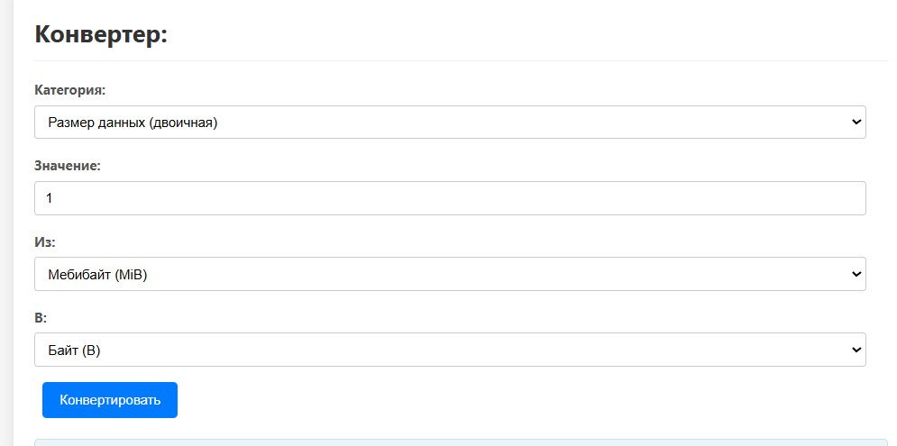

---

## Модификация Проекта: Сервис "Конвертер Единиц Измерения"

### 1. Общее описание и назначение сервиса

Сервис "Конвертер Единиц Измерения" интегрирован в "Мультисервисный веб-портал" для предоставления пользователям и внешним системам возможности выполнения конвертаций между различными единицами измерения. Поддерживаются следующие категории: длина, объем (метрическая система), размеры цифровых данных (в двоичной и десятичной системах).

**Ключевые возможности:**

*   Получение списка поддерживаемых категорий и единиц измерения.
*   Выполнение конвертации значения из одной указанной единицы в другую в рамках выбранной категории.

### 2. Архитектурные решения и хранение данных

*   **Бэкенд:** Реализован как часть основного Flask-приложения (`app.py`).
*   **Хранение данных о конвертациях:** Коэффициенты и формулы для конвертации определены статически в словаре `CONVERSION_RATES` внутри `app.py`. Каждая категория имеет базовую единицу, относительно которой задаются коэффициенты для других единиц, что упрощает алгоритм пересчета.
*   Для размеров данных реализовано раздельное хранение и конвертация для двоичной (KiB, MiB, основа 1024) и десятичной (KB, MB, и т. д.) систем.
*   **API:** Предоставляется RESTful API для взаимодействия.

### 3. Описание API-эндпоинтов

Все API-эндпоинты возвращают данные в формате JSON.

#### 3.1. Получение списка доступных единиц и категорий

*   **Эндпоинт:** `GET /api/converter/units`
*   **Метод HTTP:** `GET`
*   **Описание:** Возвращает структурированный список всех категорий измерений, поддерживаемых конвертером, и перечень единиц внутри каждой категории с их идентификаторами и человекочитаемыми названиями. Используется для динамического построения UI.
*   **Параметры запроса:** Отсутствуют.
*   **Тело ответа (Пример):**
    ```json
    {
      "category_names": {
        "length": "Длина",
        "volume_metric": "Объём (метрическая система)",
        "data_storage_binary": "Размер данных (двоичная, KiB, MiB)",
        "data_storage_decimal": "Размер данных (десятичная, KB, MB)"
      },
      "units_by_category": {
        "length": [
          {"id": "meter", "name": "Метр (м)"},
          {"id": "kilometer", "name": "Километр (км)"}
          // ... и другие единицы длины
        ],
        "data_storage_binary": [
          {"id": "byte", "name": "Байт (B)"},
          {"id": "kibibyte", "name": "Кибибайт (KiB)"}
          // ... и другие двоичные единицы
        ]
        // ... и другие категории с их единицами
      }
    }
    ```
*   **Возможные статус-коды ответа:**
    *   `200 OK`: Успешный запрос.

#### 3.2. Выполнение конвертации

*   **Эндпоинт:** `GET /api/converter/convert`
*   **Метод HTTP:** `GET`
*   **Описание:** Выполняет конвертацию заданного значения из одной единицы измерения в другую в пределах указанной категории.
*   **Параметры запроса (в URL):**
    *   `category` (string, обязательный): Идентификатор категории (например, `length`, `data_storage_binary`).
    *   `from_unit` (string, обязательный): Идентификатор исходной единицы (например, `meter`, `kibibyte`).
    *   `to_unit` (string, обязательный): Идентификатор целевой единицы (например, `foot`, `megabyte`).
    *   `value` (float/integer, обязательный): Числовое значение для конвертации.
*   **Тело ответа (Пример при успехе):**
    ```json
    {
        "original_value": 10.0,
        "original_unit_id": "meter",
        "original_unit_name": "Метр (м)",
        "converted_value": 32.808399, 
        "converted_unit_id": "foot",
        "converted_unit_name": "Фут (ft)",
        "category": "length"
    }
    ```
*   **Возможные статус-коды ответа:**
    *   `200 OK`: Конвертация успешно выполнена.
    *   `400 Bad Request`: Ошибка в параметрах запроса (отсутствуют обязательные параметры, неверный формат значения, неизвестная категория или единица измерения). Тело ответа будет содержать JSON с полем `"error"`.
    *   `500 Internal Server Error`: Внутренняя ошибка сервера при выполнении конвертации.

### 4. Пользовательский интерфейс (UI)

Для прямого взаимодействия с сервисом "Конвертер Единиц Измерения" разработана веб-страница `templates/service_converter.html`.

*   **Основные элементы UI:**
    1.  Выпадающий список для выбора **категории измерений**.
    2.  Два выпадающих списка для выбора **исходной и целевой единиц измерения**. Содержимое этих списков динамически обновляется JavaScript'ом на основе выбранной категории (данные для списков запрашиваются у эндпоинта `/api/converter/units`).
    3.  Поле для ввода **числового значения**, которое необходимо конвертировать.
    4.  Кнопка **"Конвертировать"**.
    5.  Область для **отображения результата** конвертации или сообщений об ошибках.

*   **Логика работы на клиенте (JavaScript):**
    *   При загрузке страницы выполняется запрос к `/api/converter/units` для получения списка категорий и единиц.
    *   При изменении выбранной категории списки доступных единиц для конвертации "Из" и "В" обновляются.
    *   При отправке формы конвертации данные из полей собираются, и формируется GET-запрос к `/api/converter/convert`.
    *   Полученный JSON-ответ отображается в специальной области на странице.
    *   Реализована базовая валидация вводимых данных на стороне клиента.



### 5. Зависимости (если есть новые)

*   Для реализации данного сервиса не потребовалось добавления новых внешних Python-библиотек, помимо стандартных для Flask-проекта. Вся логика конвертации реализована на чистом Python.

### 6. Замечания по реализации и возможные улучшения

*   Текущая реализация хранит коэффициенты конвертации непосредственно в коде `app.py`. Для большей гибкости и удобства администрирования в будущем эти данные могут быть вынесены в конфигурационный файл или базу данных.
*   Набор поддерживаемых категорий и единиц может быть расширен.
*   Можно добавить более сложную логику конвертации для единиц, требующих нелинейных преобразований (например, некоторые температурные шкалы, если не конвертировать через абсолютный ноль).

---