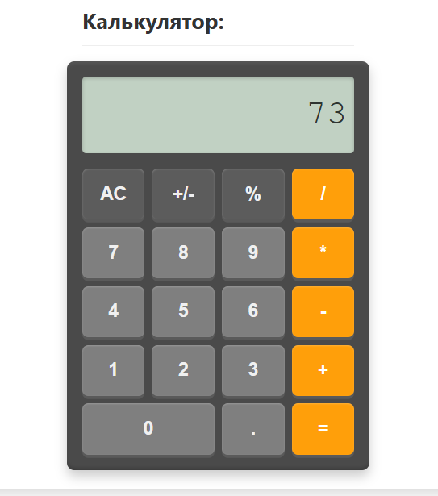
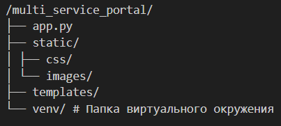

# Техническое руководство по созданию "Мультисервисного веб-портала" на Python и Flask

**Авторы:** [Мукабенов Дмитрий]
**Версия:** 1.0

## 1. Введение

Добро пожаловать в это пошаговое руководство, посвященное процессу исследования, проектирования и практической разработки "Мультисервисного веб-портала". В основе проекта лежат популярный язык программирования Python и легковесный, но гибкий микрофреймворк Flask. Создание данного портала осуществлялось в рамках проектной (учебной) практики, что позволило не только реализовать функциональный продукт, но и углубить понимание современных веб-технологий. Данное руководство сфокусировано именно на разработке самого веб-портала с его сервисами.

Мы живем в мире, где постоянно возникает потребность в быстрых и удобных онлайн-инструментах для решения самых разнообразных задач. Идея создания "Мультисервисного веб-портала" родилась как ответ на эту потребность – предложить пользователям единую точку доступа к набору полезных утилит, от простого списка дел до более специфических функций вроде сокращения ссылок или генерации данных. При этом, в ходе работы над проектом, особое внимание уделялось не только технической стороне, но и качеству пользовательского опыта, интуитивности интерфейсов и предоставлению понятной документации для разработчиков, которые захотят использовать API наших сервисов. Я стремился создать продукт, который был бы полезен самому широкому кругу пользователей.

### 1.1. Приветствие и основная задача настоящего руководства

Это руководство призвано стать вашим надежным проводником в мир создания веб-приложений с использованием Flask. Независимо от того, являетесь ли вы студентом, начинающим разработчиком или просто энтузиастом, желающим расширить свои навыки, здесь вы найдете структурированную информацию и практические шаги, необходимые для построения собственного "Мультисервисного веб-портала".


**Основная цель данного документа** – не просто предоставить набор инструкций, но и поделиться опытом, накопленным в процессе разработки. Мы детально рассмотрим каждый этап: от первоначальной идеи и исследования предметной области до написания кода, тестирования и размышлений о возможных направлениях дальнейшего развития. Я постарался сделать изложение максимально понятным, сопровождая его примерами кода и рекомендациями, которые помогут избежать распространенных ошибок.

Пройдя это руководство, вы сможете:
*   **Понять** принципы проектирования и разработки многостраничных веб-приложений на Flask.
*   **Научиться** создавать RESTful API для взаимодействия между клиентской и серверной частями приложения.
*   **Освоить** основы работы с HTML, CSS и JavaScript для создания интерактивных пользовательских интерфейсов.
*   **Создать** собственный работающий прототип мультисервисного веб-портала с шестью различными онлайн-инструментами.
*   **Получить** базу знаний и практический опыт, которые можно будет применять в ваших будущих проектах.

Мы последовательно рассмотрим выбор технологий, настройку рабочего окружения, создание базовой архитектуры приложения, реализацию каждого сервиса (как бэкенд, так и фронтенд), а также вопросы стилизации и тестирования.

### 1.2. Обзор создаваемой технологии

В результате прохождения данного руководства мы с вами создадим полноценный "Мультисервисный веб-портал". Это веб-приложение, доступное через браузер, которое будет предлагать пользователям набор из шести полезных онлайн-сервисов. Для каждого сервиса будет реализован как удобный графический пользовательский интерфейс (UI) для прямого использования, так и программный интерфейс приложения (API) для интеграции с другими системами или для использования разработчиками в своих целях.

Давайте кратко рассмотрим каждый из этих сервисов:

1.  **Список задач (To-Do List):** Классический, но всегда актуальный инструмент для управления личными делами. Позволит пользователям создавать задачи, просматривать их список, отмечать выполненные и удалять ненужные. **Именно этот сервис мы разберем наиболее подробно, шаг за шагом, от проектирования API до создания интерактивного пользовательского интерфейса, чтобы на его примере вы могли освоить все ключевые аспекты разработки на Flask.**

---

---

2.  **Сокращатель URL-адресов:** Утилита для превращения длинных и громоздких веб-ссылок в короткие и удобные для обмена. Будет поддерживать как создание коротких ссылок, так и редирект по ним.

---

---

3.  **Цитаты дня и Факты:** Небольшой сервис для поднятия настроения или расширения кругозора. Пользователи смогут получать случайную цитату (или интересный факт), а также просматривать конкретные записи по их идентификатору. API также позволит добавлять новые цитаты.

---

---

4.  **Каталог книг и фильмов:** Инструмент для тех, кто любит вести учет прочитанных книг и просмотренных фильмов. Сервис позволит добавлять новые элементы, просматривать всю коллекцию и фильтровать ее по различным критериям.

---

---

5.  **Простой онлайн-калькулятор:** Интерактивный калькулятор, имитирующий внешний вид и функциональность стандартного кнопочного калькулятора для выполнения базовых арифметических операций (+, -, \*, /).

---

---

6.  **Генератор случайных данных:** Полезный инструмент для разработчиков и не только. Позволит генерировать случайные целые числа в заданном диапазоне, а также создавать пароли различной длины с возможностью включения специальных символов.

---

---

Все эти сервисы будут интегрированы в единый веб-портал с общей навигацией, что обеспечит удобный доступ к любому из них Хотя мы детально сконцентрируемся на разработке "Списка задач", принципы и подходы, использованные при его создании, будут полностью применимы и к остальным пяти сервисам. Код для всех шести сервисов будет предоставлен, что позволит вам изучить их реализацию и, при желании, самостоятельно воспроизвести или модифицировать их по аналогии с разобранным примером.

### 1.3. Используемый стек технологий

Для успешной реализации "Мультисервисного веб-портала" был выбран набор проверенных и хорошо зарекомендовавших себя технологий. Принятие решения по стеку основывалось на нескольких ключевых факторах: доступность для освоения начинающими разработчиками, гибкость, наличие обширной документации и сообщества, а также соответствие учебным целям проектной практики.

*   **Бэкенд (серверная часть):**
    *   **Язык программирования Python:** Выбор Python в качестве основного языка для разработки серверной логики был продиктован его ясностью синтаксиса, что значительно облегчает чтение и написание кода, особенно для тех, кто только начинает свой путь в программировании. Богатая стандартная библиотека и огромное количество сторонних пакетов позволяют эффективно решать широкий круг задач. Кроме того, популярность Python в сферах веб-разработки и искусственного интеллекта делает полученные навыки особенно ценными.
    *   **Микрофреймворк Flask:** Для построения веб-приложения и API был выбран Flask. Его "микро" природа означает, что он предоставляет прочное ядро и базовую функциональность, оставляя разработчику свободу в выборе дополнительных инструментов и архитектурных решений. Это позволяет глубже понять принципы работы веб-приложений. Flask отлично подходит для быстрого прототипирования, создания легковесных API и является прекрасным выбором для учебных проектов благодаря своей простоте и отличной документации.

*   **Фронтенд (клиентская часть):**
    *   **HTML (HyperText Markup Language):** Используется для создания структуры и семантического каркаса всех веб-страниц портала. Я придерживался стандартов HTML5.
    *   **CSS (Cascading Style Sheets):** Отвечает за визуальное оформление, стилизацию и внешний вид элементов на страницах, обеспечивая приятный и единообразный пользовательский опыт.
    *   **JavaScript ("ванильный" JS):** Применяется для добавления интерактивности на клиентской стороне. Это включает обработку действий пользователя, асинхронные запросы к API (с использованием Fetch API) для обновления данных без перезагрузки страницы, и динамическое манипулирование элементами страницы (DOM). Решение использовать "чистый" JavaScript без крупных фреймворков было принято для более глубокого освоения фундаментальных веб-технологий.

*   **Шаблонизатор:**
    *   **Jinja2:** Мощный и гибкий шаблонизатор, тесно интегрированный с Flask. Jinja2 позволяет нам динамически генерировать HTML-страницы на сервере, вставляя данные из Python-кода в HTML-макеты, использовать наследование шаблонов для создания общего дизайна и применять управляющие конструкции (циклы, условия) прямо в HTML.

*   **Формат данных для API:**
    *   **JSON (JavaScript Object Notation):** Весь обмен данными между клиентской частью (JavaScript) и серверным API осуществляется в формате JSON. Этот формат был выбран благодаря его легковесности, простоте парсинга как на клиенте, так и на сервере, и широкому распространению в веб-разработке.

*   **Хранение данных:**
    *   **Временное хранение в оперативной памяти Python:** На текущем этапе разработки проекта, для максимального упрощения и фокусировки на основной логике веб-приложения и API, все данные сервисов (списки задач, URL-сокращения и т.д.) хранятся в глобальных переменных Python (списках и словарях) непосредственно в `app.py`. Важно понимать, что это решение **не подходит для производственного использования**, так как все данные будут теряться при каждом перезапуске сервера. В рамках учебного проекта это позволяет быстро прототипировать функциональность. *Для дальнейшего развития необходимо будет интегрировать полноценную базу данных (например, SQLite, PostgreSQL).*

---

## 2. Подготовка к разработке

Прежде чем погрузиться в написание кода, необходимо убедиться, что ваше рабочее место полностью готово. Правильная подготовка окружения — это первый и очень важный шаг к успешной разработке, который поможет избежать многих потенциальных проблем в будущем.

### 2.1. Необходимые инструменты и знания

Для комфортной и эффективной работы над созданием "Мультисервисного веб-портала" по данному руководству вам понадобится следующий набор программного обеспечения и определенный уровень начальных знаний.

*   **Программное обеспечение (инструменты):**
    1.  **Интерпретатор Python (версии 3.x):** Это основа нашего бэкенда. Убедитесь, что на вашем компьютере установлена одна из актуальных версий Python 3. (Подробности по установке будут ниже).
    2.  **Текстовый редактор или Интегрированная Среда Разработки (IDE):** Вам понадобится программа для написания и редактирования кода. Отличными вариантами для начинающих и опытных разработчиков являются:
        *   **Visual Studio Code (VS Code):** Бесплатный, мощный, с огромным количеством расширений для Python и веб-разработки.
        *   **PyCharm Community Edition:** Бесплатная версия популярной IDE от JetBrains, специально созданной для разработки на Python.
        *   Подойдут и другие редакторы, такие как Sublime Text, Atom, или даже более простые, если вы к ним привыкли.
    3.  **Современный веб-браузер:** Необходим для просмотра и тестирования вашего веб-приложения. Рекомендуются Google Chrome, Mozilla Firefox, Microsoft Edge или Safari. Важно, чтобы браузер имел встроенные инструменты разработчика (Developer Tools).
    4.  **Терминал (Командная строка / PowerShell):** Основной инструмент для выполнения команд, таких как запуск Python-скриптов, управление виртуальными окружениями и установка библиотек с помощью `pip`.

*   **Необходимые начальные знания и навыки:**
    Хотя это руководство ориентировано на начинающих, наличие базовых представлений в следующих областях существенно облегчит процесс обучения и разработки:
    1.  **Основы Python:** Понимание синтаксиса языка, работа с переменными, различными типами данных (строки, числа, списки, словари), написание функций, использование условных конструкций (`if/else`) и циклов (`for`, `while`).
    2.  **Базовое понимание HTML и CSS:** Знание основных HTML-тегов для структурирования контента и базовых CSS-селекторов и свойств для придания страницам минимального оформления. Глубокие знания здесь не требуются, так как будут предоставленны готовые стили, но понимание основ поможет.
    3.  **(Желательно, но не критично на старте) Начальные представления о JavaScript:** Если вы немного знакомы с тем, как JavaScript может изменять HTML-элементы на странице или отправлять запросы, это будет плюсом. Однако необходимые JS-концепции будут объяснены по ходу дела. Понимание того, как в целом работают веб-серверы и что такое HTTP-запросы, также будет полезным.

Если каких-то из этих знаний у вас пока нет, не переживайте! Данное руководство построено так, чтобы вы могли осваивать многие вещи на практике. Главное – ваше желание учиться и экспериментировать.


### 2.2. Установка Python

Первым и основополагающим шагом для разработки нашего веб-портала является установка интерпретатора языка Python на ваш компьютер. Мы будем использовать Python версии 3.x, так как он является текущим стандартом и обладает всеми необходимыми возможностями. Если Python у вас уже установлен, убедитесь, что его версия не слишком устаревшая (рекомендуется 3.7 или выше).

**Инструкция по загрузке и установке:**

1.  **Загрузка дистрибутива Python:**
    Наиболее надежный способ получить Python – загрузить его с официального веб-сайта.
    *   Перейдите по адресу: [https://www.python.org/downloads/](https://www.python.org/downloads/)
    *   Сайт автоматически определит вашу операционную систему и предложит наиболее подходящую версию для загрузки. Обычно это кнопка "Download Python X.Y.Z". Нажмите на нее, чтобы скачать установочный файл.

    

2.  **Процесс установки (с учетом особенностей ОС):**
    *   **Для Windows:** Запустите скачанный `.exe` файл. На первом экране установки **обязательно установите флажок "Add Python X.Y to PATH"**. Это позволит запускать Python и `pip` из командной строки из любой директории. Затем выберите "Install Now" для стандартной установки.
    *   **Для macOS:** Запустите скачанный `.pkg` файл и следуйте инструкциям установщика. Обычно PATH настраивается автоматически.
    *   **Для Linux:** Python 3 часто предустановлен. Если нет, используйте менеджер пакетов вашего дистрибутива (например, `sudo apt update && sudo apt install python3 python3-pip python3-venv` для систем на базе Debian/Ubuntu).

3.  **Важность добавления Python в PATH для Windows (подробнее):**
    Если при установке на Windows вы не отметили галочку "Add Python to PATH", операционная система не будет "знать", где находится исполняемый файл Python. В результате, при попытке ввести `python` в командной строке, вы получите ошибку "python не является внутренней или внешней командой...". Добавление Python в PATH решает эту проблему, делая Python доступным глобально. Если вы забыли это сделать, вам придется либо переустановить Python (самый простой путь для новичка), либо вручную редактировать системные переменные окружения PATH, что сложнее.

4.  **Проверка установки командами `python --version` и `pip --version`:**
    После установки откройте терминал (Командная строка, PowerShell, или Терминал в macOS/Linux) и выполните:
    ```bash
    python3 --version 
    # (или просто 'python --version', если python3 не является основной командой)
    pip3 --version
    # (или просто 'pip --version')
    ```
    Вы должны увидеть выведенные версии, подтверждающие успешную установку.

    

### 2.3. Настройка виртуального окружения

**Объяснение, зачем нужны виртуальные окружения:**

При работе над несколькими проектами на Python вы можете столкнуться с ситуацией, когда разные проекты требуют различных версий одних и тех же библиотек (пакетов). Если устанавливать все библиотеки глобально (в основную установку Python), это может привести к конфликтам версий: обновление библиотеки для одного проекта может "сломать" другой проект, который зависел от старой версии.

**Виртуальное окружение** решает эту проблему, создавая для каждого проекта изолированную среду. Внутри этой среды вы можете устанавливать любые необходимые пакеты конкретных версий, и они не будут пересекаться с пакетами других проектов или системной установкой Python. Это обеспечивает чистоту, воспроизводимость и предсказуемость рабочего окружения для каждого вашего проекта. Использование виртуальных окружений является стандартом и лучшей практикой в разработке на Python.

**Пошаговая инструкция по созданию и активации виртуального окружения:**

1.  **Создайте папку для вашего проекта** (если вы этого еще не сделали) и перейдите в нее с помощью терминала:
    ```bash
    mkdir multi_service_portal
    cd multi_service_portal
    ```

2.  **Создайте виртуальное окружение (`python -m venv venv`):**
    Находясь внутри директории вашего проекта, выполните команду:
    ```bash
    python3 -m venv venv
    # (Используйте `python` вместо `python3`, если ваша команда по умолчанию для Python 3 это `python`)
    ```
    *   `python3 -m venv`: Вызывает модуль `venv` из стандартной библиотеки Python.
    *   `venv` (последнее слово): Это имя папки, которая будет создана для вашего виртуального окружения. `venv` – это общепринятое стандартное имя, но вы можете выбрать и другое (например, `.venv`).
    В результате в папке вашего проекта появится новая директория `venv`, содержащая копию интерпретатора Python и необходимые файлы для окружения.

3.  **Активируйте виртуальное окружение:**
    Чтобы начать использовать виртуальное окружение, его необходимо активировать. Команда активации зависит от вашей операционной системы и используемой командной оболочки:
    *   **Windows (Командная строка - CMD):**
        ```batch
        venv\Scripts\activate.bat
        ```
    *   **Windows (PowerShell):**
        ```powershell
        venv\Scripts\Activate.ps1
        ```
        *Примечание для PowerShell:* Если вы получаете ошибку, связанную с политикой выполнения скриптов, возможно, потребуется временно изменить ее для текущего процесса: `Set-ExecutionPolicy Unrestricted -Scope Process`.
    *   **macOS и Linux (bash, zsh и аналогичные оболочки):**
        ```bash
        source venv/bin/activate
        ```
    После успешной активации вы заметите, что в начале вашей командной строки появился префикс с именем вашего виртуального окружения, обычно `(venv)`. Это верный признак того, что вы теперь работаете внутри изолированной среды.

    

Теперь любые пакеты, установленные с помощью `pip`, будут помещаться только в это активное виртуальное окружение. Чтобы выйти из виртуального окружения, достаточно ввести команду `deactivate`.

### 2.4. Установка Flask и необходимых библиотек

Теперь, когда наше виртуальное окружение подготовлено и активировано (в командной строке должен отображаться префикс, например, `(venv)`), мы можем установить ключевую библиотеку для нашего проекта – микрофреймворк Flask. Все последующие установки пакетов будут происходить именно в эту изолированную среду.

*   **Установка Flask командой `pip install Flask`:**
    Для установки Flask и его базовых зависимостей, выполните в вашем активном терминале следующую команду:
    ```bash
    pip install Flask
    ```
    Менеджер пакетов `pip` автоматически загрузит последнюю стабильную версию Flask из официального репозитория PyPI (Python Package Index) и установит ее в ваше виртуальное окружение.

*   **Краткое описание зависимостей Flask (Werkzeug и Jinja2):**
    Важно понимать, что при установке Flask вы получаете не только сам фреймворк, но и несколько критически важных для его работы библиотек, которые устанавливаются как его зависимости:
    *   **Werkzeug:** Это комплексная утилита WSGI (Web Server Gateway Interface), которая, по сути, является основой для Flask. Werkzeug предоставляет низкоуровневые инструменты для обработки HTTP-запросов и ответов, маршрутизации, отладки и многое другое. Flask элегантно абстрагирует многие из этих функций, делая их использование более удобным.
    *   **Jinja2:** Мощный и популярный шаблонизатор для Python. Flask использует Jinja2 для динамической генерации HTML-страниц. С его помощью мы сможем вставлять данные из нашего Python-кода в HTML-шаблоны, использовать управляющие конструкции (циклы, условия) и создавать переиспользуемые компоненты интерфейса.
    Также могут быть установлены другие вспомогательные пакеты, такие как `itsdangerous` (для безопасной сериализации данных) и `click` (для создания консольных команд, которые Flask использует).

На этом шаге подготовка программной среды для начала работы с Flask завершена.

---

## 3. Основы Flask: Создаем каркас приложения

С настроенным рабочим окружением и установленным Flask мы готовы приступить к созданию фундамента нашего "Мультисервисного веб-портала". Начнем с инициализации базового Flask-приложения и создания его основной структуры. Это будет отправной точкой, которую мы постепенно будем расширять, добавляя новые функции и сервисы.

### 3.1. Инициализация Flask-приложения (`app.py`)

Каждое Flask-приложение начинается с Python-скрипта, который создает экземпляр приложения Flask и определяет его поведение, такое как маршруты и обработчики запросов. Традиционно этот главный файл называют `app.py`.

*   **Создание файла `app.py`:**
    В корневой директории вашего проекта (например, `multi_service_portal/`), создайте новый текстовый файл и сохраните его под именем `app.py`.

*   **Минимальный код для запуска приложения:**
    Откройте созданный файл `app.py` в вашем текстовом редакторе или IDE и вставьте следующий базовый код:

    ```python
    # app.py - Минимальный стартовый код

    # Шаг 1: Импортируем класс Flask из библиотеки flask
    from flask import Flask

    # Шаг 2: Создаем экземпляр приложения Flask.
    # __name__ - это специальная переменная Python, которая получает имя текущего модуля.
    # Flask использует это значение, чтобы определить корень приложения, что важно для
    # поиска ресурсов, таких как шаблоны и статические файлы.
    app = Flask(__name__)

    # Шаг 3: Определяем маршрут (URL) и функцию-обработчик для него.
    # Декоратор @app.route('/') связывает корневой URL-путь сайта ("/")
    # с функцией, идущей следом (в данном случае, home_page).
    @app.route('/')
    def home_page():
        """Эта функция будет вызываться, когда пользователь откроет главную страницу."""
        return "Привет от нашего первого Flask-приложения!"

    # Шаг 4: Блок для запуска сервера разработки.
    # Эта стандартная конструкция Python if __name__ == '__main__': гарантирует,
    # что сервер будет запущен только тогда, когда этот скрипт app.py
    # выполняется напрямую (а не импортируется как модуль в другой скрипт).
    if __name__ == '__main__':
        # app.run() запускает встроенный в Flask сервер разработки.
        # host='127.0.0.1' (или 'localhost'): Сервер будет доступен только с вашего компьютера.
        # port=5001: Указывает порт, на котором сервер будет "слушать" запросы.
        # debug=True: Включает режим отладки. Это очень удобно для разработки:
        #             - При возникновении ошибок вы увидите подробную информацию в браузере.
        #             - Сервер будет автоматически перезагружаться при внесении изменений в код.
        #             ВАЖНО: Никогда не используйте debug=True в производственной (боевой) среде!
        app.run(host='127.0.0.1', port=5001, debug=True)
    ```

    **Разбор кода:**
    Этот простой скрипт уже является полноценным, хотя и минималистичным, веб-приложением.
    *   Сначала мы импортируем необходимый класс `Flask`.
    *   Затем создаем его экземпляр, который и будет нашим приложением `app`.
    *   Декоратор `@app.route('/')` определяет, что функция `home_page()` будет обрабатывать запросы к корневому пути сайта (например, `http://127.0.0.1:5001/`).
    *   Функция `home_page()` просто возвращает текстовую строку, которая будет отображена в браузере.
    *   Конструкция `if __name__ == '__main__':` и вызов `app.run()` запускают сервер.

*   **Инструкция по первому запуску и проверке в браузере:**
    1.  Убедитесь, что ваше виртуальное окружение активировано.
    2.  В терминале, находясь в корневой папке проекта (где лежит `app.py`), выполните команду:
        ```bash
        python app.py
        ```
    3.  В выводе терминала вы должны увидеть сообщения, похожие на:
        ```
         * Serving Flask app 'app' (lazy loading)
         * Environment: development
         * Debug mode: on
         * Running on http://127.0.0.1:5001 (Press CTRL+C to quit)
         * Restarting with stat
         * Debugger is active!
         * Debugger PIN: XXX-XXX-XXX 
        ```
        Это означает, что ваш веб-сервер запущен и готов принимать запросы.

    4.  Откройте ваш веб-браузер и перейдите по адресу `http://127.0.0.1:5001/`. Вы должны увидеть на странице текст: "Привет от нашего первого Flask-приложения!".

    

Поздравляем! Вы только что создали и запустили свое первое веб-приложение на Flask. Это основа, на которой мы будем строить наш многосервисный портал.

### 3.2. Структура проекта: папки `static` и `templates`

Для того чтобы наше Flask-приложение было хорошо организовано и фреймворк мог автоматически находить необходимые ему файлы, принято использовать стандартную структуру директорий. Ключевыми здесь являются папки `static` для статических ресурсов и `templates` для HTML-шаблонов.

*   **Объяснение назначения папок:**
    1.  **`templates/`**: Эта директория предназначена для хранения всех ваших HTML-файлов, которые будут обрабатываться шаблонизатором Jinja2. Когда вы в Python-коде вызываете функцию `render_template('имя_файла.html')`, Flask по умолчанию ищет этот HTML-файл именно в папке `templates`. Это позволяет отделить логику представления (HTML) от основной логики приложения (Python).
    2.  **`static/`**: В этой папке размещаются статические файлы, то есть те файлы, которые передаются клиенту (браузеру) без какой-либо серверной обработки. К таким файлам относятся:
        *   **Таблицы стилей CSS** (определяют внешний вид страниц).
        *   **Клиентские JavaScript-файлы** (отвечают за интерактивность в браузере, если вы выносите их из HTML).
        *   **Изображения** (логотипы, иконки, иллюстрации).
        *   Другие ресурсы, такие как шрифты, видео- или аудиофайлы, если они используются на сайте.
        Flask настроен так, что содержимое папки `static` доступно в веб по специальному URL (обычно `/static/...`).

*   **Инструкция по созданию папок:**
    1.  Убедитесь, что вы находитесь в **корневой директории вашего проекта** (например, `multi_service_portal/`, там же, где расположен файл `app.py`).
    2.  Создайте папку `templates`:
        ```bash
        # В терминале, находясь в корне проекта
        mkdir templates
        ```
    3.  Создайте папку `static`:
        ```bash
        mkdir static
        ```
    4.  Для лучшей организации внутри папки `static` рекомендуется сразу создать подпапки для различных типов статических файлов:
        ```bash
        # Переходим в папку static
        cd static
        # Создаем подпапки
        mkdir css
        mkdir images
        # mkdir js (если планируете отдельные js файлы)
        # Возвращаемся в корень проекта (если нужно)
        cd .. 
        ```

    После выполнения этих шагов ваша файловая структура примет более организованный вид, готовый к добавлению HTML-шаблонов и статических ресурсов.

    

### 3.3. Настройка конфигурации и контекстного процессора в `app.py`

Прежде чем мы углубимся в создание страниц и сервисов, давайте внесем несколько полезных настроек в наш основной файл `app.py` и познакомимся с такой удобной функцией Flask, как контекстные процессоры.

*   **Добавление конфигурационных параметров:**
    Flask-приложение можно настраивать с помощью словаря `app.config`. Мы добавим две полезные опции, связанные с обработкой JSON:
    1.  `app.config['JSON_AS_ASCII'] = False`: По умолчанию Flask при генерации JSON-ответов с помощью `jsonify` экранирует все не-ASCII символы (например, кириллицу) в формат `\uXXXX`. Установка этой опции в `False` заставит Flask выводить такие символы как есть, что делает JSON-ответы более читаемыми, особенно при работе с русским языком.
    2.  `app.config['JSONIFY_PRETTYPRINT_REGULAR'] = True`: Эта опция включает "красивый" (отформатированный с отступами и переносами строк) вывод JSON, когда приложение работает не в режиме отладки (`debug=False`). В режиме отладки (`debug=True`) JSON по умолчанию и так форматируется. Это полезно для анализа API-ответов.

*   **Добавление контекстного процессора для `current_year`:**
    Контекстный процессор во Flask – это функция, которая выполняется автоматически перед рендерингом каждого шаблона и имеет возможность "внедрить" переменные в контекст всех шаблонов. Это очень удобно для данных, которые должны быть доступны глобально на всех страницах сайта, например, текущий год для отображения в подвале.
    Мы создадим контекстный процессор, который будет добавлять переменную `current_year` в контекст.

*   **Пример кода (обновленный `app.py` с этими дополнениями):**
    Откройте ваш `app.py` и модифицируйте его следующим образом (или убедитесь, что эти строки уже есть):

    ```python
    # app.py
    import datetime # Необходим для получения текущего года
    from flask import render_template

    app = Flask(__name__)

    # --- Настройки конфигурации приложения ---
    app.config['JSON_AS_ASCII'] = False 
    app.config['JSONIFY_PRETTYPRINT_REGULAR'] = True

    # --- Контекстный процессор ---
    @app.context_processor
    def inject_global_template_vars():
        """
        Эта функция будет вызываться перед рендерингом каждого шаблона.
        Словарь, который она возвращает, будет объединен с контекстом шаблона.
        Таким образом, переменная 'current_year' станет доступна во всех шаблонах.
        """
        return {'current_year': datetime.datetime.now().year}

    # --- Базовые маршруты (могут быть расширены позже) ---
    @app.route('/')
    def home_page():
        """Обработчик для главной страницы."""
        # В следующих шагах мы будем использовать render_template здесь
        return "Наш Flask-сервер настроен и работает!"

    # (Добавьте здесь другие базовые маршруты, если они уже есть, например, для /services)

    if __name__ == '__main__':
        app.run(host='127.0.0.1', port=5001, debug=True)
    ```

    **Что мы сделали:**
    *   Импортировали модуль `datetime`.
    *   Добавили строки с `app.config` после инициализации `app`.
    *   Определили функцию `inject_global_template_vars` и декорировали ее `@app.context_processor`. Теперь в любом нашем Jinja2-шаблоне мы сможем использовать конструкцию `{{ current_year }}` для вывода текущего года (например, в подвале сайта в `layout.html`).

Эти предварительные настройки и структурирование проекта подготовят нас к более сложным задачам по созданию макетов страниц и реализации функциональности сервисов.

---

## 4. Разработка пользовательского интерфейса: Макет и главные страницы

После того как мы заложили фундамент нашего Flask-приложения, настроили базовую конфигурацию и создали необходимую структуру папок, пришло время заняться видимой частью нашего портала – пользовательским интерфейсом. На этом этапе мы создадим общий макет для всех страниц сайта, чтобы обеспечить единообразие внешнего вида, а затем разработаем главную страницу, которая будет приветствовать наших пользователей.

### 4.1. Базовый макет (`layout.html`)

В большинстве веб-проектов есть элементы, которые повторяются на каждой (или почти каждой) странице: шапка сайта с логотипом и навигацией, подвал с контактной информацией и копирайтами, общее подключение стилей и скриптов. Чтобы не копировать этот код из страницы в страницу, используется концепция **базового шаблона (макета)** и **наследования шаблонов**.

*   **Объяснение роли базового шаблона и наследования в Jinja2:**
    Шаблонизатор Jinja2, который используется во Flask, предоставляет мощный механизм наследования. Мы создаем один основной HTML-файл (`layout.html` в нашем случае), который определяет общую структуру страницы и содержит специальные **блоки** (``). Другие, более конкретные шаблоны (например, для главной страницы, страницы сервиса), могут "наследовать" этот базовый макет и **переопределять** (заполнять своим уникальным содержимым) эти блоки. Это позволяет поддерживать консистентный дизайн на всем сайте и легко вносить изменения в общие элементы, отредактировав всего один файл.

*   **Пошаговое создание `templates/layout.html`:**
    1.  В ранее созданной директории `templates/` создайте новый файл с именем `layout.html`.
    2.  Откройте этот файл и вставьте в него HTML-код, который будет определять структуру вашей общей страницы.

*   **Разбор структуры `layout.html` и блоков Jinja2:**
    Ниже приведен код нашего `layout.html` с пояснениями его ключевых частей.

    *Пример кода: (Полный код `templates/layout.html`)*
    ```html
    <!-- templates/layout.html -->
    <!DOCTYPE html>
    <html lang="ru">
    <head>
        <meta charset="UTF-8">
        <meta name="viewport" content="width=device-width, initial-scale=1.0">
        <!-- 1. Блок для заголовка страницы в теге <title> -->
        <title>Мультисервисный Портал по Умолчанию - Название Вашего Проекта</title>
        
        <!-- 2. Подключение основного файла стилей CSS -->
        <link rel="stylesheet" href="{{ url_for('static', filename='css/style.css') }}">
        
        <!-- 3. Подключение иконки сайта (favicon) -->
        <link rel="icon" href="{{ url_for('static', filename='images/home-button.png') }}"> 
    </head>
    <body>
        <header>
            <nav>
                <div class="nav-left">
                    <!-- 4. Ссылка на главную страницу с использованием url_for -->
                    <a href="{{ url_for('home_page') }}" id="home-link">
                        
                    </a>
                </div>
                <div class="nav-center">
                    <!-- 5. Блок для отображаемого заголовка в шапке (может отличаться от <title>) -->
                    <h1>Наш Портал</h1>
                </div>
                <div class="nav-right">
                    <!-- 6. Ссылка на страницу со списком сервисов -->
                    <a href="{{ url_for('list_all_services_page') }}">Сервисы</a>
                    <a href="#footer-contacts">Контакты</a> {# Якорная ссылка на подвал #}
                </div>
            </nav>
        </header>
    
        <main>
            <!-- 7. Основной блок, куда будет вставляться уникальный контент каждой страницы -->
            
                <p>Это содержимое по умолчанию. Если дочерний шаблон не переопределит блок content, будет показан этот текст.</p>
            
        </main>
    
        <footer id="footer-contacts">
            <h2>Контакты</h2>
            <!-- Ваши реальные контактные данные -->
            <p>Telegram: <a href="https://t.me/dontopentheboxx" target="_blank">@dontopentheboxx</a></p>
            <p>GitHub: <a href="https://github.com/a1lock" target="_blank">a1lock</a></p>
            <p>Email: <a href="mailto:a1lockteam@a1l.com">a1lockteam@a1l.com</a></p>
            <p>Телефон: +7 (800) 555-35-35</p>
            <!-- 8. Блок для года, использующий переменную из контекстного процессора -->
            <p>© {{ current_year }} Ailock team corp./a1l. Все права защищены.</p>
        </footer>
    </body>
    </html>
    ```
    **Объяснение ключевых элементов:**
    1.  **``:** Этот блок определяет место, где дочерние шаблоны могут указать свой уникальный заголовок страницы (тот, что отображается во вкладке браузера). Если дочерний шаблон не переопределит его, будет использовано значение по умолчанию ("Мультисервисный Портал по Умолчанию").
    2.  **`url_for('static', filename='css/style.css')`:** Функция Flask (и Jinja2), которая генерирует правильный URL-путь к статическим файлам, находящимся в папке `/static`. Это гарантирует, что ссылки на CSS и изображения будут работать корректно, независимо от того, как настроено ваше приложение или где оно развернуто.
    3.  Ссылка на `favicon`: Аналогично стилям, путь к иконке сайта также генерируется через `url_for`. Убедитесь, что файл `home-button.png` (или ваша иконка) находится в `static/images/`.
    4.  **`url_for('home_page')`** и **`url_for('list_all_services_page')`:** Эти вызовы генерируют URL-адреса для навигационных ссылок. Вместо того чтобы жестко кодировать пути (например, `/` или `/services`), мы используем имя функции-обработчика маршрута из нашего `app.py` (например, `home_page` или `list_all_services_page`). Это делает ссылки более устойчивыми к изменениям: если вы решите изменить сам URL-путь в `@app.route`, вам не придется исправлять его во всех шаблонах, достаточно, чтобы имя функции осталось тем же.
    5.  **``:** Позволяет дочерним страницам устанавливать свой собственный заголовок, который будет отображаться непосредственно в шапке сайта.
    6.  Якорная ссылка `#footer-contacts`: Простой способ сделать быструю навигацию к подвалу страницы. `id="footer-contacts"` должен быть у элемента `<footer>`.
    7.  **``:** Это сердце нашего макета. Каждая уникальная страница сайта будет переопределять этот блок, вставляя в него свое основное содержимое.
    8.  **`{{ current_year }}`:** Эта переменная становится доступной благодаря контекстному процессору `inject_global_template_vars`, который мы определили в `app.py`. Она автоматически подставит текущий год.


### 4.2. Главная страница (`index.html`)

Теперь, когда у нас есть надежный фундамент в виде `layout.html`, мы можем приступить к созданию контента для нашей главной страницы. Это первая страница, которую увидит посетитель, поэтому важно сделать ее информативной и привлекательной.

*   **Создание `templates/index.html`:**
    Внутри вашей папки `templates/` создайте новый файл с именем `index.html`.

*   **Объяснение, как `index.html` наследует `layout.html` (``):**
    Ключевым моментом здесь является наследование. Файл `index.html` не будет содержать всей HTML-разметки заново. Вместо этого, он "скажет" Jinja2, что хочет использовать `layout.html` как свою основу, а затем просто определит, какой контент нужно вставить в изменяемые блоки (такие как `title` и `content`).
    Это делается с помощью директивы `` в самой первой строке шаблона.

*   **Как переопределять блоки (title, header_title, content):**
    После строки `` вы можете переопределить любой блок, объявленный в `layout.html`, используя синтаксис ` ... Ваш уникальный контент ... `.

*   **Наполнение контентом:**
    Ниже приведен полный код для `templates/index.html`. Он включает текст, который мы ранее "очеловечивали" и обсуждали.

    *Пример кода: (Полный код `templates/index.html`)*
    ```html
    <!-- templates/index.html -->
    

    Главная | Мультисервисный Портал Онлайн-Инструментов

    
        Добро пожаловать на наш Портал!
    

    
    <section class="hero">
        <h2>Откройте для себя мир удобных онлайн-инструментов!</h2>
        <p>
            Добро пожаловать на наш портал – вашу новую универсальную платформу, 
            где собраны самые разнообразные и полезные онлайн-сервисы. 
            Мы создали это место, чтобы вам больше не приходилось тратить время на 
            поиск нужных инструментов на десятках разных сайтов. Нужно ли вам упорядочить задачи, 
            сократить длинную ссылку, найти вдохновение для нового проекта или 
            просто что-то быстро посчитать – все необходимое уже здесь, под рукой!
        </p>
        <h3>Ключевые возможности нашего портала:</h3>
        <ul>
            <li><strong>Всегда что-то найдется:</strong> Наш арсенал включает как простые утилиты для повседневных мелочей, так и более продвинутые инструменты, призванные сделать вашу цифровую жизнь проще и продуктивнее.</li>
            <li><strong>Просто и понятно:</strong> Мы постарались сделать интерфейс интуитивным, а описание каждого API – максимально ясным. Вы сможете легко использовать наши сервисы напрямую или быстро интегрировать их в свои проекты.</li>
            <li><strong>Для всех и каждого:</strong> Если вы разработчик, наши API уже готовы к работе. А если вы просто пользователь, для многих сервисов уже есть или скоро появятся удобные веб-интерфейсы, чтобы вы могли пользоваться ими без лишних сложностей.</li>
            <li><strong>Растем и развиваемся:</strong> Мы не останавливаемся на достигнутом! Наша команда постоянно работает над расширением списка сервисов, добавляя новые полезные и интересные инструменты.</li>
            <li><strong>Открытость и честность:</strong> Многие базовые функции наших сервисов доступны совершенно бесплатно. А если вам понадобится что-то большее, условия расширенного использования всегда будут прозрачными и понятными.</li>
        </ul>
        <p>
            Окунитесь в мир, где технологии работают на вас, делая задачи проще, 
            а идеи – ближе к реализации. Начните свое путешествие по нашим сервисам 
            прямо сейчас и оцените все преимущества сами!
        </p>
        <div class="cta-buttons">
            <a href="{{ url_for('list_all_services_page') }}" class="btn btn-primary">Посмотреть все сервисы</a> 
            <a href="#footer-contacts" class="btn btn-secondary">Связаться с нами</a>
        </div>
    </section>
    
    ```

*   **Обновление маршрута `/` в `app.py` (`home_page`) для рендеринга `index.html`:**
    Убедитесь, что ваша функция `home_page` в `app.py` теперь вызывает `render_template` для этого нового файла. Переменная `page_title`, которую мы передаем, может использоваться для установки `<title>` или других целей, если бы мы ее явно не переопределили в `index.html` (хотя мы переопределили).

    *Пример кода: (Код обновленного маршрута `home_page` в `app.py`)*
    ```python
    # app.py
    # ... (импорты, app, context_processor и другие маршруты)
    from flask import (
        Flask,
        jsonify,
        redirect,
        render_template,
        request,
        url_for,
    )

    @app.route('/')
    def home_page():
        """Отображает главную (лендинговую) страницу сайта."""
        # Можно передать в шаблон дополнительный заголовок, если это нужно где-то еще в layout,
        # но  в index.html его переопределит для тега <title>.
        # page_specific_title_for_context = 'Добро пожаловать на МногоСервисПроект!'
        return render_template('index.html') # page_title можно не передавать, т.к. title определен в index.html
    ```
    После сохранения изменений в `app.py` и `index.html`, перезапустите ваш Flask-сервер (если он не перезапустился автоматически в режиме отладки). Теперь, открыв главную страницу (`http://127.0.0.1:5001/`) в браузере, вы должны увидеть отрендеренный контент из `index.html`, встроенный в общую структуру `layout.html`.

**(Иллюстрация: Скриншот итоговой главной страницы, как она выглядит в браузере)**
    

### 4.3. Страница со списком сервисов (`services.html`)

После того как мы создали главную страницу, логичным следующим шагом будет разработка страницы, которая станет своего рода "витриной" для всех инструментов нашего портала. Это страница "Сервисы", откуда пользователи смогут легко переходить к интересующей их утилите. Мы отобразим каждый сервис в виде информативного виджета или карточки.

*   **Создание `templates/services.html`:**
    В вашей директории `templates/` создайте новый HTML-файл с именем `services.html`. Как и главная страница, он будет наследовать общий макет `layout.html`.

*   **Принцип работы: получение списка сервисов из `app.py` и их отображение в цикле:**
    Эта страница будет динамической. Информация о каждом сервисе (его название, описание и ссылка на его страницу) не будет жестко закодирована в HTML. Вместо этого, Python-функция в `app.py`, отвечающая за этот маршрут, будет формировать список словарей, где каждый словарь описывает один сервис. Этот список затем передается в шаблон `services.html`. В шаблоне, с помощью цикла Jinja2 (``), мы пройдемся по этому списку и для каждого элемента сгенерируем соответствующий HTML-код (карточку сервиса).

*   **Пример кода (`templates/services.html`):**
    Ниже приведен код для `services.html`, который отображает переданный список сервисов в виде сетки.

    ```html
    

    Наши сервисы

    Выберите сервис

    
    <section class="services-grid">
        
            
            <a href="{{ service.url }}" class="service-widget">
                <h3>{{ service.name }}</h3>
                <p>{{ service.description }}</p>
            </a>
            
        
            <p>Извините, на данный момент доступных сервисов нет.</p>
        
    </section>
    
    ```
    **Ключевые моменты:**
    *   Наследование от `layout.html`.
    *   Ожидает переменную `services` (список словарей).
    *   Цикл `` создает HTML-блок для каждого сервиса.
    *   `service.url`, `service.name`, `service.description` – это ключи из словарей, которые мы будем формировать в `app.py`.
    *   Классы `.services-grid` и `.service-widget` используются для стилизации (их описание есть в вашем `style.css`).

*   **Реализация маршрута `/services` в `app.py` (`list_all_services_page`):**
    Теперь необходимо убедиться, что в вашем `app.py` есть функция, которая обрабатывает URL `/services`, готовит данные о сервисах и передает их в наш новый шаблон.

    *Пример кода (фрагмент `app.py` для маршрута `/services`):*
    ```python
    @app.route('/services')
    def list_all_services_page(): # Описательное имя
        """Отображает страницу со списком всех доступных на сайте сервисов."""
        # Список сервисов, который будет передан в шаблон для генерации виджетов.
        # Используем url_for для построения URL – это гарантирует, что ссылки
        # останутся рабочими даже если мы изменим пути в @app.route.
        services_summary = []
        return render_template('services.html', services=services_summary, page_title="Наши онлайн-сервисы")
    ```
    Функция `url_for()` здесь играет ключевую роль, динамически генерируя правильные ссылки на страницы отдельных сервисов.

*   **(Иллюстрация: Скриншот страницы "Сервисы" с виджетами)**


---

#### 4.4.1. Страница "Сервисы" (`services.html`) - отображение доступных инструментов

Эта страница необходима, чтобы пользователи могли легко увидеть все предлагаемые порталом утилиты и перейти к интересующей.

*   **Создание HTML-шаблона (`templates/services.html`):**
    В директории `templates/` создайте файл `services.html`. Он будет наследовать `layout.html` и динамически отображать список сервисов.

    *Пример кода (`templates/services.html`):*
    ```html
    

    Наши сервисы

    Выберите сервис

    
    <section class="services-grid">
        
            
            <a href="{{ service.url }}" class="service-widget">
                <h3>{{ service.name }}</h3>
                <p>{{ service.description }}</p>
            </a>
            
        
            <p>Извините, на данный момент доступных сервисов нет.</p>
        
    </section>
    
    ```
    Шаблон ожидает переменную `services` (список словарей) и в цикле Jinja2 создает карточку для каждого сервиса, используя ключи `url`, `name` и `description`.

*   **Реализация маршрута `/services` в `app.py` (`list_all_services_page`):**
    Эта функция в `app.py` будет готовить данные о сервисах и передавать их в шаблон.

    *Пример кода (фрагмент `app.py`):*
    ```python
    @app.route('/services')
    def list_all_services_page(): # Описательное имя
        """Отображает страницу со списком всех доступных на сайте сервисов."""
        # Список сервисов, который будет передан в шаблон для генерации виджетов.
        # Используем url_for для построения URL – это гарантирует, что ссылки
        # останутся рабочими даже если мы изменим пути в @app.route.
        services_summary = [
            {"name": "Список задач (To-Do List)", "url": url_for('service_todo_page'), "description": "Ваш личный менеджер задач. Создавайте, отслеживайте и достигайте целей"}
        ]
        return render_template('services.html', services=services_summary, page_title="Наши онлайн-сервисы")
    ```
    *   **Пояснение по `name` и `description`:** Поля `"name"` и `"description"` в словаре `services_summary` используются непосредственно в шаблоне `services.html` для отображения названия и краткого описания сервиса на его карточке-виджете. Это помогает пользователю понять назначение каждого инструмента. Поле `"url"` содержит ссылку на страницу этого сервиса, сгенерированную `url_for()`.

#### 4.4.2. Страница первого сервиса: "Список Задач" (`service_todo.html`)

Чтобы ссылка на "Список Задач" со страницы `/services` куда-то вела, нам необходимо создать страницу для самого этого сервиса. На этой странице мы позже разместим и документацию по API, и интерактивный интерфейс.

*   **Создание HTML-шаблона (`templates/service_todo.html`):**
    Создайте этот файл в папке `templates/`. На данном этапе он может быть достаточно простым, просто чтобы обозначить страницу. Позже мы его наполним.

    ```html
    

    {{ service_data.name if service_data else "Список Задач"}}
    {{ service_data.name if service_data else "Список Задач (To-Do List)" }}

    
    <section class="service-description-page">
        <h2>Сервис: {{ service_data.name if service_data else "Список Задач" }}</h2>
        
        <p class="service-intro">{{ service_data.intro }}</p>
        

        <h3>Описание API эндпоинтов (для разработчиков):</h3>
        
        <div class="api-endpoints">
            
            <div class="endpoint-card">
                <h4><code>{{ endpoint.method }} {{ endpoint.path }}</code></h4>
                <p>{{ endpoint.description }}</p>
                
                <p><strong>Пример тела запроса (JSON):</strong></p>
                <pre><code class="language-json">{{ endpoint.example_request | tojson(indent=2) if endpoint.example_request is mapping else endpoint.example_request }}</code></pre>
                
            </div>
            
        </div>
        <p>Описание API не добавлено.</p>
    </section>

    <hr class="separator"> 

    <section class="interactive-todo">
        <h2>Ваш список задач:</h2>

        <div class="todo-form-container">
            <h3>Добавить новую задачу:</h3>
            <form id="addTaskForm">
                <input type="text" id="taskText" name="taskText" placeholder="Введите текст задачи..." required>
                <button type="submit" class="btn btn-add">Добавить задачу</button>
            </form>
            <p id="form-message" class="form-message"></p>
        </div>

        <h3>Текущие задачи:</h3>
        <ul id="taskList" class="task-list">
            <li class="no-tasks-message">Загрузка задач...</li>
        </ul>
    </section>
    
    ```
*   **Ключевые элементы доп HTML-разметки(section class="interactive-todo"):**
    1.  **Форма для добавления задачи:** Поле ввода текста (`<input type="text">`) и кнопка "Добавить задачу" (`<button type="submit">`). Форме присвоим `id="addTaskForm"`.
    2.  **Область для сообщений:** Параграф (`<p>`) с `id="form-message"` для отображения сообщений об успехе или ошибках при добавлении задачи.
    3.  **Список задач:** Неупорядоченный список (`<ul>`) с `id="taskList"`, куда JavaScript будет динамически добавлять элементы задач (`<li>`).
    4.  **Заглушка для пустого списка:** Элемент `<li>` с классом `no-tasks-message`, который будет отображаться, если задач нет, или во время первоначальной загрузки.

*   **Реализация маршрута `/service/todo` в `app.py` (`service_todo_page`):**
    Теперь добавим в `app.py` функцию, которая будет обрабатывать URL `/service/todo` и рендерить наш новый шаблон `service_todo.html`.

    *Пример кода (фрагмент `app.py`):*
    ```python
    @app.route('/service/todo')
    def service_todo_page():
        """Отображает интерактивную страницу для сервиса 'Список Задач' и документацию по его API."""
        service_page_data = {
            "name": "Список задач (To-Do List)",
            "intro": "Наш 'Список задач' поможет вам легко навести порядок в делах! Добавляйте новые задачи всего в пару кликов, просматривайте то, что актуально сейчас, отмечайте выполненное и с чувством удовлетворения удаляйте завершенные дела. Вы можете удобно работать со своими задачами прямо на этой странице, используя интерактивный интерфейс ниже. А если вы разработчик, наш API готов к интеграции с вашими приложениями.",
            "page_url_name": "service_todo_page", # Может использоваться для активной навигации
            "endpoints": [
                    # На этом этапе эндпоинты могут быть еще не полностью определены
                    # или вы можете добавить заглушки, если API еще не спроектирован.
                    # Пример того, как это будет выглядеть позже:
                    # {"method": "POST", "path": "/api/tasks", "description": "Создать новую задачу."}
            ]
        }
        return render_template('service_todo.html', service_data=service_page_data, page_title=service_page_data["name"])
    ```
    **Пояснение:** Функция `service_todo_page` готовит словарь `service_page_data`, который содержит название и вступительный текст для страницы. Это позволяет нам использовать одни и те же переменные (`service_data.name`, `service_data.intro`) в шаблоне, даже если позже мы будем передавать туда больше информации (например, список API-эндпоинтов для документации).

После выполнения этих шагов, при переходе на страницу `/services`, вы увидите карточку "Списка Задач". Кликнув на нее, вы должны будете попасть на страницу `/service/todo`, которая покажет базовую информацию о сервисе. Это закладывает основу для дальнейшего наполнения этой страницы API-документацией и интерактивным UI.

**(Иллюстрация: Скриншот страницы "/service/todo" в ее начальном виде)**
    


## 5. Реализация сервисов: Бэкенд (API)

Теперь, когда у нас есть основной каркас сайта, включая главную страницу и страницу со списком сервисов, мы можем приступить к самому интересному – реализации функциональности каждого из шести запланированных онлайн-инструментов. Для каждого сервиса мы сначала разработаем **серверную часть (бэкенд)**, которая будет включать в себя **API (Application Programming Interface – программный интерфейс приложения)**.

Создание API – это ключевой этап, поскольку именно через API наш фронтенд (JavaScript в браузере пользователя), а в будущем, возможно, и другие внешние приложения, смогут взаимодействовать с логикой наших сервисов: запрашивать данные, создавать новые записи, обновлять или удалять существующие.

Мы будем придерживаться принципов **RESTful API**, что означает:
*   Каждая сущность или набор данных будет рассматриваться как **ресурс**, доступный по уникальному URL.
*   Для взаимодействия с этими ресурсами мы будем использовать стандартные **HTTP-методы** (GET, POST, PUT, DELETE), каждый из которых несет определенную семантическую нагрузку (получение, создание, обновление, удаление).
*   Данные между клиентом и сервером будут передаваться в формате **JSON**, который является легковесным и широко распространенным стандартом.
*   Сервер будет возвращать осмысленные **HTTP-статус коды**, информирующие клиента о результате выполнения запроса.

В следующих подразделах мы пошагово реализуем API для каждого сервиса, начиная с нашего первого инструмента – "Списка Задач".

**(Иллюстрация: Общая схема работы API (может быть упрощенной версией "запрос-ответ" из раздела 2.3 или новая, акцентирующая внимание на JSON и HTTP-методах))**
*   *Предлагаемое описание:* "Упрощенная диаграмма, иллюстрирующая основной принцип взаимодействия с API нашего портала: Клиент (например, JavaScript на странице сервиса) отправляет HTTP-запрос с JSON-данными (для POST/PUT) на определенный API-эндпоинт. Flask-сервер обрабатывает запрос, выполняет соответствующую логику и возвращает JSON-ответ вместе со статус-кодом HTTP."
    

### 5.1. Сервис "Список Задач (To-Do List)" - API

Начнем реализацию API нашего портала с одного из наиболее востребованных и наглядных инструментов – "Списка Задач". Этот сервис позволит пользователям эффективно управлять своими делами, а его API станет отличным примером для демонстрации всех основных CRUD-операций (Create, Read, Update, Delete) в контексте RESTful веб-сервисов, построенных на Flask. Мы последовательно создадим все необходимые эндпоинты для полноценного управления задачами.

#### 5.1.1. Определение хранилища данных (временно в `app.py`)

Для любого сервиса, работающего с данными, необходимо место для их хранения. На данном этапе, в рамках учебного проекта и для упрощения первоначальной разработки, мы будем хранить все задачи непосредственно в оперативной памяти нашего Flask-сервера. Для этого мы используем обычные Python-структуры данных.

*   **Создание глобальных переменных для хранения задач:**
    В основном файле вашего приложения, `app.py` (обычно после импортов и инициализации экземпляра `app = Flask(__name__)`), необходимо определить две глобальные переменные: одну для хранения самого списка задач и вторую – для генерации уникальных идентификаторов для новых задач.

    *Пример кода:*
    ```python
    # ..........после функции inject_global_template_vars
    tasks_db = []  # Список, где каждый элемент - это словарь, представляющий задачу.
    _next_task_id_counter = 1 # Начальное значение для счетчика ID новых задач.
    ```
    *   **`tasks_db`**: Это будет простой Python-список. Каждый элемент этого списка будет словарем, представляющим одну задачу. Пример структуры задачи: `{'id': 1, 'text': 'Купить молоко', 'done': False}`. Использование суффикса `_db` условно намекает на "базу данных", хотя это пока лишь переменная.
    *   **`_next_task_id_counter`**: Эта переменная будет хранить следующее доступное значение для уникального идентификатора (`id`) задачи. После добавления каждой новой задачи мы будем увеличивать этот счетчик. Префикс `_` часто используется в Python для обозначения переменных, предназначенных для внутреннего использования в модуле.

    **Важное замечание:** Следует четко понимать, что хранение данных таким образом (в глобальных переменных в памяти) является временным решением. **Все данные будут утеряны при каждом перезапуске Flask-сервера.** Для создания более надежных и постоянных приложений в будущем необходимо будет интегрировать полноценную базу данных (например, SQLite, PostgreSQL или MongoDB).

#### 5.1.2. Эндпоинт: Создание задачи (`POST /api/tasks`)

Первый и один из самых важных эндпоинтов для нашего списка задач – это возможность создавать новые задачи. Согласно принципам REST, для создания нового ресурса (в данном случае, новой задачи) используется HTTP-метод `POST`, направленный на URL, представляющий коллекцию этих ресурсов (`/api/tasks`).

*   **Описание назначения:**
    Данный эндпоинт будет принимать от клиента JSON-объект, содержащий текст новой задачи. На сервере задача будет обработана: ей будет присвоен уникальный идентификатор (ID), установлен статус "не выполнена" (`done: False`) по умолчанию, и она будет сохранена в нашем временном хранилище (`tasks_db`). В ответ клиенту будет отправлен JSON с сообщением об успехе и данными созданной задачи.

*   **Код функции `tasks_api_create()` в `app.py`:**
    Эта функция будет обрабатывать POST-запросы к `/api/tasks`.

    ```python
    @app.route('/api/tasks', methods=['POST'])
    def tasks_api_create():
        """API: Создает новую задачу."""
        global _next_task_id_counter
        if not request.is_json:
            return jsonify({"error": "Некорректный формат запроса: ожидается JSON."}), 400
        
        json_data = request.get_json()
        task_description_text = json_data.get('text')

        if not task_description_text or not isinstance(task_description_text, str) or not task_description_text.strip():
            return jsonify({"error": "Поле 'text' для задачи обязательно и не может быть пустым."}), 400
        
        new_task_item = {
            'id': _next_task_id_counter,
            'text': task_description_text.strip(),
            'done': False # Новые задачи по умолчанию не выполнены
        }
        tasks_db.append(new_task_item)
        _next_task_id_counter += 1
        
        return jsonify({'message': 'Задача успешно создана.', 'task': new_task_item}), 201
    ```
    **Разбор ключевых моментов функции:**
    1.  `@app.route('/api/tasks', methods=['POST'])`: Декоратор указывает Flask, что эта функция должна обрабатывать `POST`-запросы на указанный URL.
    2.  Проверка `request.is_json` гарантирует, что мы работаем с ожидаемым форматом данных.
    3.  `request.get_json()` безопасно извлекает JSON-данные.
    4.  Проводится валидация наличия и корректности поля `text`.
    5.  Новая задача создается как словарь со стандартными полями. Обратите внимание, `done` по умолчанию устанавливается в `False`.
    6.  Задача добавляется в список `tasks_db`.
    7.  Счетчик ID инкрементируется для следующей задачи.
    8.  В ответ отправляется JSON с подтверждением и созданным объектом задачи, а также HTTP-статус `201 Created`, сигнализирующий об успешном создании ресурса.

#### 5.1.3. Эндпоинт: Получение всех задач (`GET /api/tasks`)

Чтобы отобразить список задач, нам нужен эндпоинт, который вернет все задачи, имеющиеся в системе. Для запроса данных используется HTTP-метод `GET`.

*   **Описание назначения:**
    При обращении клиента (например, при загрузке страницы "Списка Задач" в браузере) к этому эндпоинту, сервер должен вернуть полный список всех задач, хранящихся в `tasks_db`, в формате JSON.

*   **Код функции `tasks_api_get_all()` в `app.py`:**

    ```python
    @app.route('/api/tasks', methods=['GET'])
    def tasks_api_get_all():
        """API: Возвращает список всех задач."""
        return jsonify({'count': len(tasks_db),'tasks': tasks_db})
    ```
    Эта функция достаточно проста: она берет текущее состояние списка `tasks_db` и упаковывает его в JSON-ответ вместе с общим количеством задач.

#### 5.1.4. Эндпоинт: Получение одной задачи (`GET /api/tasks/<id>`)

Часто возникает необходимость получить информацию не обо всех задачах сразу, а только об одной конкретной. Для этого используется эндпоинт, который включает в свой URL идентификатор нужного ресурса.

*   **Описание, использование `<int:task_id>`:**
    Часть URL `/api/tasks/<int:task_id>` содержит динамический сегмент `<int:task_id>`. Префикс `int:` указывает Flask, что ожидаемая в этом месте часть пути должна быть целым числом, и это значение будет автоматически преобразовано и передано в нашу функцию-обработчик как аргумент `task_id`.

*   **Код функции `tasks_api_get_one(task_id)` с комментариями (поиск, возврат 404):**

    ```python
    @app.route('/api/tasks/<int:task_id>', methods=['GET'])
    def tasks_api_get_one(task_id: int):
        """API: Возвращает одну задачу по ее ID."""
        found_task = next((task for task in tasks_db if task['id'] == task_id), None)
        if found_task is None:
            return jsonify({"error": f"Задача с идентификатором {task_id} не найдена."}), 404
        return jsonify({'task': found_task})
    ```
    В этой функции мы ищем задачу в списке `tasks_db` по `task_id`. Если задача найдена, мы ее возвращаем; в противном случае – стандартный ответ `404 Not Found`.

#### 5.1.5. Эндпоинт: Обновление задачи (`PUT /api/tasks/<id>`)

Для модификации уже существующей задачи (например, изменения ее текста или отметки о выполнении) используется HTTP-метод `PUT`.

*   **Описание, важность `methods=['PUT']`:**
    `PUT` предполагает передачу обновленного состояния ресурса. Крайне важно в декораторе `@app.route` явно указать `methods=['PUT']`, чтобы Flask корректно маршрутизировал PUT-запросы на этот обработчик. Если этого не сделать, сервер вернет ошибку `405 Method Not Allowed`.

*   **Код функции `tasks_api_update_one(task_id)` с комментариями:**

    ```python
    @app.route('/api/tasks/<int:task_id>', methods=['PUT'])
    def tasks_api_update_one(task_id: int):
        """API: Обновляет существующую задачу (текст и/или статус выполнения)."""
        task_to_modify = next((task for task in tasks_db if task['id'] == task_id), None)
        if task_to_modify is None:
            return jsonify({"error": f"Задача с ID {task_id} не найдена и не может быть обновлена."}), 404
        
        if not request.is_json:
            return jsonify({"error": "Тело запроса для обновления должно быть в формате JSON."}), 400
        
        update_data = request.get_json()
        fields_updated_count = 0

        if 'text' in update_data:
            new_text = update_data['text']
            if isinstance(new_text, str) and new_text.strip():
                task_to_modify['text'] = new_text.strip()
                fields_updated_count += 1
            elif new_text is not None: # Если text передан, но он невалидный
                app.logger.warning(f"При обновлении задачи {task_id} получено невалидное значение для 'text': {new_text}")
                # Можно вернуть ошибку 400, если это строгое требование.
                # return jsonify({"error": "Если поле 'text' передано, оно должно быть непустой строкой."}), 400
        
        if 'done' in update_data:
            new_status = update_data['done']
            if isinstance(new_status, bool):
                task_to_modify['done'] = new_status
                fields_updated_count += 1
            elif new_status is not None: # Если done передано, но не булево
                app.logger.warning(f"При обновлении задачи {task_id} получено невалидное значение для 'done': {new_status}")
                # return jsonify({"error": "Если поле 'done' передано, оно должно быть булевым значением (true/false)."}), 400

        if fields_updated_count == 0 and update_data: # Если тело запроса было, но ничего валидного не найдено
            return jsonify({"message": "Не было предоставлено валидных данных для обновления.", 'task': task_to_modify}), 200 # или 400, если это считать ошибкой клиента
            
        return jsonify({'message': f'Задача {task_id} была успешно обновлена.', 'task': task_to_modify})
    ```
    Эта функция находит задачу, проверяет данные из запроса и обновляет соответствующие поля. Важно предусмотреть валидацию типов данных, приходящих от клиента.

#### 5.1.6. Эндпоинт: Удаление задачи (`DELETE /api/tasks/<id>`)

Завершающая операция CRUD – удаление ресурса. Для этого используется HTTP-метод `DELETE`.

*   **Описание, важность `methods=['DELETE']`:**
    Как и в случае с `PUT`, необходимо явно указать `methods=['DELETE']` в декораторе `@app.route`, чтобы этот эндпоинт мог обрабатывать DELETE-запросы.

*   **Код функции `tasks_api_delete_one(task_id)` с комментариями:**

    ```python
    @app.route('/api/tasks/<int:task_id>', methods=['DELETE'])
    def tasks_api_delete_one(task_id: int):
        """API: Удаляет задачу по ее ID."""
        global tasks_db # Так как мы модифицируем сам список
        
        original_length = len(tasks_db)
        tasks_db = [task for task in tasks_db if task['id'] != task_id]
        
        if len(tasks_db) == original_length: # Значит, задача не была найдена и удалена
            return jsonify({"error": f"Задача с идентификатором {task_id} не найдена для удаления."}), 404
            
        # Статус 200 OK с сообщением или 204 No Content с пустым телом. Выберем 200 для единообразия с сообщением.
        return jsonify({"message": f"Задача {task_id} успешно удалена из списка."}), 200
    ```
    Эта функция находит и удаляет задачу из нашего списка `tasks_db`. Если задача не найдена, возвращается `404`.

С реализацией этих пяти эндпоинтов у нас есть полнофункциональный бэкенд для сервиса "Список Задач". Это прочный фундамент, на котором мы будем строить интерактивный пользовательский интерфейс в следующем разделе. \


Далее мы кратко рассмотрим API для остальных пяти сервисов нашего портала. Принципы их проектирования и реализации в `app.py` во многом аналогичны тем, что были подробно разобраны на примере "Списка Задач": использование RESTful подходов, HTTP-методов, формата JSON для обмена данными и соответствующая обработка запросов с валидацией и возвратом корректных статус-кодов.

Полную реализацию всех API-эндпоинтов и функций вы найдете в файле `app.py`. Здесь же мы приведем основные эндпоинты и их назначение для каждого сервиса.

### 5.2. Сервис "Сокращатель URL-адресов" - API (Краткий обзор)

API этого сервиса предназначен для создания коротких псевдонимов для длинных URL-адресов и последующего перенаправления по этим коротким ссылкам.

*   **Основные эндпоинты:**
    *   `POST /api/shorten`: Принимает JSON с полем `long_url`, генерирует уникальный короткий код, сохраняет сопоставление и возвращает JSON с оригинальным и коротким URL.
    *   `GET /s/<short_code>`: Принимает короткий код как часть пути, находит соответствующий длинный URL и выполняет HTTP-редирект (статус 302) на него.

    *Ключевые аспекты реализации:* Генерация уникального короткого кода (например, с помощью функции `generate_random_short_code`), сохранение сопоставлений в словаре `url_shortener_mappings`, обработка возможных коллизий кодов и корректная реализация HTTP-редиректа.

### 5.3. Сервис "Цитаты дня и Факты" - API (Краткий обзор)

Данный API позволяет получать случайные цитаты/факты, запрашивать их по ID, а также добавлять новые записи в коллекцию (последняя операция защищена Basic Authentication).

*   **Основные эндпоинты:**
    *   `GET /api/quotes/random`: Возвращает случайный элемент из коллекции цитат.
    *   `GET /api/quotes/<id>`: Возвращает цитату/факт по указанному ID.
    *   `POST /api/quotes`: Добавляет новую цитату (текст и автор передаются в JSON-теле). Требует Basic Authentication.

    *Ключевые аспекты реализации:* Хранение цитат в списке `quotes_collection`, использование `random.choice` для случайной выборки, поиск по ID, и реализация декоратора `@protected_by_auth` для защиты POST-эндпоинта.

### 5.4. Сервис "Каталог книг и фильмов" - API (Краткий обзор)

API этого сервиса предоставляет функциональность для ведения личной медиатеки, включая добавление новых элементов (книг или фильмов) и их получение с возможностью фильтрации.

*   **Основные эндпоинты:**
    *   `POST /api/catalog`: Добавляет новый элемент (книгу или фильм) в каталог. Данные (тип, название, автор/режиссер, год, жанр) передаются в JSON.
    *   `GET /api/catalog`: Возвращает список всех элементов каталога. Поддерживает фильтрацию по GET-параметрам (например, `?type=book`, `?year=2020`, `?author=...`, `?title=...`, `?creator=...`).
    *   `GET /api/catalog/<id>`: Возвращает информацию о конкретном элементе каталога по его ID.

    *Ключевые аспекты реализации:* Хранение данных в `media_catalog_db`, валидация полей при добавлении (особенно для специфичных полей книги/фильма), реализация логики фильтрации в `catalog_api_get_items` на основе `request.args`.

### 5.5. Сервис "Простой онлайн-калькулятор" - API (Краткий обзор)

API калькулятора позволяет выполнять базовые арифметические операции, принимая два числа и тип операции.

*   **Основной эндпоинт:**
    *   `GET /api/calculate` или `POST /api/calculate`: Выполняет арифметическую операцию.
        *   При GET-запросе параметры (`num1`, `num2`, `operation`) передаются в URL.
        *   При POST-запросе те же параметры передаются в теле запроса в формате JSON.
        *   Поддерживаемые операции: "add" (+), "subtract" (-), "multiply" (*), "divide" (/).
        *   Возвращает JSON с результатом и входными данными.

    *Ключевые аспекты реализации:* Обработка как GET, так и POST запросов в одной функции, преобразование строковых входных данных в числа, выполнение соответствующей операции и обработка особых случаев, таких как деление на ноль.

### 5.6. Сервис "Генератор случайных данных" - API (Краткий обзор)

Этот API предоставляет два эндпоинта для генерации случайных чисел в заданном диапазоне и случайных паролей с настраиваемыми параметрами.

*   **Основные эндпоинты:**
    *   `GET /api/random/number`: Генерирует случайное целое число. Принимает GET-параметры `min` и `max` для задания диапазона.
    *   `GET /api/random/password`: Генерирует случайный пароль. Принимает GET-параметры `length` (длина) и `use_symbols` (булево значение для включения спецсимволов).

    *Ключевые аспекты реализации:* Использование модуля `random` для генерации чисел (`random.randint`) и паролей (`random.choice`), валидация входных параметров (диапазон чисел, длина пароля).

**(Иллюстрация: Можно вставить нбольшуею таблицу, суммирующую основные API-эндпоинты всех сервисов для наглядности)**
*   *Предлагаемое описание:* "Сводная таблица, представляющая ключевые API-эндпоинты, доступные на Мультисервисном веб-портале, с указанием HTTP-метода, основного пути и краткого назначения каждого эндпоинта."
    | Сервис                     | Метод  | Путь API                 | Краткое назначение                                     |
    |----------------------------|--------|--------------------------|--------------------------------------------------------|
    | **Список Задач**           | POST   | `/api/tasks`             | Создать новую задачу                                   |
    |                            | GET    | `/api/tasks`             | Получить список всех задач                             |
    |                            | GET    | `/api/tasks/<id>`        | Получить задачу по ID                                  |
    |                            | PUT    | `/api/tasks/<id>`        | Обновить существующую задачу                           |
    |                            | DELETE | `/api/tasks/<id>`        | Удалить задачу по ID                                   |
    | **Сокращатель URL**        | POST   | `/api/shorten`           | Сократить длинный URL-адрес                            |
    |                            | GET    | `/s/<short_code>`        | Перенаправить по короткому коду на оригинальный URL    |
    | **Цитаты дня и Факты**     | GET    | `/api/quotes/random`     | Получить случайную цитату или факт                     |
    |                            | GET    | `/api/quotes/<id>`       | Получить цитату/факт по ID                             |
    |                            | POST   | `/api/quotes`            | Добавить новую цитату (требуется Basic Auth)           |
    | **Каталог книг и фильмов** | POST   | `/api/catalog`           | Добавить новый элемент (книгу или фильм)               |
    |                            | GET    | `/api/catalog`           | Получить список всех элементов (с фильтрацией)         |
    |                            | GET    | `/api/catalog/<id>`      | Получить элемент каталога по ID                        |
    | **Калькулятор**            | GET    | `/api/calculate`         | Выполнить операцию (параметры в URL)                   |
    |                            | POST   | `/api/calculate`         | Выполнить операцию (параметры в JSON-теле)             |
    | **Генератор данных**       | GET    | `/api/random/number`     | Сгенерировать случайное целое число                    |
    |                            | GET    | `/api/random/password`   | Сгенерировать случайный пароль                         |

Таким образом, для каждого сервиса был разработан набор API-эндпоинтов, обеспечивающих необходимую функциональность. Детальная реализация этих функций в `app.py` демонстрирует применение основных принципов Flask для создания веб-API.

---

## 6. Реализация сервисов: Фронтенд (Интерактивный UI)

После того как мы успешно разработали API для каждого из наших шести сервисов, наступает этап создания удобных пользовательских интерфейсов (UI) для них. Хотя API позволяет программно взаимодействовать с нашими сервисами, для большинства обычных пользователей необходим наглядный и интуитивно понятный графический интерфейс, доступный прямо на веб-страницах портала.

На этом этапе мы будем использовать HTML для разметки элементов интерфейса, CSS для их стилизации (основываясь на уже созданном `style.css`) и JavaScript для добавления интерактивности. JavaScript будет "общаться" с нашим API-бэкендом, отправляя асинхронные запросы (Fetch API) и динамически обновляя содержимое страницы без необходимости ее полной перезагрузки.

Как и при описании API, мы подробно разберем создание UI для сервиса "Список Задач", так как он включает все типовые операции. Для остальных сервисов полный код можно найти в гит=репозитории, текстовые пояснения здесь будут более сжатыми, поскольку основные принципы останутся теми же.

### 6.1. Сервис "Список Задач (To-Do List)" - UI

Пользовательский интерфейс для "Списка Задач" должен позволять легко добавлять новые задачи, просматривать существующие, отмечать их как выполненные или невыполненные, а также удалять ненужные задачи.

#### 6.1.1. Маршрут Flask для страницы сервиса (напоминание)

Для того чтобы эта HTML-страница отображалась, в `app.py` у нас уже определен маршрут и функция `service_todo_page`. Эта функция рендерит шаблон `service_todo.html` и передает в него переменную `service_data`, содержащую информацию о сервисе и его API-эндпоинтах (для отображения в верхней части страницы). Необходимо заполнить словарь эндпоинтов:

*Пример кода (напоминание фрагмента `service_todo_page` из `app.py`):*

    ```python
    @app.route('/service/todo')
    def service_todo_page():
        """Отображает интерактивную страницу для сервиса 'Список Задач' и документацию по его API."""
        service_page_data = {
            "name": "Список задач (To-Do List)",
            "intro": "Наш 'Список задач' поможет вам легко навести порядок в делах! Добавляйте новые задачи всего в пару кликов, просматривайте то, что актуально сейчас, отмечайте выполненное и с чувством удовлетворения удаляйте завершенные дела. Вы можете удобно работать со своими задачами прямо на этой странице, используя интерактивный интерфейс ниже. А если вы разработчик, наш API готов к интеграции с вашими приложениями.",
            "page_url_name": "service_todo_page", # Может использоваться для активной навигации
            "endpoints": [
                {"method": "POST", "path": url_for('tasks_api_create'), "description": "Создать новую задачу.", "example_request": {"text": "Прочитать главу книги"}},
                {"method": "GET", "path": url_for('tasks_api_get_all'), "description": "Получить текущий список всех задач."},
                {"method": "GET", "path": "/api/tasks/<id>", "description": "Получить детальную информацию о конкретной задаче по её ID."},
                {"method": "PUT", "path": "/api/tasks/<id>", "description": "Обновить существующую задачу (например, изменить текст или отметить как выполненную).", "example_request": {"text": "Прочитать две главы книги", "done": False}},
                {"method": "DELETE", "path": "/api/tasks/<id>", "description": "Удалить задачу из списка по её ID."}
            ]
        }
        return render_template('service_todo.html', service_data=service_page_data, page_title=service_page_data["name"])
    ```

#### 6.1.2. JavaScript для интерактивности

Теперь самая важная часть для UI – JavaScript-код, который "оживит" нашу страницу. Этот код будет размещен в файле `service_todo.html` внутри тегов `<script> ... </script>`, обычно перед закрывающим тегом `</body>` или ``.

*   **Основные задачи JavaScript:**
    1.  **Инициализация:** При загрузке страницы получить текущий список задач с сервера (`GET /api/tasks`) и отобразить их.
    2.  **Добавление задачи:** Перехватить отправку формы `#addTaskForm`, отправить `POST`-запрос на `/api/tasks` с текстом новой задачи, и после успешного ответа обновить список задач на странице.
    3.  **Изменение статуса задачи:** Для каждой задачи добавить кнопки "Выполнено"/"Не выполнено". При клике отправлять `PUT`-запрос на `/api/tasks/<id>` с новым статусом `done` и обновлять отображение задачи.
    4.  **Удаление задачи:** Для каждой задачи добавить кнопку "Удалить". При клике отправлять `DELETE`-запрос на `/api/tasks/<id>` и удалять задачу из списка на странице.
    5.  **Обратная связь:** Отображать сообщения об успехе или ошибках операций.

*   **Пример кода (ключевые функции JavaScript для `service_todo.html`):**
    Ниже приведен полный JavaScript-код, который реализует описанную функциональность. Убедитесь, что он вставлен в ваш `service_todo.html`.

    ```javascript
    // </section>
    <script>
    (function() {
        if (!document.getElementById('addTaskForm')) { return; }

        const tasksApiBaseUrl = '/api/tasks'; 

        const addTaskForm = document.getElementById('addTaskForm');
        const taskTextInput = document.getElementById('taskText');
        const taskListUl = document.getElementById('taskList');
        const formMessageP = document.getElementById('form-message');

        function showFormMessage(message, isError = false) {
            formMessageP.textContent = message;
            formMessageP.className = isError ? 'form-message error' : 'form-message success';
            formMessageP.style.display = 'block'; 
            setTimeout(() => { 
                formMessageP.textContent = ''; 
                formMessageP.className = 'form-message';
                formMessageP.style.display = 'none'; 
            }, 3000);
        }

        async function fetchAndRenderTasks() {
            try {
                const response = await fetch(tasksApiBaseUrl);
                if (!response.ok) {
                    throw new Error(`Ошибка HTTP: ${response.status} ${response.statusText}`);
                }
                const data = await response.json();
                const tasks = data.tasks || [];

                taskListUl.innerHTML = ''; 

                if (tasks.length === 0) {
                    const li = document.createElement('li');
                    li.className = 'no-tasks-message';
                    li.textContent = 'Задач пока нет. Добавьте первую!';
                    taskListUl.appendChild(li);
                    return;
                }

                tasks.forEach(task => {
                    const li = document.createElement('li');
                    console.log('Задача', task.id, 'done?', task.done);
                    li.classList.add('task-item');
                    li.classList.toggle('done', task.done);
                    li.dataset.taskId = task.id;

                    const taskTextSpan = document.createElement('span');
                    taskTextSpan.className = 'task-text-content';
                    taskTextSpan.textContent = task.text;
                    
                    const actionsDiv = document.createElement('div');
                    actionsDiv.className = 'task-actions';

                    const toggleDoneButton = document.createElement('button');
                    toggleDoneButton.textContent = task.done ? 'Выполнено' : 'Не выполнено';
                    toggleDoneButton.className = `btn btn-toggle ${task.done ? 'btn-undo' : 'btn-done'}`;
                    toggleDoneButton.addEventListener('click', () => toggleTaskDone(task.id, !task.done));
                    
                    const deleteButton = document.createElement('button');
                    deleteButton.textContent = 'Удалить';
                    deleteButton.className = 'btn btn-delete';
                    deleteButton.addEventListener('click', () => deleteTask(task.id));

                    actionsDiv.appendChild(toggleDoneButton);
                    actionsDiv.appendChild(deleteButton);

                    li.appendChild(taskTextSpan);
                    li.appendChild(actionsDiv);
                    taskListUl.appendChild(li);
                });
            } catch (error) {
                console.error('Ошибка при загрузке задач:', error);
                taskListUl.innerHTML = `<li class="error-message">Не удалось загрузить задачи: ${error.message}. Пожалуйста, попробуйте позже.</li>`;
            }
        }

        addTaskForm.addEventListener('submit', async (event) => {
            event.preventDefault(); 
            const text = taskTextInput.value.trim();
            if (!text) {
                showFormMessage('Текст задачи не может быть пустым!', true);
                return;
            }

            try {
                const response = await fetch(tasksApiBaseUrl, {
                    method: 'POST',
                    headers: { 'Content-Type': 'application/json' },
                    body: JSON.stringify({ text: text }),
                });
                
                const result = await response.json(); 

                if (!response.ok) { 
                    showFormMessage(result.error || `Ошибка: ${response.status}`, true);
                    throw new Error(result.error || `Ошибка HTTP: ${response.status} ${response.statusText}`);
                }
                
                showFormMessage(result.message || 'Задача добавлена!', false);
                taskTextInput.value = ''; 
                fetchAndRenderTasks(); 
            } catch (error) {
                console.error('Ошибка при добавлении задачи:', error);
                if (!formMessageP.textContent || formMessageP.style.display === 'none' || formMessageP.classList.contains('success')) {
                    showFormMessage(`Не удалось добавить задачу: ${error.message}. Попробуйте позже.`, true);
                }
            }
        });

        async function toggleTaskDone(taskId, newDoneStatus) {
            try {
                const response = await fetch(`${tasksApiBaseUrl}/${taskId}`, {
                    method: 'PUT',
                    headers: { 'Content-Type': 'application/json' },
                    body: JSON.stringify({ done: newDoneStatus }),
                });

                if (!response.ok) {
                    const errorData = await response.json().catch(() => ({ error: `Ошибка HTTP: ${response.status} ${response.statusText}` }));
                    throw new Error(errorData.error);
                }
                fetchAndRenderTasks();
            } catch (error) {
                console.error(`Ошибка при изменении статуса задачи ${taskId}:`, error);
                alert(`Не удалось обновить задачу: ${error.message}`);
            }
        }

        async function deleteTask(taskId) {
            if (!confirm('Вы уверены, что хотите удалить эту задачу?')) {
                return;
            }
            try {
                const response = await fetch(`${tasksApiBaseUrl}/${taskId}`, {
                    method: 'DELETE',
                });
                if (!response.ok) {
                    const errorData = await response.json().catch(() => ({ error: `Ошибка HTTP: ${response.status} ${response.statusText}` }));
                    throw new Error(errorData.error);
                }
                fetchAndRenderTasks(); 
            } catch (error) {
                console.error(`Ошибка при удалении задачи ${taskId}:`, error);
                alert(`Не удалось удалить задачу: ${error.message}`);
            }
        }
        
        fetchAndRenderTasks();
    })();
    </script>
    // 
    ```
    **Разбор ключевых моментов JavaScript:**
    *   **`tasksApiBaseUrl = '/api/tasks';`**: Базовый URL для всех API-запросов к сервису задач.
    *   **`fetchAndRenderTasks()`**: Асинхронная функция для получения списка задач с сервера (`fetch(tasksApiBaseUrl)`) и их динамического отображения. Важно, как здесь на основе `task.done` формируются классы (`task-item ${task.done ? 'done' : ''}`) и текст/классы кнопок.
    *   **Обработчик для `addTaskForm`**: Предотвращает стандартную отправку формы (`event.preventDefault()`), собирает данные, отправляет `POST`-запрос с помощью `fetch`, обрабатывает ответ и обновляет список.
    *   **`toggleTaskDone(taskId, newDoneStatus)`**: Отправляет `PUT`-запрос на `/api/tasks/<taskId>` с новым состоянием `done` в теле JSON.
    *   **`deleteTask(taskId)`**: Отправляет `DELETE`-запрос на `/api/tasks/<taskId>`.
    *   После каждой изменяющей операции (POST, PUT, DELETE) вызывается `fetchAndRenderTasks()` для немедленного обновления интерфейса.
    *   Весь код обернут в IIFE `(function() { ... })();` для изоляции области видимости.

**(Иллюстрация: Скриншот работающего интерактивного интерфейса "Списка Задач")**
    

Реализация этого первого сервиса с его UI заложит основу и понимание для создания интерактивных интерфейсов для остальных инструментов нашего портала.

---

Реализация интерактивных пользовательских интерфейсов для остальных сервисов нашего портала следует тем же фундаментальным принципам, что и для "Списка Задач": создание HTML-шаблона, определение маршрута во Flask для его отображения, и написание JavaScript-кода для обеспечения динамического взаимодействия с соответствующими API-эндпоинтами.

Ниже мы кратко рассмотрим концепцию UI для каждого из оставшихся сервисов. Читателю предлагается самостоятельно изучить исходный код соответствующих HTML-файлов (`templates/service_ИМЯ_СЕРВИСА.html`) и встроенного в них JavaScript, применяя знания и подходы, полученные при детальном разборе "Списка Задач". Основная логика работы с формами, отправки Fetch-запросов и обновления DOM будет во многом схожей.

### 6.2. Сервис "Сокращатель URL" - UI (Краткий обзор)

Страница этого сервиса (`templates/service_shortener.html`) предоставляет пользователю простой и понятный интерфейс для быстрого сокращения длинных веб-адресов.

*   **Основная идея UI:**
    *   **Форма ввода:** Содержит одно текстовое поле для вставки оригинального (длинного) URL-адреса и кнопку "Сократить".
    *   **Область результата:** После успешной обработки запроса API, ниже формы отображается как оригинальный URL, так и сгенерированная короткая ссылка. Короткая ссылка является кликабельной (ведет на редирект).
    *   **Кнопка "Копировать":** Рядом с короткой ссылкой располагается кнопка, позволяющая одним кликом скопировать ее в буфер обмена пользователя.
    *   **Сообщения:** Предусмотрена область для вывода сообщений об успехе операции или возможных ошибках (например, если введен некорректный URL).
*   **JavaScript:** Обрабатывает отправку формы, выполняет `POST`-запрос к `/api/shorten`, отображает результат и реализует функциональность кнопки "Копировать".

### 6.3. Сервис "Цитаты дня и Факты" - UI (Краткий обзор)

Интерфейс этого сервиса на странице `templates/service_quote.html` ориентирован на простое получение информации.

*   **Основная идея UI:**
    *   **Кнопка "Случайная цитата/факт":** Позволяет пользователю одним кликом получить и отобразить случайную запись из коллекции.
    *   **Форма для получения по ID:** Содержит числовое поле для ввода идентификатора цитаты/факта и кнопку "Найти".
    *   **Область отображения:** Специально отформатированный блок для вывода текста цитаты/факта и ее автора.
    *   **Сообщения:** Информирование о процессе загрузки или ошибках.
*   **JavaScript:** Обрабатывает клики по кнопкам, выполняет `GET`-запросы к `/api/quotes/random` или `/api/quotes/<id>` и отображает полученные данные. *Примечание: UI для добавления новых цитат через Basic Auth на данный момент не реализован, эта функциональность доступна только через API.*


### 6.4. Сервис "Каталог книг и фильмов" - UI (Краткий обзор)

Пользовательский интерфейс для каталога (`templates/service_catalog.html`) предоставляет более богатые возможности для взаимодействия, включая добавление новых записей и их фильтрацию.

*   **Основная идея UI:**
    *   **Форма добавления элемента:** Включает поля для типа (книга/фильм – выпадающий список), названия, автора/режиссера (метка поля динамически меняется в зависимости от типа), года и жанра.
    *   **Форма фильтрации:** Набор полей (текстовые, числовые, выпадающие списки) для поиска и фильтрации элементов каталога по различным критериям. Предусмотрена кнопка сброса фильтров.
    *   **Область отображения списка:** Элементы каталога выводятся в виде сетки карточек, каждая из которых содержит основную информацию об элементе (название, тип, автор/режиссер, год, жанр, ID). Отображается общее количество найденных элементов.
*   **JavaScript:** Управляет формой добавления (отправка `POST`-запроса на `/api/catalog`), формой фильтрации (отправка `GET`-запросов с параметрами на `/api/catalog`), динамическим обновлением списка элементов и отображением сообщений.

### 6.5. Сервис "Простой онлайн-калькулятор" - UI (Краткий обзор)

Для калькулятора на странице `templates/service_calculator.html` создан интерфейс, максимально приближенный к внешнему виду и логике работы физического калькулятора.

*   **Основная идея UI:**
    *   **Дисплей:** Область для отображения вводимых чисел, текущей операции и результата вычислений.
    *   **Сетка кнопок:** Включает кнопки для ввода цифр (0-9), десятичной точки, основных арифметических операций (+, -, \*, /), а также функциональные кнопки (AC - сброс, +/- - смена знака, % - процент, = - вычислить).
*   **JavaScript:** Перехватывает нажатия на все кнопки, управляет состоянием калькулятора (текущий ввод, предыдущий ввод, выбранный оператор), формирует числа, а при нажатии "=" отправляет `POST`-запрос с операндами и типом операции на API `/api/calculate` и отображает полученный результат на дисплее.


### 6.6. Сервис "Генератор случайных данных" - UI (Краткий обзор)

Интерфейс для генератора (`templates/service_random.html`) разделен на две секции для удобства пользователя: одна для генерации чисел, другая – для паролей.

*   **Основная идея UI:**
    *   **Генератор чисел:** Поля для ввода минимального и максимального значения диапазона, кнопка "Сгенерировать Число" и область для вывода результата.
    *   **Генератор паролей:** Поле для ввода желаемой длины пароля, чекбокс для включения/отключения использования специальных символов, кнопка "Сгенерировать Пароль". Сгенерированный пароль отображается в текстовом поле (только для чтения) с кнопкой для его копирования в буфер обмена.
    *   **Сообщения:** Общая область для вывода сообщений о процессе генерации или ошибках.
*   **JavaScript:** Обрабатывает отправку форм для каждого типа генерации, формирует GET-запросы с соответствующими параметрами к API (`/api/random/number` и `/api/random/password`), отображает полученные случайные данные и реализует функциональность копирования пароля.


Изучение HTML-кода и JavaScript-логики этих страниц позволит глубже понять, как создаются интерактивные веб-интерфейсы, взаимодействующие с Flask API, и как можно применять полученные при разборе "Списка Задач" знания для реализации разнообразной функциональности.

---

## 7. Стилизация и улучшение внешнего вида (`style.css`)

После того как основная функциональность нашего "Мультисервисного веб-портала" реализована как на стороне бэкенда (API), так и на стороне фронтенда (HTML-структура и JavaScript-интерактивность), наступает важный этап – придание ему привлекательного и удобного для пользователя внешнего вида. За это отвечает файл каскадных таблиц стилей `static/css/style.css`. Грамотная стилизация не только делает сайт эстетически приятным, но и улучшает пользовательский опыт (UX), делая навигацию интуитивно понятной, а взаимодействие с элементами – комфортным.

**Обзор структуры файла `style.css` и ключевых подходов к стилизации:**

Наш файл `style.css` содержит набор правил, определяющих внешний вид различных компонентов портала. Для удобства поддержки и читаемости стили можно логически сгруппировать:

1.  **Общие (базовые) стили:**
    *   Определяют основной шрифт для всего сайта (`font-family`), базовый размер текста и межстрочный интервал (`line-height`), цвета фона (`background-color`) и текста (`color`) для элемента `<body>`.
    *   Сюда же относятся сбросы некоторых стандартных отступов (`margin`, `padding: 0` для `body`).
    *   Использование `display: flex; flex-direction: column; min-height: 100vh;` для `body` и `margin-top: auto;` для `footer` позволяет реализовать "прилипающий" подвал.

2.  **Стили для основных элементов макета (`layout.html`):**
    *   **Шапка (`<header>` и `<nav>`):** Задание фона, цвета текста, выравнивание элементов навигации с использованием Flexbox. Реализация эффектов при наведении на ссылки.
    *   **Основной контент (`<main>`):** Ограничение максимальной ширины, центрирование, внутренние отступы.
    *   **Подвал (`<footer>`):** Оформление с контактной информацией.

3.  **Стили для специфических страниц:**
    *   **Главная страница (`index.html`):** Оформление секции `.hero`, заголовков, списков "фич", кнопок `.cta-buttons`.
    *   **Страница "Сервисы" (`services.html`):** Стилизация сетки `.services-grid` и карточек `.service-widget`.

4.  **Стили для страниц описания API и интерактивных блоков сервисов:**
    *   Общий контейнер `.service-description-page`.
    *   Блок документации API (`.api-endpoints`, `.endpoint-card`), включая оформление тегов `<pre>` и `<code>`.
    *   **Интерактивные блоки** (например, `.interactive-todo`, `.interactive-calculator-ui`, и т.д.): Для каждого сервиса разработаны уникальные стили.
        *   **Пример: Стилизация "Списка Задач" (`.interactive-todo`):**
            Ключевым моментом является применение стилей к выполненным задачам: класс `.done`, добавленный JavaScript'ом к элементу `li`, используется в CSS для зачеркивания текста (`.task-item.done .task-text-content { text-decoration: line-through; }`). Также стилизуются кнопки действий.
        *   **Пример: Стилизация "Калькулятора" (`.interactive-calculator-ui`):**
            Создание внешнего вида, имитирующего физический калькулятор, оформление "дисплея" и кнопок с различными цветами и тенями для объема.

5.  **Общие вспомогательные стили:**
    *   Стили для кнопок (`.btn`, `.btn-primary`, `.btn-action`).
    *   Стили для сообщений пользователю (`.form-message`, `.form-message.success`, `.form-message.error`).
    *   Горизонтальный разделитель (`hr.separator`).

*больше стилей вы можете найти в файле style.css*
```css
    /* ======== ОБЩИЕ СТИЛИ ======== */

    body {
        font-family: -apple-system, BlinkMacSystemFont, "Segoe UI", Roboto, Helvetica, Arial, sans-serif;
        line-height: 1.6;
        margin: 0;
        padding: 0;
        background-color: #f4f4f4; /* Светло-серый фон для всей страницы */
        color: #333; /* Основной цвет текста */
        display: flex;
        flex-direction: column;
        min-height: 100vh; /* Чтобы футер всегда был внизу */
    }

    header {
        background: #333; /* Темный фон хедера */
        color: #fff; /* Белый текст в хедере */
        padding: 1rem 0;
        border-bottom: #007bff 4px solid; /* Синяя акцентная полоса под хедером */
        box-shadow: 0 2px 4px rgba(0,0,0,0.1);
    }

    header nav {
        max-width: 1100px; /* Ограничиваем ширину контента в хедере */
        margin: 0 auto; /* Центрируем */
        padding: 0 20px; /* Боковые отступы */
        display: flex;
        justify-content: space-between;
        align-items: center;
    }

    #home-icon {
        height: 32px; /* Размер иконки "домой" */
        width: auto;
        vertical-align: middle; /* Для лучшего выравнивания с текстом, если он рядом */
        transition: transform 0.2s ease-in-out;
    }

    #home-icon:hover {
        transform: scale(1.1);
    }

    #home-link {
        display: inline-block; /* Чтобы transform работал */
    }

    header h1 { /* Заголовок сайта в хедере */
        margin: 0;
        font-size: 1.6rem;
        font-weight: 600;
        text-align: center;
        color: #fff;
    }

    header nav .nav-left, 
    header nav .nav-right {
        display: flex;
        align-items: center;
    }

    header nav .nav-right a {
        flex-shrink: 0; /* Предотвращает перенос текста ссылок */
        color: #f8f9fa; /* Светлый цвет для ссылок в хедере */
        text-decoration: none;
        margin-left: 25px; /* Расстояние между ссылками */
        font-size: 1rem;
        font-weight: 500;
        transition: color 0.2s ease-in-out;
        position: relative; /* Для подчеркивания */
    }

    header nav .nav-right a::after { /* Эффект подчеркивания при наведении */
        content: '';
        position: absolute;
        width: 0;
        height: 2px;
        display: block;
        margin-top: 3px;
        right: 0;
        background: #007bff;
        transition: width .2s ease;
    }

    header nav .nav-right a:hover::after {
        width: 100%;
        left: 0;
        background: #007bff;
    }

    header nav .nav-right a:hover {
        color: #007bff; /* Цвет при наведении */
    }

    main {
        flex-grow: 1; /* Основной контент занимает все доступное пространство */
        max-width: 1100px; /* Ограничиваем ширину основного контента */
        margin: 30px auto; /* Отступы сверху/снизу и центрирование */
        padding: 0 20px; /* Боковые отступы */
        width: 100%;
        box-sizing: border-box;
    }

    footer {
        background: #2c3e50; /* Темно-синий фон футера */
        color: #bdc3c7; /* Светло-серый текст в футере */
        text-align: center;
        padding: 25px 20px;
        margin-top: auto; /* Прижимает футер к низу */
        font-size: 0.9em;
    }

    footer h2 {
        color: #ecf0f1; /* Почти белый для заголовка "Контакты" */
        margin-top: 0;
        margin-bottom: 15px;
        font-size: 1.4em;
    }

    footer p {
        margin: 8px 0;
    }

    footer a {
        color: #3498db; /* Ярко-синий для ссылок в футере */
        text-decoration: none;
    }

    footer a:hover {
        text-decoration: underline;
        color: #5dade2;
    }


    /* ======== Стили для Лендинга (index.html) ======== */

    .hero {
        background: #fff;
        padding: 40px 30px;
        border-radius: 10px;
        box-shadow: 0 5px 15px rgba(0,0,0,0.08);
        text-align: center;
    }

    .hero h2 {
        color: #2c3e50;
        font-size: 2.2em;
        margin-bottom: 1.5rem;
    }

    .hero h3 {
        margin-top: 2rem;
        margin-bottom: 1rem;
        color: #34495e;
        font-size: 1.5em;
    }

    .hero ul {
        list-style-type: none; /* Убираем маркеры списка */
        padding-left: 0;
        text-align: left;
        max-width: 700px; /* Ограничиваем ширину списка фич */
        margin: 1rem auto 2rem auto; /* Центрируем список */
    }

    .hero li {
        margin-bottom: 0.8rem;
        padding-left: 25px; /* Отступ для псевдо-маркера */
        position: relative; /* Для псевдо-маркера */
        font-size: 1.05em;
    }

    .hero li::before { /* Кастомный маркер списка */
        content: '✔'; /* Или другой символ/SVG */
        color: #007bff;
        position: absolute;
        left: 0;
        font-weight: bold;
    }

    .cta-buttons {
        margin-top: 2.5rem;
    }

    /* Общие стили для кнопок */
    .btn {
        display: inline-block;
        padding: 12px 25px;
        margin: 0 10px;
        border-radius: 6px;
        text-decoration: none;
        font-size: 1.05rem;
        font-weight: 500;
        border: none; /* Убираем стандартную рамку */
        cursor: pointer;
        transition: background-color 0.2s ease-in-out, transform 0.1s ease;
    }

    .btn:hover {
        transform: translateY(-2px); /* Небольшой подъем при наведении */
    }

    .btn:active {
        transform: translateY(0px);
    }

    .btn-primary {
        background-color: #007bff;
        color: white;
        box-shadow: 0 2px 5px rgba(0,123,255,0.3);
    }

    .btn-primary:hover {
        background-color: #0056b3;
    }

    .btn-secondary {
        background-color: #6c757d;
        color: white;
        box-shadow: 0 2px 5px rgba(108,117,125,0.3);
    }

    .btn-secondary:hover {
        background-color: #545b62;
    }

    .btn-action { /* Общая кнопка действия для форм в интерактивных блоках */
        padding: 12px 20px;
        background-color: #007bff; /* Синий */
        color: white;
        border: none;
        border-radius: 5px;
        cursor: pointer;
        font-size: 1rem;
        transition: background-color 0.2s ease-in-out;
    }

    .btn-action:hover {
        background-color: #0056b3;
    }


    /* ======== Стили для Страницы Сервисов (services.html) ======== */

    .services-grid {
        display: grid;
        grid-template-columns: repeat(auto-fit, minmax(300px, 1fr)); /* Адаптивная сетка */
        gap: 25px; /* Расстояние между виджетами */
    }

    .service-widget {
        background: #fff;
        padding: 25px;
        border-radius: 10px;
        box-shadow: 0 4px 10px rgba(0,0,0,0.07);
        text-decoration: none;
        color: #333;
        display: flex;
        flex-direction: column;
        transition: transform 0.2s ease-in-out, box-shadow 0.2s ease-in-out;
    }

    .service-widget:hover {
        transform: translateY(-5px) scale(1.02); /* Подъем и легкое увеличение */
        box-shadow: 0 6px 18px rgba(0,0,0,0.1);
    }

    .service-widget h3 {
        margin-top: 0;
        color: #007bff;
        font-size: 1.4em;
        margin-bottom: 10px;
    }

    .service-widget p {
        font-size: 0.95em;
        color: #555;
        flex-grow: 1; /* Чтобы описание занимало место, если виджеты разной высоты */
    }


    /* ======== Стили для Страниц Описания Сервисов (service_details.html и его наследники) ======== */

    .service-description-page { /* Общий контейнер на страницах service_*.html */
        background: #fff;
        padding: 30px 25px;
        border-radius: 10px;
        box-shadow: 0 5px 15px rgba(0,0,0,0.08);
    }

    .service-description-page h2 {
        font-size: 2em;
        color: #2c3e50;
        margin-top: 0;
        margin-bottom: 15px;
        padding-bottom: 10px;
        border-bottom: 2px solid #007bff;
    }

    .service-description-page h3 {
        font-size: 1.6em;
        color: #34495e;
        margin-top: 30px; /* Отступ перед блоком API */
        margin-bottom: 15px;
    }

    .service-intro {
        font-size: 1.1em;
        color: #444;
        margin-bottom: 25px;
        line-height: 1.7;
    }

    .api-endpoints {
        margin-top: 20px;
    }

    .endpoint-card {
        background-color: #f9f9fa; /* Очень светлый фон карточки API */
        border: 1px solid #e9ecef; /* Светлая рамка */
        border-left: 4px solid #007bff; /* Акцентная линия слева */
        border-radius: 6px;
        padding: 20px;
        margin-bottom: 20px;
        box-shadow: 0 2px 5px rgba(0,0,0,0.05);
    }

    .endpoint-card h4 {
        margin-top: 0;
        margin-bottom: 10px;
        color: #0056b3; /* Темно-синий для пути API */
        font-family: "SFMono-Regular", Consolas, "Liberation Mono", Menlo, Courier, monospace;
        font-size: 1.1em;
    }

    .endpoint-card h4 code { /* Внутри h4 (если там <code>) */
        background-color: transparent; /* Убираем фон, т.к. у h4 есть свой */
        padding: 0;
        font-weight: bold;
    }

    .endpoint-card p {
        margin-bottom: 8px;
        font-size: 0.95em;
        color: #555;
    }

    .endpoint-card p strong {
        color: #333;
    }

    /* Стили для блоков <pre><code> */
    pre {
        background-color: #2d2d2d; /* Темный фон для блоков кода (например, JSON) */
        color: #f8f8f2; /* Светлый текст кода */
        padding: 1em 1.2em;
        overflow-x: auto; /* Горизонтальная прокрутка для длинного кода */
        border-radius: 5px;
        font-family: "SFMono-Regular", Consolas, "Liberation Mono", Menlo, Courier, monospace;
        font-size: 0.9em;
        line-height: 1.4;
        margin-top: 5px;
    }

    pre code.language-json { /* Если используется класс для подсветки JSON */
        background: none;
        padding: 0;
        color: inherit; /* Наследуем цвет от <pre> */
    }

    /* Инлайн <code> (не в <pre>) */
    .endpoint-card code { 
        background-color: #e8e8e8;
        padding: 2px 5px;
        border-radius: 3px;
        font-family: "SFMono-Regular", Consolas, "Liberation Mono", Menlo, Courier, monospace;
        font-size: 0.9em;
    }

    /* Горизонтальный разделитель */
    hr.separator {
        border: 0;
        height: 1px;
        background-image: linear-gradient(to right, rgba(0, 0, 0, 0), rgba(0, 0, 0, 0.2), rgba(0, 0, 0, 0));
        margin: 40px 0;
    }

    /* ======== Сообщения для форм (успех/ошибка) - ОБЩИЕ ======== */

    .form-message {
        margin-top: 12px;
        padding: 10px 15px;
        border-radius: 5px;
        font-size: 0.95em;
        display: none; /* Скрыто по умолчанию */
        text-align: center;
        border-width: 1px;
        border-style: solid;
    }

    .form-message.success {
        background-color: #d1e7dd;
        color: #0f5132;
        border-color: #badbcc;
        display: block;
    }

    .form-message.error {
        background-color: #f8d7da;
        color: #842029;
        border-color: #f5c2c7;
        display: block;
    }


    /* ======== Стили для Интерактивного To-Do List ======== */

    .interactive-todo {
        background: #ffffff;
        padding: 25px;
        border-radius: 8px;
        box-shadow: 0 4px 12px rgba(0, 0, 0, 0.1);
        margin-top: 30px;
    }

    .interactive-todo h2, 
    .interactive-todo h3 {
        color: #333;
        margin-top: 0; 
        margin-bottom: 18px;
    }

    .interactive-todo h2 {
        font-size: 1.8em;
        border-bottom: 1px solid #eee;
        padding-bottom: 10px;
    }

    .interactive-todo h3 {
        font-size: 1.3em;
        color: #444;
    }

    .todo-form-container {
        margin-bottom: 30px;
        padding-bottom: 25px;
        border-bottom: 1px solid #e0e0e0;
    }

    #addTaskForm {
        display: flex;
        gap: 12px;
        align-items: center;
    }

    #addTaskForm input[type="text"] {
        flex-grow: 1;
        padding: 12px 15px;
        border: 1px solid #ccc;
        border-radius: 5px;
        font-size: 1rem;
        box-shadow: inset 0 1px 3px rgba(0,0,0,0.06);
    }

    #addTaskForm input[type="text"]:focus {
        border-color: #28a745;
        box-shadow: 0 0 0 0.2rem rgba(40,167,69,.25);
    }

    .btn-add {
        padding: 12px 20px;
        background-color: #28a745;
        color: white;
        border: none;
        border-radius: 5px;
        cursor: pointer;
        font-size: 1rem;
        transition: background-color 0.2s ease-in-out;
    }

    .btn-add:hover { 
        background-color: #218838; 
    }

    .task-list { 
        list-style-type: none; 
        padding: 0; 
        margin: 0; 
    }

    .task-item {
        display: flex; 
        justify-content: space-between; 
        align-items: center;
        padding: 12px 15px; 
        border: 1px solid #e0e0e0; 
        border-radius: 5px;
        margin-bottom: 10px; 
        background-color: #fff;
        transition: background-color 0.2s ease, box-shadow 0.2s ease;
    }

    .task-item:hover { 
        box-shadow: 0 2px 8px rgba(0,0,0,0.08); 
    }

    .task-item.done { 
        background-color: #f8f9fa; 
    }

    .task-item.done .task-text-content { 
        text-decoration: line-through; 
        color: #6c757d; 
    }

    .task-text-content { 
        flex-grow: 1; 
        margin-right: 15px; 
        word-break: break-word; 
    }

    .task-actions { 
        display: flex; 
        gap: 8px; 
        flex-shrink: 0; 
    }

    .task-actions .btn { 
        padding: 6px 12px; 
        font-size: 0.9em; 
        border-radius: 4px; 
        border: 1px solid transparent; 
        cursor: pointer; 
        transition: background-color 0.2s ease, border-color 0.2s ease; 
    }

    .btn-toggle.btn-done { 
        background-color: #17a2b8; 
        color: white; 
    }

    .btn-toggle.btn-done:hover { 
        background-color: #138496; 
    }

    .btn-toggle.btn-undo { 
        background-color: #ffc107; 
        color: #212529; 
    }

    .btn-toggle.btn-undo:hover { 
        background-color: #e0a800; 
    }

    .btn-delete { 
        background-color: #dc3545; 
        color: white; 
    }

    .btn-delete:hover { 
        background-color: #c82333; 
    }

    .no-tasks-message, 
    .error-message { /* Эти стили стали общими выше */
        grid-column: 1 / -1; /* Для грид контейнеров */
        padding: 20px; 
        text-align: center; 
        color: #6c757d;
        background-color: #f8f9fa; 
        border: 1px dashed #ced4da; 
        border-radius: 5px;
        margin-top: 10px;
    }

    .error-message { 
        color: #842029; 
        background-color: #f8d7da; 
        border-color: #f5c2c7; 
    }
```


**Общие советы по поддержке и расширению CSS:**
* **Комментарии**: Используйте комментарии в CSS (например, /* == Стили для шапки == */) для логического разделения блоков.
* **Переиспользование классов**: Создавайте общие классы для схожих элементов (например, .btn) и добавляйте классы-модификаторы.
* **Адаптивность**: Для улучшения отображения на мобильных устройствах следует добавить медиа-запросы (@media).\
\
Тщательно продуманная таблица стилей CSS является неотъемлемой частью качественного веб-приложения.

## 9. Заключение и дальнейшие шаги

Подводя итог проделанной в рамках данного руководства работе по созданию "Мультисервисного веб-портала", можно с уверенностью констатировать, что основные поставленные цели были успешно достигнуты. Нам удалось не только спроектировать и последовательно реализовать веб-приложение, включающее шесть разноплановых интерактивных сервисов с соответствующими API, но и подробно задокументировать весь процесс разработки. Этот путь, от первоначального исследования предметной области до этапа тестирования, позволил получить ценный практический опыт.

**Краткие выводы о проделанной работе:**

*   **Освоение технологического стека:** В процессе разработки были применены и углубленно изучены язык программирования Python, микрофреймворк Flask и шаблонизатор Jinja2. Также были закреплены навыки работы с фундаментальными веб-технологиями: HTML для структурирования контента, CSS для его визуального оформления и JavaScript для создания динамичных пользовательских интерфейсов.
*   **Реализация клиент-серверной архитектуры:** Был успешно построен веб-портал с четким архитектурным разделением на серверную часть (бэкенд), отвечающую за обработку логики и предоставление API, и клиентскую часть (фронтенд), обеспечивающую взаимодействие с пользователем.
*   **Разработка RESTful API:** Для каждого из шести интегрированных сервисов был спроектирован и реализован программный интерфейс приложения (API), соответствующий принципам REST. Обмен данными с API осуществляется в формате JSON, что является современным стандартом.
*   **Создание интерактивных пользовательских интерфейсов (UI):** Пользователи получили возможность прямого взаимодействия с каждым сервисом через интуитивно понятные веб-интерфейсы, реализованные с использованием JavaScript и технологии асинхронных запросов (Fetch API).
*   **Подготовка учебной документации:** Данное руководство само по себе является результатом систематизации полученных знаний и практического опыта, и, надеюсь, послужит полезным ресурсом для других разработчиков.

**Основные полученные в ходе работы навыки:**

Прохождение всех этапов создания портала способствует развитию целого комплекса важных компетенций, необходимых современному веб-разработчику:
*   Практические навыки программирования на языке Python и эффективного использования возможностей фреймворка Flask.
*   Умение проектировать и реализовывать RESTful API, включая определение ресурсов, эндпоинтов и форматов данных.
*   Навыки верстки веб-страниц с использованием HTML и их стилизации с помощью CSS.
*   Способность писать клиентский JavaScript-код для создания интерактивных пользовательских интерфейсов и организации асинхронного взаимодействия с серверной частью.
*   Опыт работы с системой шаблонизации Jinja2 для динамической генерации веб-страниц.
*   Более глубокое понимание принципов функционирования веб-приложений и протокола HTTP.
*   Умение структурировать и документировать разрабатываемый программный код и проект в целом.

**Потенциальные направления для улучшения и дальнейшего развития технологии:**

Созданный в рамках данного руководства веб-портал является хорошей отправной точкой, однако всегда существует пространство для его дальнейшего роста и совершенствования. Ниже перечислены некоторые из возможных направлений для будущей работы:

1.  **Переход на полноценную систему управления базами данных (СУБД):** Это наиболее критичный следующий шаг. Замена текущего временного хранения данных в оперативной памяти на SQLite (для простоты старта) или более масштабируемые решения, такие как PostgreSQL или MySQL, обеспечит персистентность данных (их сохранение между перезапусками сервера), надежность и возможности для выполнения более сложных запросов.
2.  **Реализация системы аутентификации и авторизации пользователей:** Внедрение механизма регистрации и входа пользователей позволит персонализировать использование сервисов (например, каждый пользователь сможет иметь свой собственный, приватный список задач или личный каталог медиа). Это потребует изучения таких тем, как управление сессиями, безопасное хранение паролей (хеширование), и, возможно, использования специализированных расширений Flask (например, Flask-Login).
3.  **Добавление новых сервисов и расширение функциональности существующих:** Архитектура портала спроектирована с учетом возможности добавления новых инструментов. Можно также подумать о расширении возможностей уже имеющихся сервисов (например, добавление приоритетов или тегов к задачам в To-Do листе).
4.  **Улучшение пользовательского интерфейса (UI) и пользовательского опыта (UX):** Дальнейшая работа над дизайном, возможное использование более современных CSS-фреймворков или методологий, добавление плавной анимации, улучшение адаптивности для корректного отображения на мобильных устройствах. Проведение A/B тестирования интерфейсных решений также может помочь выявить наиболее удачные варианты.
5.  **Написание автоматических тестов:** Для повышения надежности кода и упрощения процесса рефакторинга в будущем необходимо покрыть API-эндпоинты и ключевую бизнес-логику юнит-тестами и интеграционными тестами.
6.  **Более продвинутое логирование и система обработки ошибок:** Реализация более гранулированного и информативного логирования действий пользователей и системных событий, а также создание более дружелюбных и понятных страниц ошибок для пользователя.
7.  **Развертывание на production-ready сервере:** Перенос приложения со встроенного сервера разработки Flask на более производительный и безопасный WSGI-сервер (например, Gunicorn в связке с Nginx или uWSGI) и его размещение на облачной платформе или выделенном хостинге.
8.  **Рассмотрение асинхронных операций:** Для задач, которые потенциально могут выполняться длительное время (если такие появятся в будущем, например, обработка больших файлов или сложные вычисления), можно будет рассмотреть использование асинхронных очередей задач (например, Celery с брокером сообщений RabbitMQ или Redis).

Данное руководство заложило прочную основу для понимания процесса создания веб-приложений на Flask. Надеюсь, полученный в ходе его изучения и практической работы опыт вдохновит вас на дальнейшее исследование мира веб-разработки и создание собственных интересных и полезных проектов!