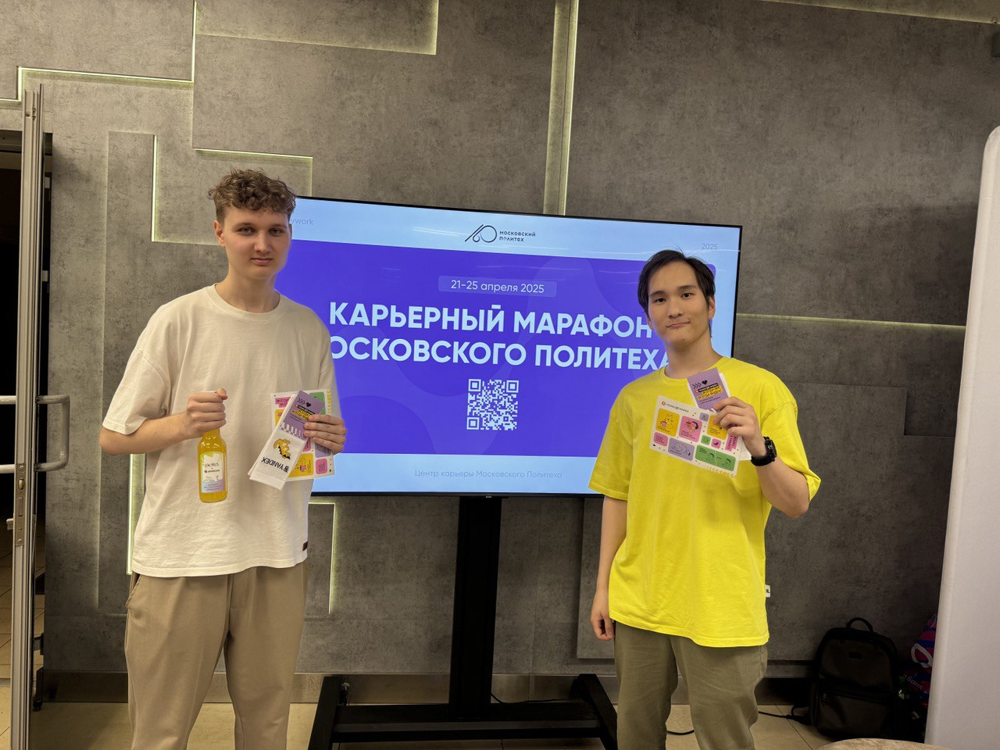
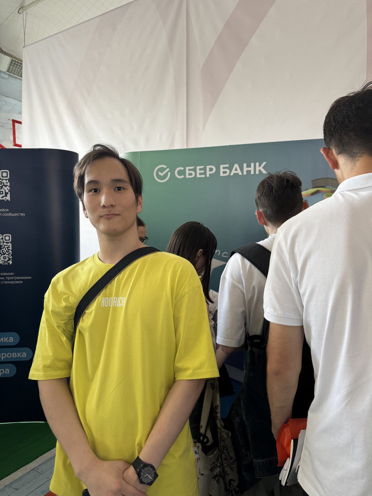
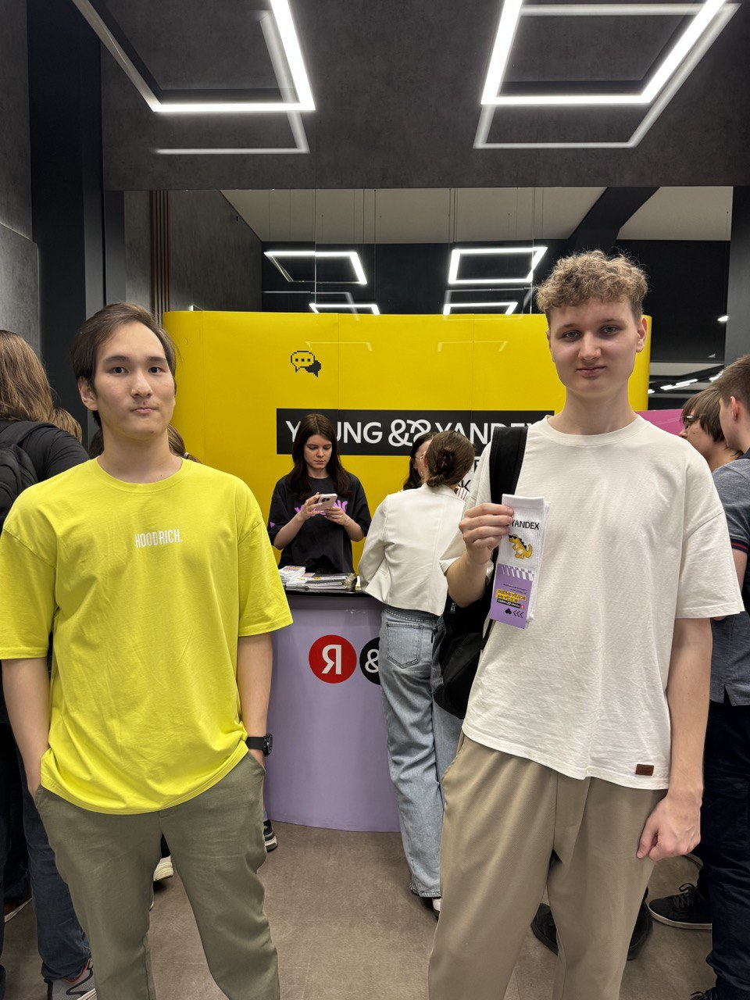
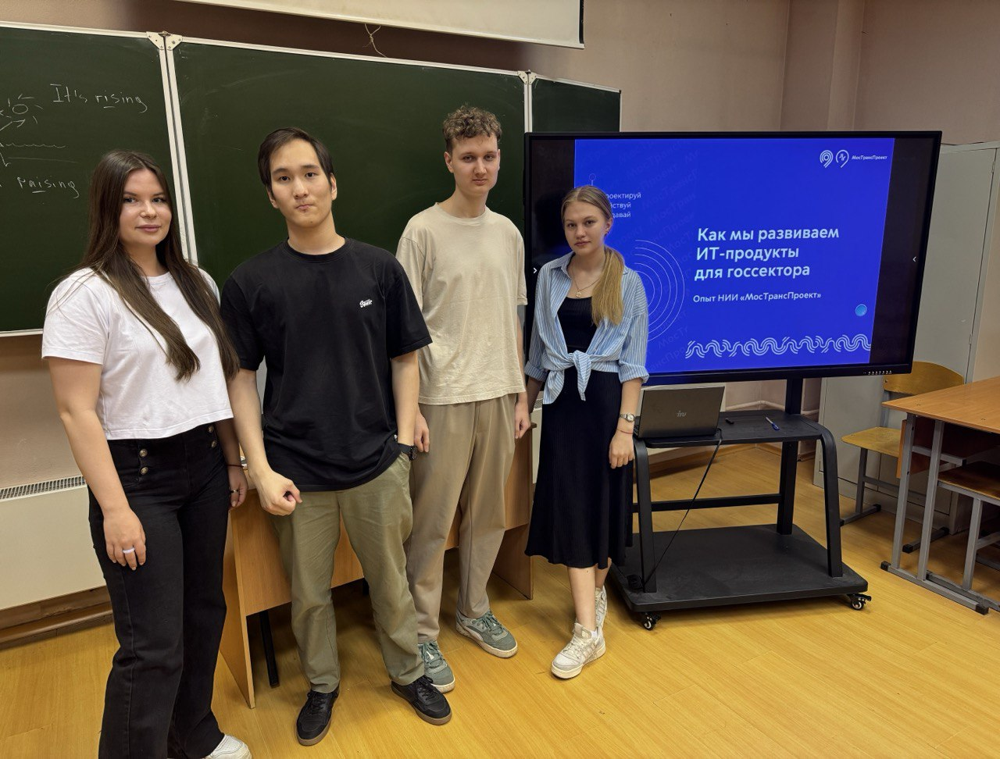

## Участие в карьерном марафоне

Участие в карьерном марафоне, организованном университетом, стало для меня значимым этапом профессионального становления. Мне удалось не только посетить выставку индустриальных партнеров, среди которых были такие гиганты, как **ПАО «Сбербанк», ПАО «Ростелеком», Young&&Yandex и R-Vision**, но и принять активное участие в ряде целевых мероприятий. 

Посещение выставки **индустриальных партнёров** и ряда **специализированных мастер-классов** предоставило мне отличную возможность для непосредственного взаимодействия с представителями ведущих компаний, установлению ценных профессиональных связей и погружению в актуальные технологические тренды. 

## Опыт взаимодействия с Young&&Yandex

В рамках выставки я посетил стенд компании **Young&&Yandex**, где представилась возможность не просто ознакомиться с их деятельностью, но и немедленно применить свои знания на практике. *Предложение решить алгоритмическую задачу или кейс на логику* стало своего рода экспресс-тестом моих текущих компетенций. 

Этот интерактивный формат взаимодействия позволил мне не только оценить собственный уровень подготовки к решению нестандартных задач, но и получить более четкое представление о том, какого рода аналитические способности и скорость мышления ценятся в ведущих IT-корпорациях при отборе молодых специалистов. Такой опыт, безусловно, является ценным для калибровки собственных усилий в процессе обучения и подготовки к будущей карьере.

## Мастер-класс НИИ «Мостранспроект»

Особое внимание привлек мастер-класс, проведенный специалистами компании **НИИ «Мостранспроект»**. В его рамках были детально рассмотрены передовые технологии цифрового моделирования, методы искусственного интеллекта и геоинформационные системы, используемые для оптимизации транспортной инфраструктуры, эксперты института продемонстрировали данные практические аспекты на примере успешно реализованных проектов.

 

Этот опыт позволил глубже осмыслить специфику разработки IT-решений для государственных нужд, начиная от анализа больших данных и заканчивая проектированием инфраструктурных объектов.

## Конференция R-EVOLUTION 2025 от R-Vision

Не менее значимым стало участие в конференции **R-EVOLUTION 2025** от компании **R-Vision**. Там были представлены последние достижения в области применения нейросетей и ИИ для задач кибербезопасности. Я получил представление о том, как нейросетевые алгоритмы способствуют автоматизированному мониторингу угроз, как функционируют интеллектуальные системы реагирования (SOAR) и каковы перспективы использования генеративного ИИ для защиты информации. 

 

Эксперты также продемонстрировали, как машинное обучение улучшает обнаружение угроз за счет обработки больших объемов данных в реальном времени. Информация о практической интеграции ИИ-решений от компаний-партнеров, таких как «Бастион» и «Информзащита», подчеркнула тенденцию к межплатформенному взаимодействию. Специалисты R-Vision также выделили ключевую мысль о том, что *наиболее эффективная стратегия заключается не в полной замене человека машиной, а в достижении синергии между ними*. Было отмечено, что взвешенный подход, при котором автоматизированные средства дополняются человеческим контролем, позволяет предотвратить потенциальные пробелы в логике работы алгоритмов и избежать упущений, способных привести к серьезным последствиям. 

## Итоговые выводы

Прошедший карьерный марафон стал для меня не просто чередой информативных мероприятий, а периодом активного вовлечения и профессионального роста. От ключевых аспектов применения ИТ в транспортной инфраструктуре (благодаря **НИИ «Мостранспроект»**), до  современных подходов к кибербезопасности с акцентом на синергию человека и ИИ от **R-Vision** на **R-EVOLUTION 2025**. Общение с широким кругом индустриальных партнеров, от **ПАО «Сбербанк»** до **«Ростелекома»**, не только позволило наладить потенциально важные связи, но и укрепило мою мотивацию развиваться в области ИИ. Это был важный шаг к пониманию требований работодателей и выстраиванию траектории собственного карьерного роста.